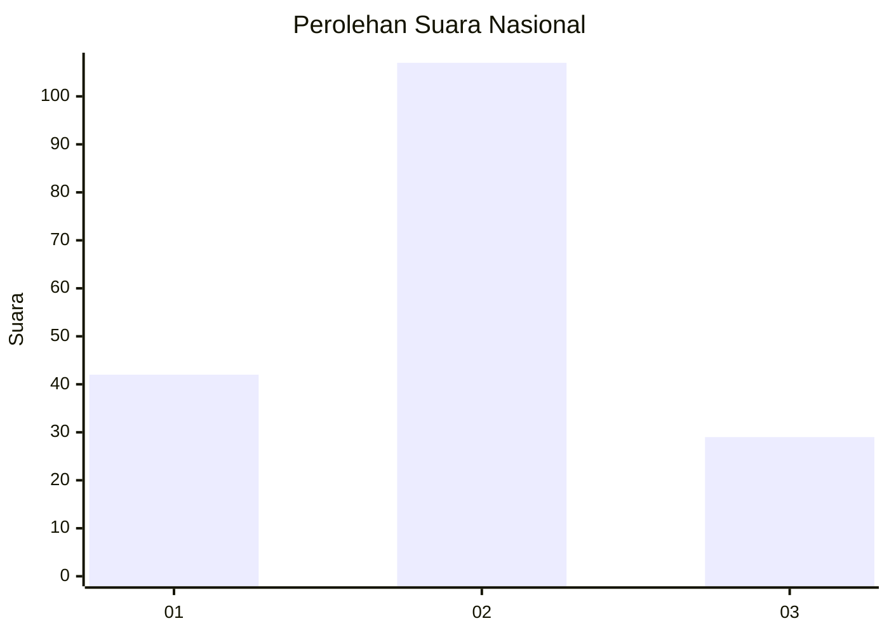

# Hasil

## Grafik

## Tabel

| No. | Nama Paslon    | Suara | Suara (raw) | Persentase |
|:--- |:-------------- | -----:| -----------:| ----------:|
| 1   | ANIES MUHAIMIN | 42    | [42][p-1]   | 23,60      |
| 2   | PRABOWO GIBRAN | 107   | [107][p-2]  | 60,11      |
| 3   | GANJAR MAHFUD  | 29    | [29][p-3]   | 16,29      |

[p-1]: https://github.com/gigit-pemilu/pemilu-2024/blob/main/pilpres/hitung-suara/sub/34-di-yogyakarta/sub/02-bantul/sub/10-imogiri/sub/2002-sriharjo/sub/017-tps/sub/paslon-1.txt
[p-2]: https://github.com/gigit-pemilu/pemilu-2024/blob/main/pilpres/hitung-suara/sub/34-di-yogyakarta/sub/02-bantul/sub/10-imogiri/sub/2002-sriharjo/sub/017-tps/sub/paslon-2.txt
[p-3]: https://github.com/gigit-pemilu/pemilu-2024/blob/main/pilpres/hitung-suara/sub/34-di-yogyakarta/sub/02-bantul/sub/10-imogiri/sub/2002-sriharjo/sub/017-tps/sub/paslon-3.txt

## Foto C Plano

https://sirekap-obj-formc.kpu.go.id/ed83/pemilu/ppwp/34/02/10/20/02/3402102002017-20240214-223109--2fcabb28-2419-450f-b4ff-0ea8e89bcba5.jpg

https://sirekap-obj-formc.kpu.go.id/ed83/pemilu/ppwp/34/02/10/20/02/3402102002017-20240214-223256--b93c6805-e4d3-4fc7-ab20-9ccd815696ff.jpg

https://sirekap-obj-formc.kpu.go.id/ed83/pemilu/ppwp/34/02/10/20/02/3402102002017-20240214-223402--3ffda1fd-81a1-4e78-8189-1cdd53a56e80.jpg

## Metadata

| Key        | Value               |
| ---------- | ------------------- |
| Time Stamp | 2024-02-15 20:00:44 |

