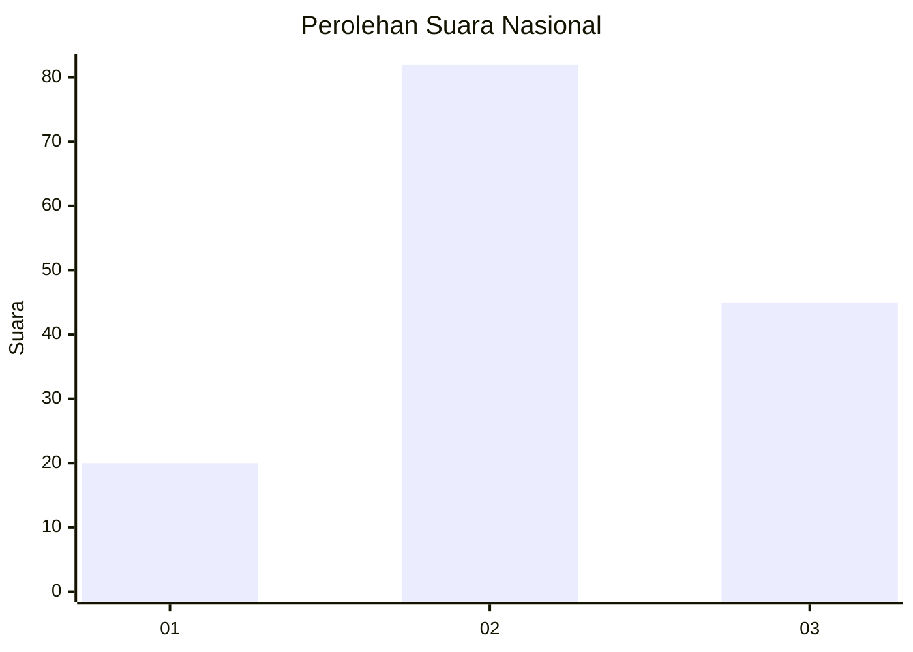
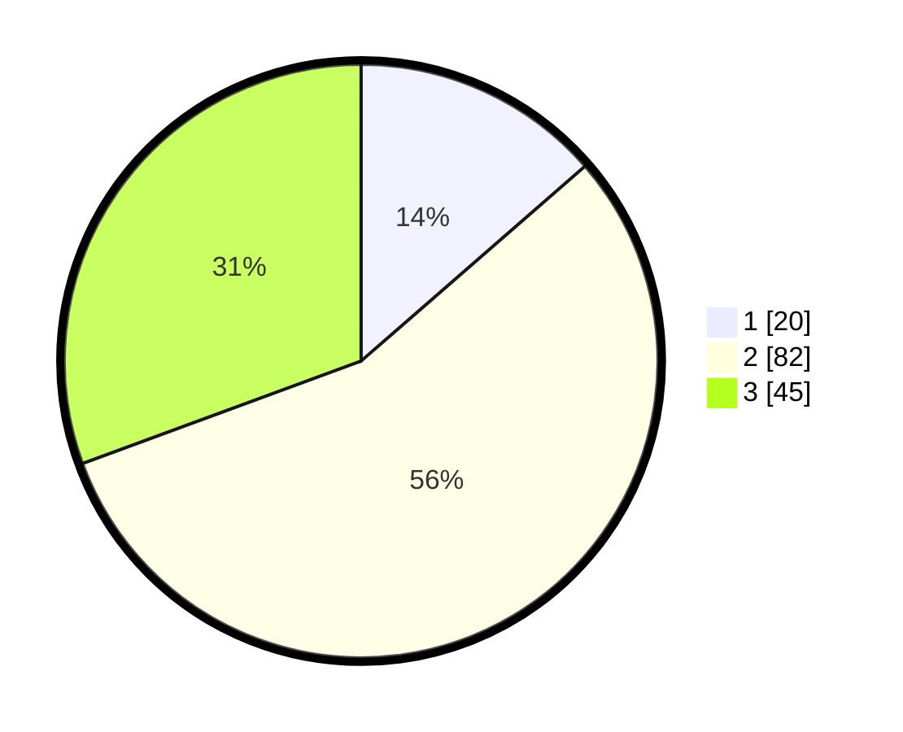

# Hasil

## Grafik

## Tabel

| No. | Nama Paslon    | Suara | Suara (raw) | Persentase |
|:--- |:-------------- | -----:| -----------:| ----------:|
| 1   | ANIES MUHAIMIN | 20    | [20][p-1]   | 13,61      |
| 2   | PRABOWO GIBRAN | 82    | [82][p-2]   | 55,78      |
| 3   | GANJAR MAHFUD  | 45    | [45][p-3]   | 30,61      |

[p-1]: https://github.com/gigit-pemilu/pemilu-2024/blob/main/pilpres/hitung-suara/sub/34-di-yogyakarta/sub/02-bantul/sub/10-imogiri/sub/2002-sriharjo/sub/022-tps/sub/paslon-1.txt
[p-2]: https://github.com/gigit-pemilu/pemilu-2024/blob/main/pilpres/hitung-suara/sub/34-di-yogyakarta/sub/02-bantul/sub/10-imogiri/sub/2002-sriharjo/sub/022-tps/sub/paslon-2.txt
[p-3]: https://github.com/gigit-pemilu/pemilu-2024/blob/main/pilpres/hitung-suara/sub/34-di-yogyakarta/sub/02-bantul/sub/10-imogiri/sub/2002-sriharjo/sub/022-tps/sub/paslon-3.txt

## Foto C Plano

https://sirekap-obj-formc.kpu.go.id/31d8/pemilu/ppwp/34/02/10/20/02/3402102002022-20240215-001936--4a9a316b-a1c9-4b0c-9987-8c5e86addecc.jpg

https://sirekap-obj-formc.kpu.go.id/31d8/pemilu/ppwp/34/02/10/20/02/3402102002022-20240214-220420--85546e6b-eb8b-4df6-b6c0-b0e94d36c155.jpg

https://sirekap-obj-formc.kpu.go.id/31d8/pemilu/ppwp/34/02/10/20/02/3402102002022-20240216-063006--6e4e14a6-8ee4-4b27-83bf-f501946362fe.jpg

## Metadata

| Key        | Value               |
| ---------- | ------------------- |
| Time Stamp | 2024-02-16 08:00:28 |

