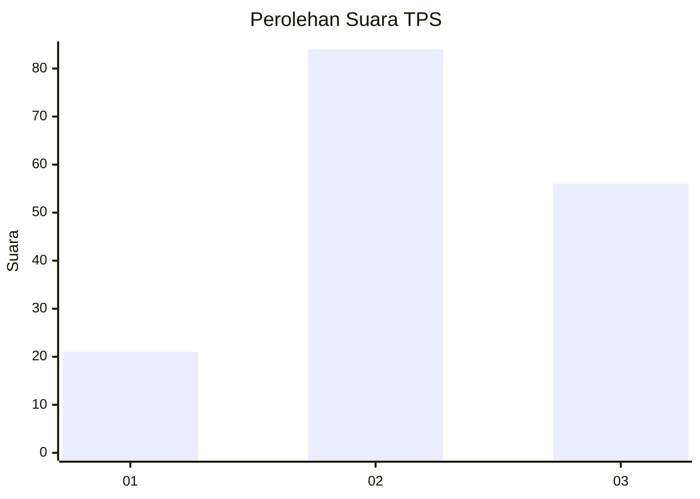
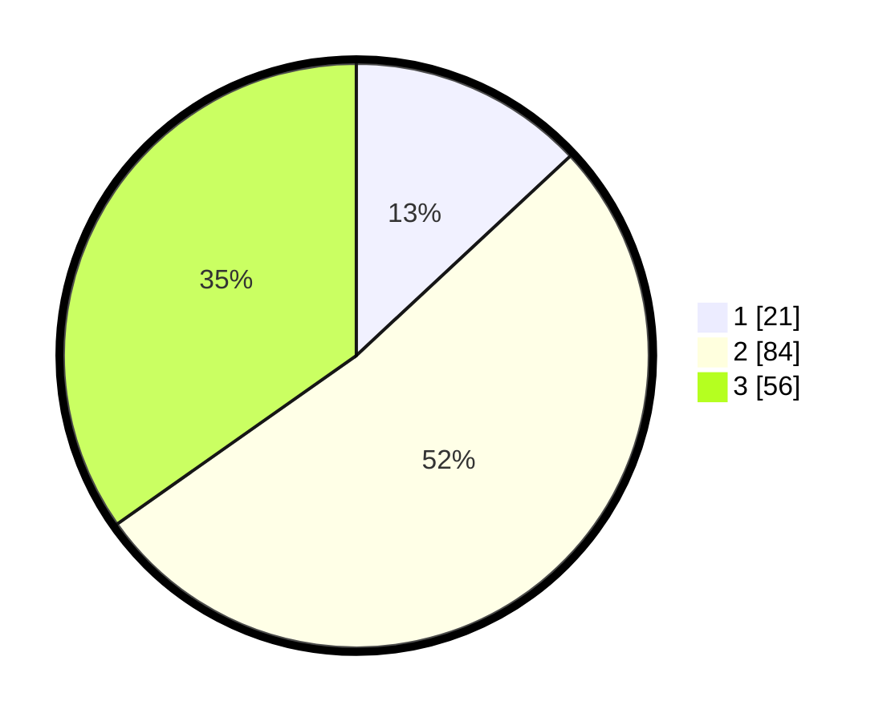

# Hasil

## Grafik

## Tabel

| No. | Nama Paslon    | Suara | Suara (raw) | Persentase |
|:--- |:-------------- | -----:| -----------:| ----------:|
| 1   | ANIES MUHAIMIN | 21    | [21][p-1]   | 13,04      |
| 2   | PRABOWO GIBRAN | 84    | [84][p-2]   | 52,17      |
| 3   | GANJAR MAHFUD  | 56    | [56][p-3]   | 34,78      |

[p-1]: https://github.com/gigit-pemilu/pemilu-2024-34-di-yogyakarta/blob/main/pilpres/hitung-suara/sub/34-di-yogyakarta/sub/02-bantul/sub/10-imogiri/sub/2002-sriharjo/sub/023-tps/sub/paslon-1.txt
[p-2]: https://github.com/gigit-pemilu/pemilu-2024-34-di-yogyakarta/blob/main/pilpres/hitung-suara/sub/34-di-yogyakarta/sub/02-bantul/sub/10-imogiri/sub/2002-sriharjo/sub/023-tps/sub/paslon-2.txt
[p-3]: https://github.com/gigit-pemilu/pemilu-2024-34-di-yogyakarta/blob/main/pilpres/hitung-suara/sub/34-di-yogyakarta/sub/02-bantul/sub/10-imogiri/sub/2002-sriharjo/sub/023-tps/sub/paslon-3.txt

## Foto C Plano

https://sirekap-obj-formc.kpu.go.id/d4c2/pemilu/ppwp/34/02/10/20/02/3402102002023-20240214-231614--479f4829-0798-466a-92dd-e6cee28ab1d3.jpg

https://sirekap-obj-formc.kpu.go.id/d4c2/pemilu/ppwp/34/02/10/20/02/3402102002023-20240214-232028--b806967f-e76f-4800-a1a8-3536f46e030d.jpg

https://sirekap-obj-formc.kpu.go.id/d4c2/pemilu/ppwp/34/02/10/20/02/3402102002023-20240216-082433--b5409a4d-2c56-4f1b-a0e6-f4034fa25015.jpg

## Metadata

| Key        | Value               |
| ---------- | ------------------- |
| Time Stamp | 2024-02-16 22:01:00 |

