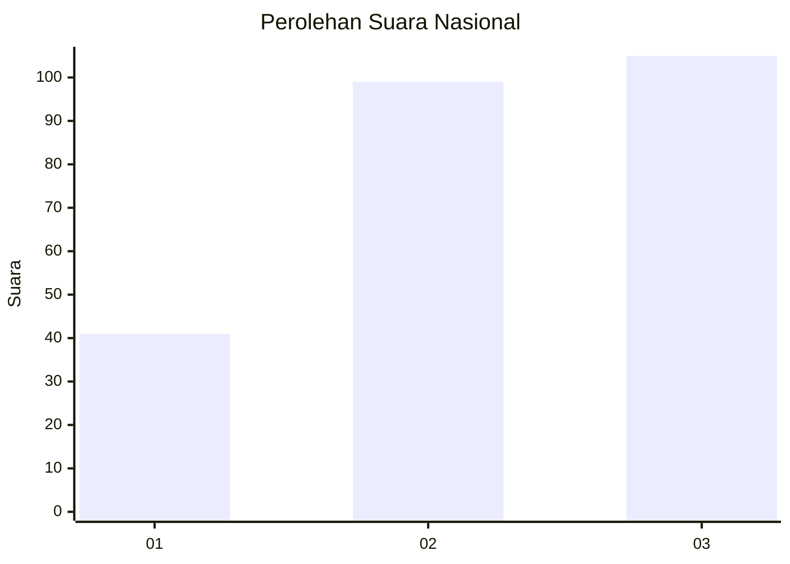
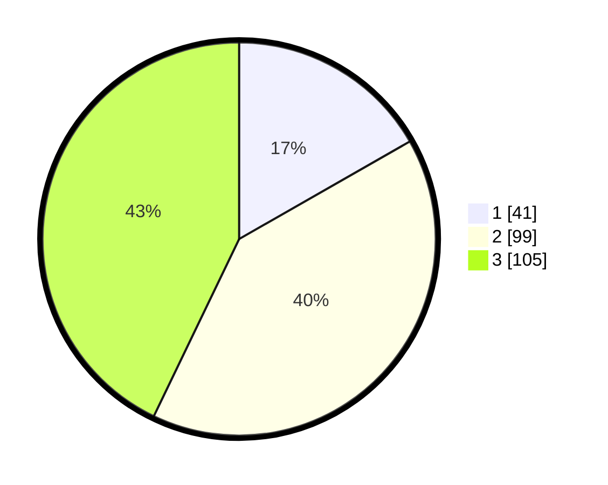

# Hasil

## Grafik

## Tabel

| No. | Nama Paslon    | Suara | Suara (raw) | Persentase |
|:--- |:-------------- | -----:| -----------:| ----------:|
| 1   | ANIES MUHAIMIN | 41    | [41][p-1]   | 16,73      |
| 2   | PRABOWO GIBRAN | 99    | [99][p-2]   | 40,41      |
| 3   | GANJAR MAHFUD  | 105   | [105][p-3]  | 42,86      |

[p-1]: https://github.com/gigit-pemilu/pemilu-2024/blob/main/pilpres/hitung-suara/sub/34-di-yogyakarta/sub/02-bantul/sub/10-imogiri/sub/2003-wukirsari/sub/003-tps/sub/paslon-1.txt
[p-2]: https://github.com/gigit-pemilu/pemilu-2024/blob/main/pilpres/hitung-suara/sub/34-di-yogyakarta/sub/02-bantul/sub/10-imogiri/sub/2003-wukirsari/sub/003-tps/sub/paslon-2.txt
[p-3]: https://github.com/gigit-pemilu/pemilu-2024/blob/main/pilpres/hitung-suara/sub/34-di-yogyakarta/sub/02-bantul/sub/10-imogiri/sub/2003-wukirsari/sub/003-tps/sub/paslon-3.txt

## Foto C Plano

https://sirekap-obj-formc.kpu.go.id/0d87/pemilu/ppwp/34/02/10/20/03/3402102003003-20240214-234216--2d589391-e602-4017-b9ab-07e60668d0fe.jpg

https://sirekap-obj-formc.kpu.go.id/0d87/pemilu/ppwp/34/02/10/20/03/3402102003003-20240214-234317--bec92d13-3474-430a-a603-21bd33f6774a.jpg

https://sirekap-obj-formc.kpu.go.id/0d87/pemilu/ppwp/34/02/10/20/03/3402102003003-20240214-234443--17b76fb5-0e57-4be6-aedd-fdfea72b2a9c.jpg

## Metadata

| Key        | Value               |
| ---------- | ------------------- |
| Time Stamp | 2024-02-15 12:00:28 |

