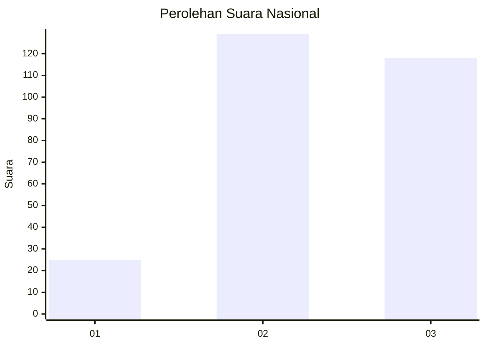
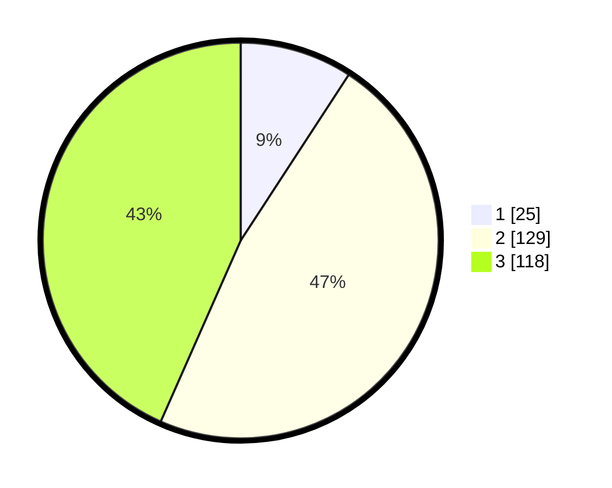

# Hasil

## Grafik

## Tabel

| No. | Nama Paslon    | Suara | Suara (raw) | Persentase |
|:--- |:-------------- | -----:| -----------:| ----------:|
| 1   | ANIES MUHAIMIN | 25    | [25][p-1]   | 9,19       |
| 2   | PRABOWO GIBRAN | 129   | [129][p-2]  | 47,43      |
| 3   | GANJAR MAHFUD  | 118   | [118][p-3]  | 43,38      |

[p-1]: https://github.com/gigit-pemilu/pemilu-2024/blob/main/pilpres/hitung-suara/sub/34-di-yogyakarta/sub/02-bantul/sub/10-imogiri/sub/2003-wukirsari/sub/018-tps/sub/paslon-1.txt
[p-2]: https://github.com/gigit-pemilu/pemilu-2024/blob/main/pilpres/hitung-suara/sub/34-di-yogyakarta/sub/02-bantul/sub/10-imogiri/sub/2003-wukirsari/sub/018-tps/sub/paslon-2.txt
[p-3]: https://github.com/gigit-pemilu/pemilu-2024/blob/main/pilpres/hitung-suara/sub/34-di-yogyakarta/sub/02-bantul/sub/10-imogiri/sub/2003-wukirsari/sub/018-tps/sub/paslon-3.txt

## Foto C Plano

https://sirekap-obj-formc.kpu.go.id/d76b/pemilu/ppwp/34/02/10/20/03/3402102003018-20240217-184747--0a4679fd-3bd4-4965-9c75-f08816014598.jpg

https://sirekap-obj-formc.kpu.go.id/d76b/pemilu/ppwp/34/02/10/20/03/3402102003018-20240217-184929--defcd657-20dd-472f-b6c8-084d33d7d9b3.jpg

https://sirekap-obj-formc.kpu.go.id/d76b/pemilu/ppwp/34/02/10/20/03/3402102003018-20240217-185110--ba5b73d2-fd26-4c8c-8424-31d8229592e8.jpg

## Metadata

| Key        | Value               |
| ---------- | ------------------- |
| Time Stamp | 2024-02-24 22:31:28 |

