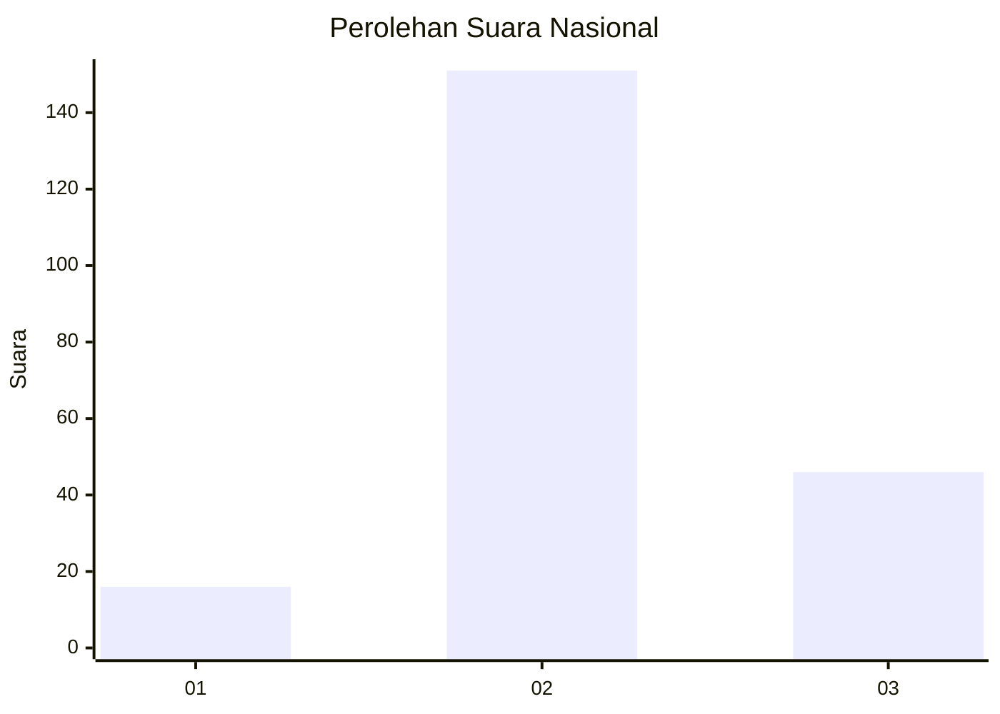
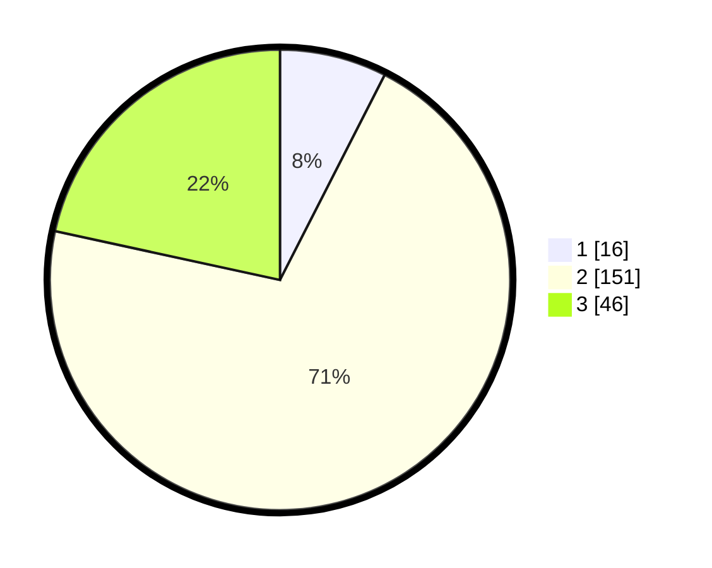

# Hasil

## Grafik

## Tabel

| No. | Nama Paslon    | Suara | Suara (raw) | Persentase |
|:--- |:-------------- | -----:| -----------:| ----------:|
| 1   | ANIES MUHAIMIN | 16    | [16][p-1]   | 7,51       |
| 2   | PRABOWO GIBRAN | 151   | [151][p-2]  | 70,89      |
| 3   | GANJAR MAHFUD  | 46    | [46][p-3]   | 21,60      |

[p-1]: https://github.com/gigit-pemilu/pemilu-2024/blob/main/pilpres/hitung-suara/sub/34-di-yogyakarta/sub/02-bantul/sub/10-imogiri/sub/2003-wukirsari/sub/029-tps/sub/paslon-1.txt
[p-2]: https://github.com/gigit-pemilu/pemilu-2024/blob/main/pilpres/hitung-suara/sub/34-di-yogyakarta/sub/02-bantul/sub/10-imogiri/sub/2003-wukirsari/sub/029-tps/sub/paslon-2.txt
[p-3]: https://github.com/gigit-pemilu/pemilu-2024/blob/main/pilpres/hitung-suara/sub/34-di-yogyakarta/sub/02-bantul/sub/10-imogiri/sub/2003-wukirsari/sub/029-tps/sub/paslon-3.txt

## Foto C Plano

https://sirekap-obj-formc.kpu.go.id/adaa/pemilu/ppwp/34/02/10/20/03/3402102003029-20240217-131928--40e86847-bd50-44c9-ab83-3f7b4a180313.jpg

https://sirekap-obj-formc.kpu.go.id/adaa/pemilu/ppwp/34/02/10/20/03/3402102003029-20240217-132136--5d4d0fc7-5a28-4cbc-81c6-d433e82afe65.jpg

https://sirekap-obj-formc.kpu.go.id/adaa/pemilu/ppwp/34/02/10/20/03/3402102003029-20240217-132303--235db572-8b7c-4f15-8ca7-a5759a9f084c.jpg

## Metadata

| Key        | Value               |
| ---------- | ------------------- |
| Time Stamp | 2024-02-24 22:31:28 |

