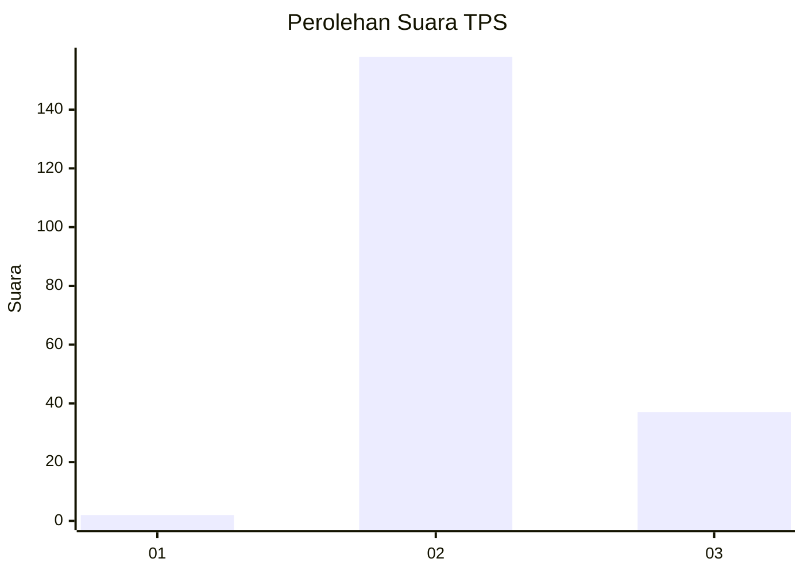
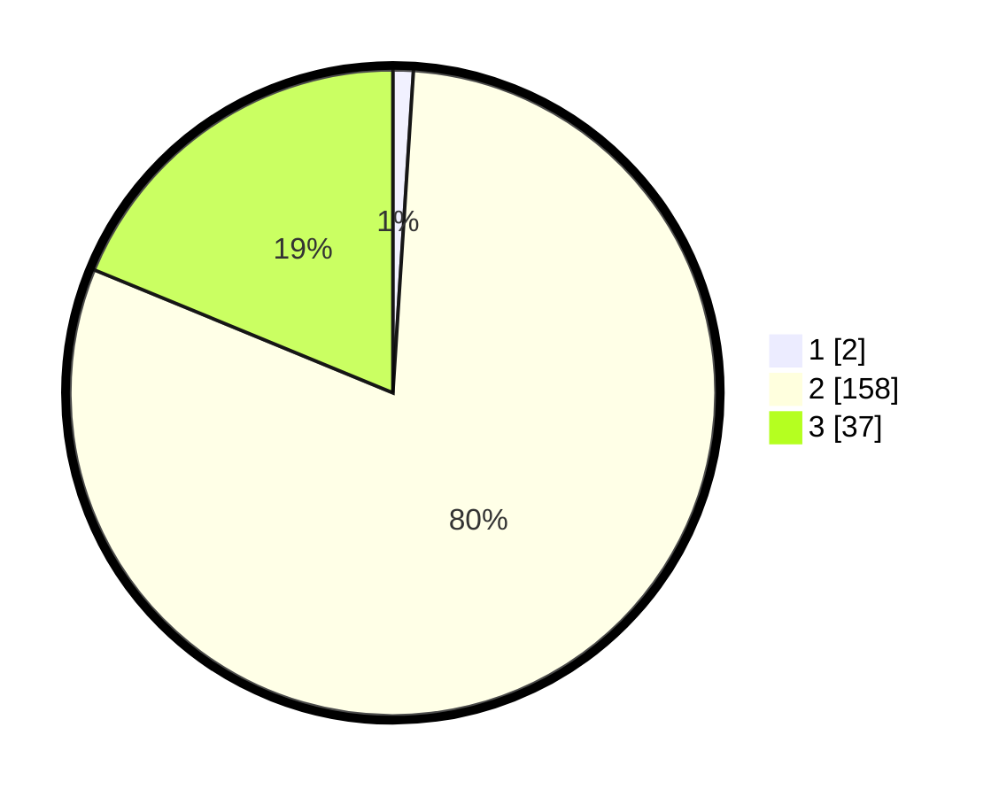

# Hasil

## Grafik

## Tabel

| No. | Nama Paslon    | Suara | Suara (raw) | Persentase |
|:--- |:-------------- | -----:| -----------:| ----------:|
| 1   | ANIES MUHAIMIN | 2     | [2][p-1]    | 1,02       |
| 2   | PRABOWO GIBRAN | 158   | [158][p-2]  | 80,20      |
| 3   | GANJAR MAHFUD  | 37    | [37][p-3]   | 18,78      |

[p-1]: https://github.com/gigit-pemilu/pemilu-2024-34-di-yogyakarta/blob/main/pilpres/hitung-suara/sub/34-di-yogyakarta/sub/02-bantul/sub/10-imogiri/sub/2003-wukirsari/sub/030-tps/sub/paslon-1.txt
[p-2]: https://github.com/gigit-pemilu/pemilu-2024-34-di-yogyakarta/blob/main/pilpres/hitung-suara/sub/34-di-yogyakarta/sub/02-bantul/sub/10-imogiri/sub/2003-wukirsari/sub/030-tps/sub/paslon-2.txt
[p-3]: https://github.com/gigit-pemilu/pemilu-2024-34-di-yogyakarta/blob/main/pilpres/hitung-suara/sub/34-di-yogyakarta/sub/02-bantul/sub/10-imogiri/sub/2003-wukirsari/sub/030-tps/sub/paslon-3.txt

## Foto C Plano

https://sirekap-obj-formc.kpu.go.id/ee37/pemilu/ppwp/34/02/10/20/03/3402102003030-20240217-192903--fd30c28a-6465-4715-b252-599b9629cb6c.jpg

https://sirekap-obj-formc.kpu.go.id/ee37/pemilu/ppwp/34/02/10/20/03/3402102003030-20240216-203048--a9ecd976-2c32-41e6-88c8-acce7517ed0d.jpg

https://sirekap-obj-formc.kpu.go.id/ee37/pemilu/ppwp/34/02/10/20/03/3402102003030-20240218-080544--c6544263-710b-4010-a46e-b8aaa2f47fe2.jpg

## Metadata

| Key        | Value               |
| ---------- | ------------------- |
| Time Stamp | 2024-02-24 22:31:28 |

