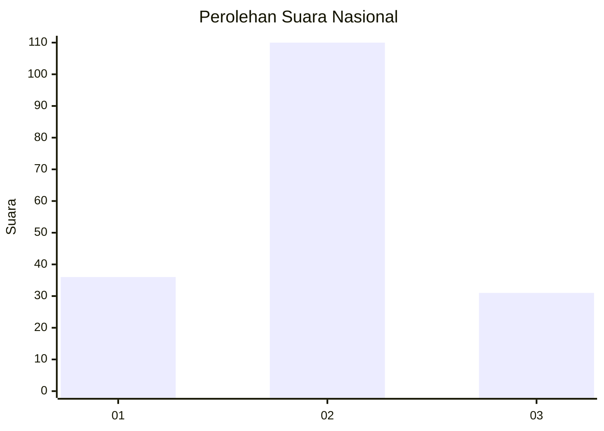

# Hasil

## Grafik

## Tabel

| No. | Nama Paslon    | Suara | Suara (raw) | Persentase |
|:--- |:-------------- | -----:| -----------:| ----------:|
| 1   | ANIES MUHAIMIN | 36    | [36][p-1]   | 20,34      |
| 2   | PRABOWO GIBRAN | 110   | [110][p-2]  | 62,15      |
| 3   | GANJAR MAHFUD  | 31    | [31][p-3]   | 17,51      |

[p-1]: https://github.com/gigit-pemilu/pemilu-2024/blob/main/pilpres/hitung-suara/sub/34-di-yogyakarta/sub/02-bantul/sub/10-imogiri/sub/2003-wukirsari/sub/053-tps/sub/paslon-1.txt
[p-2]: https://github.com/gigit-pemilu/pemilu-2024/blob/main/pilpres/hitung-suara/sub/34-di-yogyakarta/sub/02-bantul/sub/10-imogiri/sub/2003-wukirsari/sub/053-tps/sub/paslon-2.txt
[p-3]: https://github.com/gigit-pemilu/pemilu-2024/blob/main/pilpres/hitung-suara/sub/34-di-yogyakarta/sub/02-bantul/sub/10-imogiri/sub/2003-wukirsari/sub/053-tps/sub/paslon-3.txt

## Foto C Plano

https://sirekap-obj-formc.kpu.go.id/ce5d/pemilu/ppwp/34/02/10/20/03/3402102003053-20240216-202851--6a2ced1f-bba6-4f77-887a-216d8691a06f.jpg

https://sirekap-obj-formc.kpu.go.id/ce5d/pemilu/ppwp/34/02/10/20/03/3402102003053-20240215-015744--4fc235ab-7090-4c14-85e8-dee83e7ed36e.jpg

https://sirekap-obj-formc.kpu.go.id/ce5d/pemilu/ppwp/34/02/10/20/03/3402102003053-20240215-020437--a4b2a0e6-a9e5-4395-9ba5-4a97aa029c0a.jpg

## Metadata

| Key        | Value               |
| ---------- | ------------------- |
| Time Stamp | 2024-02-24 23:00:00 |

