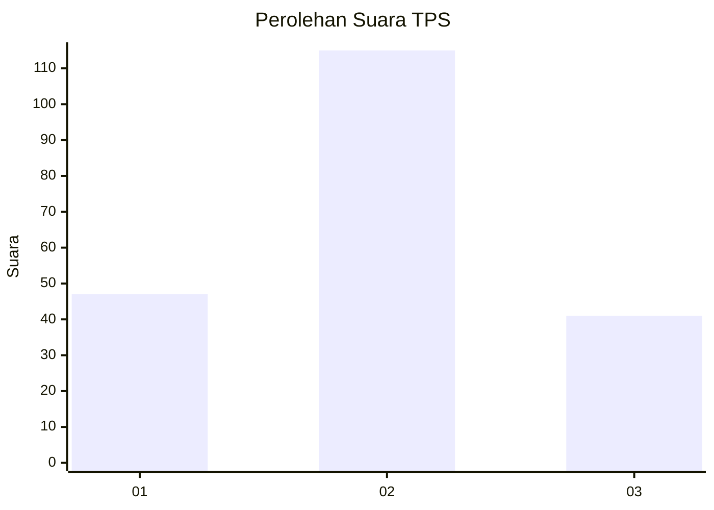
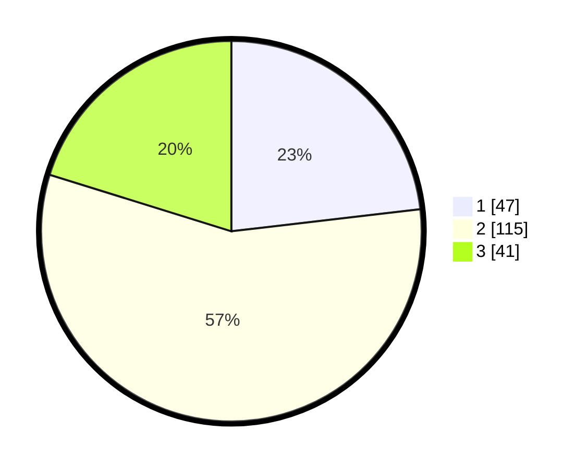

# Hasil

## Grafik

## Tabel

| No. | Nama Paslon    | Suara | Suara (raw) | Persentase |
|:--- |:-------------- | -----:| -----------:| ----------:|
| 1   | ANIES MUHAIMIN | 47    | [47][p-1]   | 23,15      |
| 2   | PRABOWO GIBRAN | 115   | [115][p-2]  | 56,65      |
| 3   | GANJAR MAHFUD  | 41    | [41][p-3]   | 20,20      |

[p-1]: https://github.com/gigit-pemilu/pemilu-2024-34-di-yogyakarta/blob/main/pilpres/hitung-suara/sub/34-di-yogyakarta/sub/02-bantul/sub/10-imogiri/sub/2004-kebonagung/sub/002-tps/sub/paslon-1.txt
[p-2]: https://github.com/gigit-pemilu/pemilu-2024-34-di-yogyakarta/blob/main/pilpres/hitung-suara/sub/34-di-yogyakarta/sub/02-bantul/sub/10-imogiri/sub/2004-kebonagung/sub/002-tps/sub/paslon-2.txt
[p-3]: https://github.com/gigit-pemilu/pemilu-2024-34-di-yogyakarta/blob/main/pilpres/hitung-suara/sub/34-di-yogyakarta/sub/02-bantul/sub/10-imogiri/sub/2004-kebonagung/sub/002-tps/sub/paslon-3.txt

## Foto C Plano

https://sirekap-obj-formc.kpu.go.id/7b4e/pemilu/ppwp/34/02/10/20/04/3402102004002-20240215-200458--e715efc8-a918-4df8-872b-a8456fd21ea6.jpg

https://sirekap-obj-formc.kpu.go.id/7b4e/pemilu/ppwp/34/02/10/20/04/3402102004002-20240215-203030--7b1270f0-a134-4967-9823-9ecc2aa1cd74.jpg

https://sirekap-obj-formc.kpu.go.id/7b4e/pemilu/ppwp/34/02/10/20/04/3402102004002-20240214-141511--2d887d62-42aa-49dc-ad6e-7901f55fdf6a.jpg

## Metadata

| Key        | Value               |
| ---------- | ------------------- |
| Time Stamp | 2024-02-16 01:00:27 |

