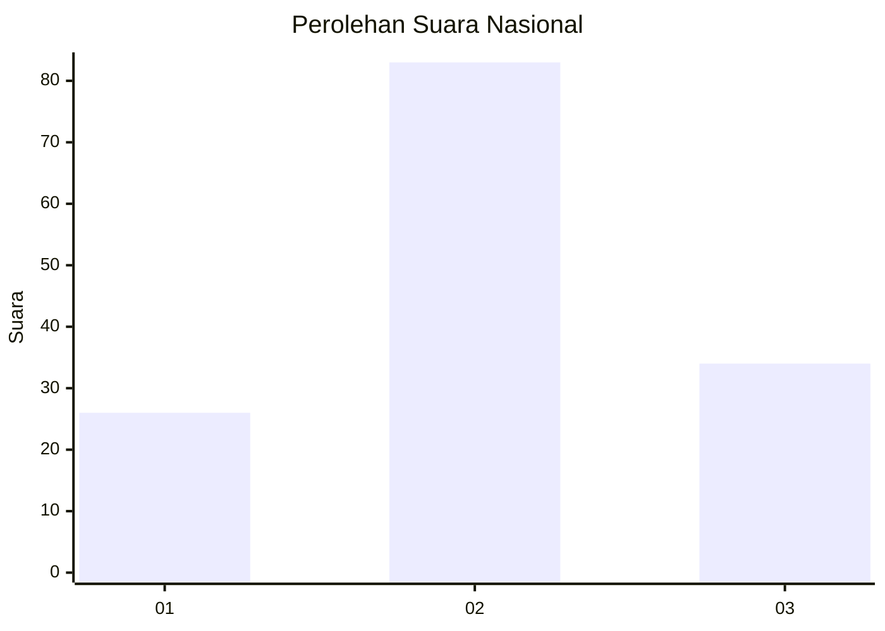
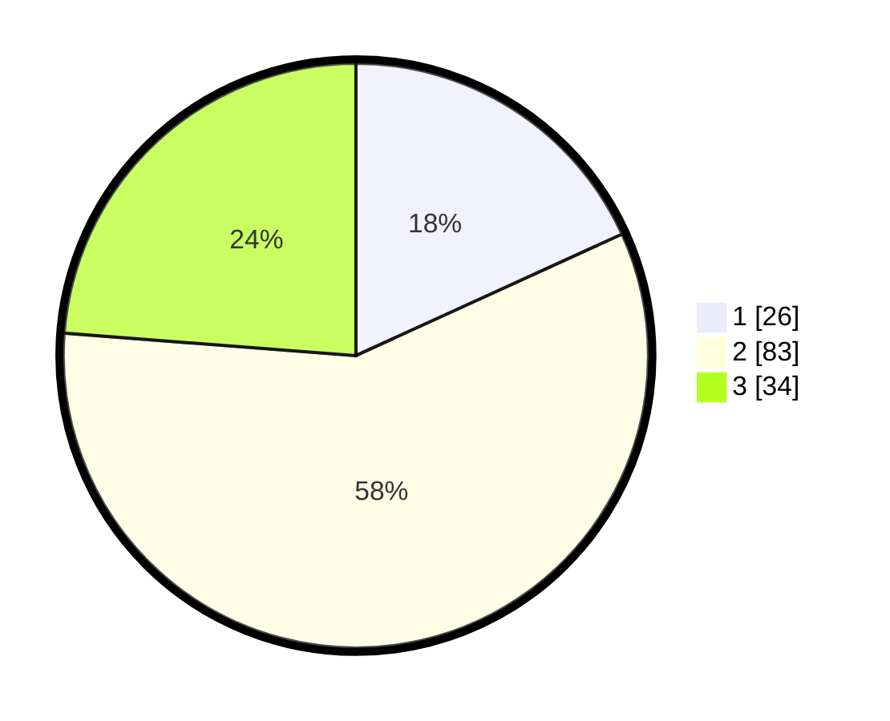

# Hasil

## Grafik

## Tabel

| No. | Nama Paslon    | Suara | Suara (raw) | Persentase |
|:--- |:-------------- | -----:| -----------:| ----------:|
| 1   | ANIES MUHAIMIN | 26    | [26][p-1]   | 18,18      |
| 2   | PRABOWO GIBRAN | 83    | [83][p-2]   | 58,04      |
| 3   | GANJAR MAHFUD  | 34    | [34][p-3]   | 23,78      |

[p-1]: https://github.com/gigit-pemilu/pemilu-2024/blob/main/pilpres/hitung-suara/sub/34-di-yogyakarta/sub/02-bantul/sub/10-imogiri/sub/2004-kebonagung/sub/013-tps/sub/paslon-1.txt
[p-2]: https://github.com/gigit-pemilu/pemilu-2024/blob/main/pilpres/hitung-suara/sub/34-di-yogyakarta/sub/02-bantul/sub/10-imogiri/sub/2004-kebonagung/sub/013-tps/sub/paslon-2.txt
[p-3]: https://github.com/gigit-pemilu/pemilu-2024/blob/main/pilpres/hitung-suara/sub/34-di-yogyakarta/sub/02-bantul/sub/10-imogiri/sub/2004-kebonagung/sub/013-tps/sub/paslon-3.txt

## Foto C Plano

https://sirekap-obj-formc.kpu.go.id/f285/pemilu/ppwp/34/02/10/20/04/3402102004013-20240216-084728--0c48dd1d-75e4-4816-b59a-6b15382e2cd0.jpg

https://sirekap-obj-formc.kpu.go.id/f285/pemilu/ppwp/34/02/10/20/04/3402102004013-20240216-084921--efc1d5ed-26a9-430d-abcd-89bd6bb87709.jpg

https://sirekap-obj-formc.kpu.go.id/f285/pemilu/ppwp/34/02/10/20/04/3402102004013-20240216-085133--0d1616ce-0679-4ed1-be13-d52462376884.jpg

## Metadata

| Key        | Value               |
| ---------- | ------------------- |
| Time Stamp | 2024-02-25 18:00:00 |

