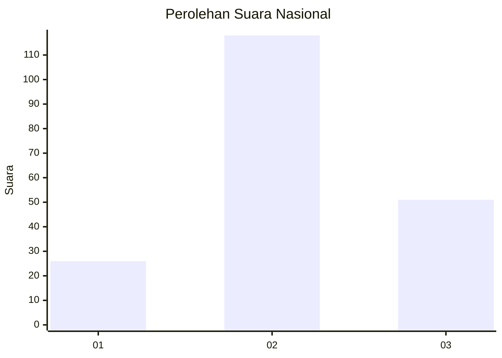
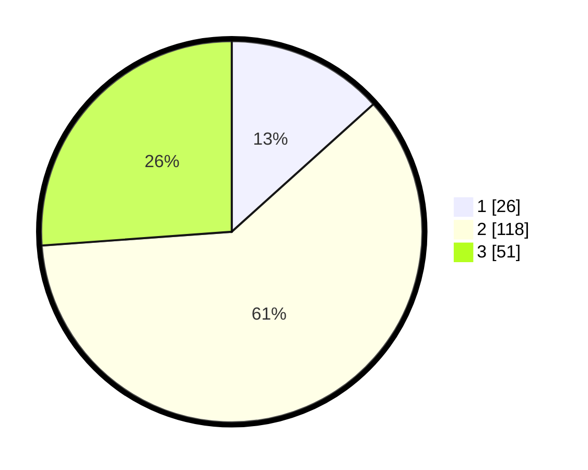

# Hasil

## Grafik

## Tabel

| No. | Nama Paslon    | Suara | Suara (raw) | Persentase |
|:--- |:-------------- | -----:| -----------:| ----------:|
| 1   | ANIES MUHAIMIN | 26    | [26][p-1]   | 13,33      |
| 2   | PRABOWO GIBRAN | 118   | [118][p-2]  | 60,51      |
| 3   | GANJAR MAHFUD  | 51    | [51][p-3]   | 26,15      |

[p-1]: https://github.com/gigit-pemilu/pemilu-2024/blob/main/pilpres/hitung-suara/sub/34-di-yogyakarta/sub/02-bantul/sub/10-imogiri/sub/2005-karangtengah/sub/012-tps/sub/paslon-1.txt
[p-2]: https://github.com/gigit-pemilu/pemilu-2024/blob/main/pilpres/hitung-suara/sub/34-di-yogyakarta/sub/02-bantul/sub/10-imogiri/sub/2005-karangtengah/sub/012-tps/sub/paslon-2.txt
[p-3]: https://github.com/gigit-pemilu/pemilu-2024/blob/main/pilpres/hitung-suara/sub/34-di-yogyakarta/sub/02-bantul/sub/10-imogiri/sub/2005-karangtengah/sub/012-tps/sub/paslon-3.txt

## Foto C Plano

https://sirekap-obj-formc.kpu.go.id/8231/pemilu/ppwp/34/02/10/20/05/3402102005012-20240217-194458--d6c23f2d-cd3a-4cd3-b062-c88e18f8595e.jpg

https://sirekap-obj-formc.kpu.go.id/8231/pemilu/ppwp/34/02/10/20/05/3402102005012-20240217-194719--48a1463d-0a10-4fe6-a5b6-0eb768122fa4.jpg

https://sirekap-obj-formc.kpu.go.id/8231/pemilu/ppwp/34/02/10/20/05/3402102005012-20240216-221042--2014d1f7-b9f8-4bca-894e-f3272b43d900.jpg

## Metadata

| Key        | Value               |
| ---------- | ------------------- |
| Time Stamp | 2024-02-24 22:31:28 |

