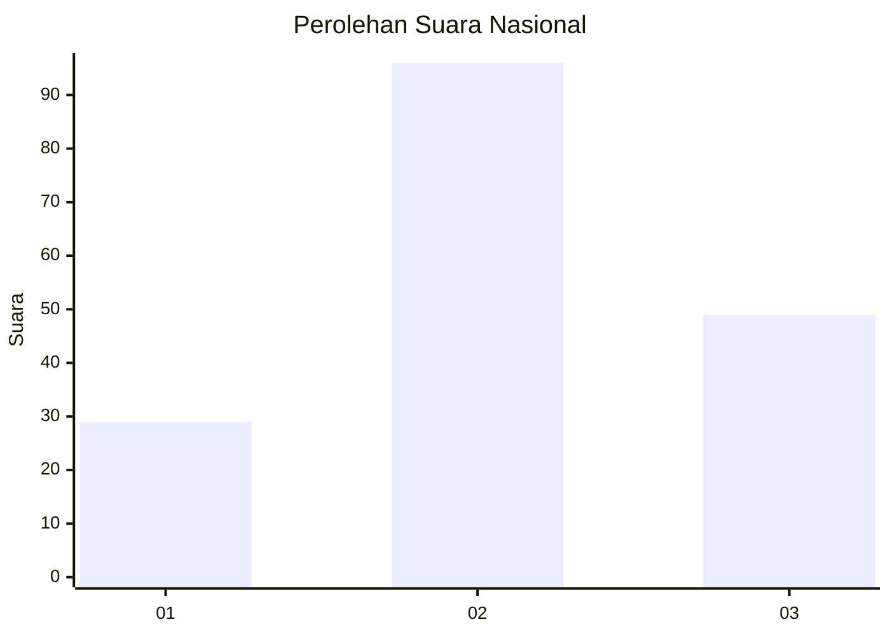
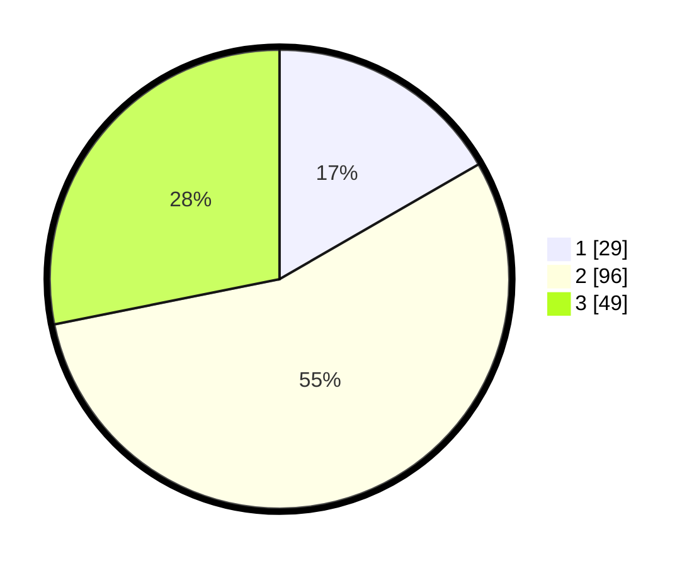

# Hasil

## Grafik

## Tabel

| No. | Nama Paslon    | Suara | Suara (raw) | Persentase |
|:--- |:-------------- | -----:| -----------:| ----------:|
| 1   | ANIES MUHAIMIN | 29    | [29][p-1]   | 16,67      |
| 2   | PRABOWO GIBRAN | 96    | [96][p-2]   | 55,17      |
| 3   | GANJAR MAHFUD  | 49    | [49][p-3]   | 28,16      |

[p-1]: https://github.com/gigit-pemilu/pemilu-2024/blob/main/pilpres/hitung-suara/sub/34-di-yogyakarta/sub/02-bantul/sub/10-imogiri/sub/2006-girirejo/sub/007-tps/sub/paslon-1.txt
[p-2]: https://github.com/gigit-pemilu/pemilu-2024/blob/main/pilpres/hitung-suara/sub/34-di-yogyakarta/sub/02-bantul/sub/10-imogiri/sub/2006-girirejo/sub/007-tps/sub/paslon-2.txt
[p-3]: https://github.com/gigit-pemilu/pemilu-2024/blob/main/pilpres/hitung-suara/sub/34-di-yogyakarta/sub/02-bantul/sub/10-imogiri/sub/2006-girirejo/sub/007-tps/sub/paslon-3.txt

## Foto C Plano

https://sirekap-obj-formc.kpu.go.id/bd00/pemilu/ppwp/34/02/10/20/06/3402102006007-20240216-023433--feea0663-c971-44aa-9a07-5e3d4c7284ad.jpg

https://sirekap-obj-formc.kpu.go.id/bd00/pemilu/ppwp/34/02/10/20/06/3402102006007-20240216-023805--833bda15-52c0-4ab4-a696-9d2f406cc7f8.jpg

https://sirekap-obj-formc.kpu.go.id/bd00/pemilu/ppwp/34/02/10/20/06/3402102006007-20240216-024424--10560bb6-f66a-4d0f-afc9-86caed0ec30d.jpg

## Metadata

| Key        | Value               |
| ---------- | ------------------- |
| Time Stamp | 2024-02-16 03:00:26 |

