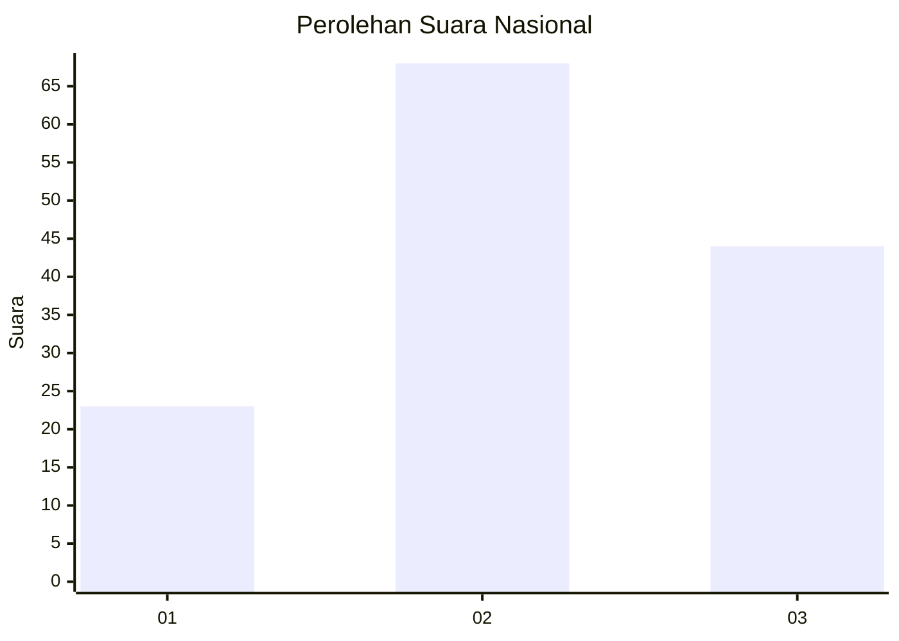
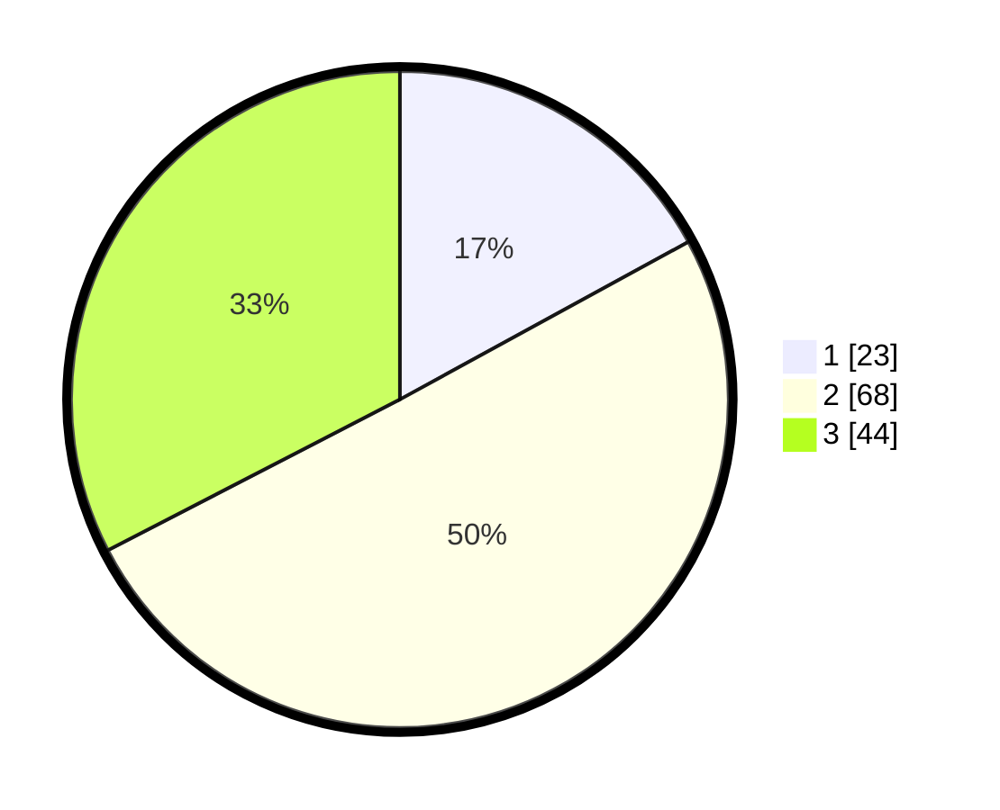

# Hasil

## Grafik

## Tabel

| No. | Nama Paslon    | Suara | Suara (raw) | Persentase |
|:--- |:-------------- | -----:| -----------:| ----------:|
| 1   | ANIES MUHAIMIN | 23    | [23][p-1]   | 17,04      |
| 2   | PRABOWO GIBRAN | 68    | [68][p-2]   | 50,37      |
| 3   | GANJAR MAHFUD  | 44    | [44][p-3]   | 32,59      |

[p-1]: https://github.com/gigit-pemilu/pemilu-2024/blob/main/pilpres/hitung-suara/sub/34-di-yogyakarta/sub/02-bantul/sub/10-imogiri/sub/2007-karangtalun/sub/011-tps/sub/paslon-1.txt
[p-2]: https://github.com/gigit-pemilu/pemilu-2024/blob/main/pilpres/hitung-suara/sub/34-di-yogyakarta/sub/02-bantul/sub/10-imogiri/sub/2007-karangtalun/sub/011-tps/sub/paslon-2.txt
[p-3]: https://github.com/gigit-pemilu/pemilu-2024/blob/main/pilpres/hitung-suara/sub/34-di-yogyakarta/sub/02-bantul/sub/10-imogiri/sub/2007-karangtalun/sub/011-tps/sub/paslon-3.txt

## Foto C Plano

https://sirekap-obj-formc.kpu.go.id/42b6/pemilu/ppwp/34/02/10/20/07/3402102007011-20240214-221914--7b5579c7-bf98-45c1-8119-5eb2ea5d350a.jpg

https://sirekap-obj-formc.kpu.go.id/42b6/pemilu/ppwp/34/02/10/20/07/3402102007011-20240214-202119--69c2f8e1-db55-4fa9-a86f-beeadabbdaf1.jpg

https://sirekap-obj-formc.kpu.go.id/42b6/pemilu/ppwp/34/02/10/20/07/3402102007011-20240214-222255--5a0b7052-9805-4bcc-97b5-49be8e5ace03.jpg

## Metadata

| Key        | Value               |
| ---------- | ------------------- |
| Time Stamp | 2024-02-15 03:06:03 |

