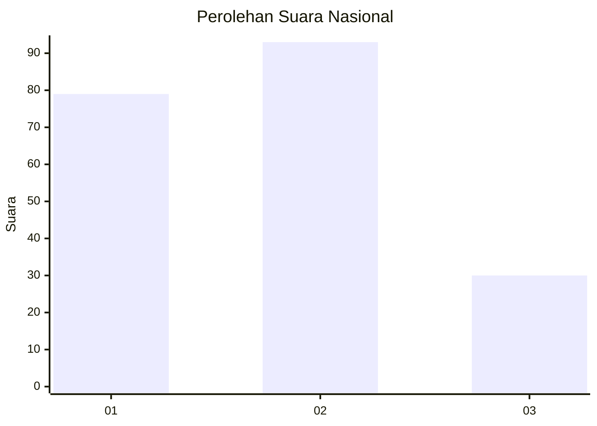
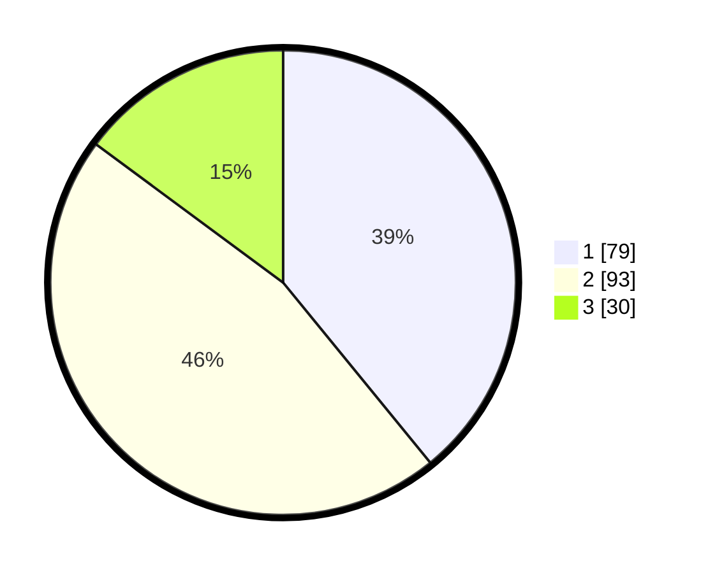

# Hasil

## Grafik

## Tabel

| No. | Nama Paslon    | Suara | Suara (raw) | Persentase |
|:--- |:-------------- | -----:| -----------:| ----------:|
| 1   | ANIES MUHAIMIN | 79    | [79][p-1]   | 39,11      |
| 2   | PRABOWO GIBRAN | 93    | [93][p-2]   | 46,04      |
| 3   | GANJAR MAHFUD  | 30    | [30][p-3]   | 14,85      |

[p-1]: https://github.com/gigit-pemilu/pemilu-2024/blob/main/pilpres/hitung-suara/sub/34-di-yogyakarta/sub/02-bantul/sub/10-imogiri/sub/2008-imogiri/sub/005-tps/sub/paslon-1.txt
[p-2]: https://github.com/gigit-pemilu/pemilu-2024/blob/main/pilpres/hitung-suara/sub/34-di-yogyakarta/sub/02-bantul/sub/10-imogiri/sub/2008-imogiri/sub/005-tps/sub/paslon-2.txt
[p-3]: https://github.com/gigit-pemilu/pemilu-2024/blob/main/pilpres/hitung-suara/sub/34-di-yogyakarta/sub/02-bantul/sub/10-imogiri/sub/2008-imogiri/sub/005-tps/sub/paslon-3.txt

## Foto C Plano

https://sirekap-obj-formc.kpu.go.id/37db/pemilu/ppwp/34/02/10/20/08/3402102008005-20240214-225843--2f0a9ab1-c91d-45f8-86c2-3f6d12b60935.jpg

https://sirekap-obj-formc.kpu.go.id/37db/pemilu/ppwp/34/02/10/20/08/3402102008005-20240214-224851--57f0e48f-3878-448e-b31d-7eb1ed7e6ef4.jpg

https://sirekap-obj-formc.kpu.go.id/37db/pemilu/ppwp/34/02/10/20/08/3402102008005-20240214-225013--4aeb4636-bb3a-40f2-a9d6-67a22a58ac08.jpg

## Metadata

| Key        | Value               |
| ---------- | ------------------- |
| Time Stamp | 2024-02-25 17:00:00 |

