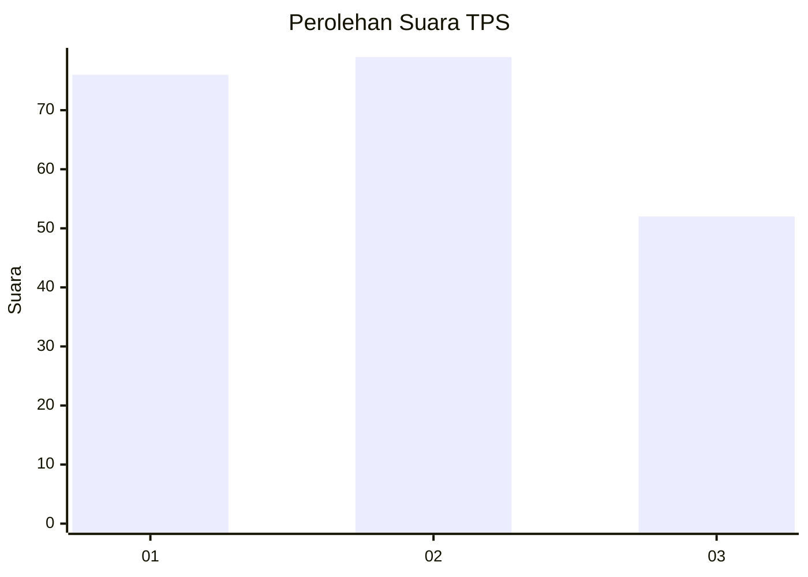
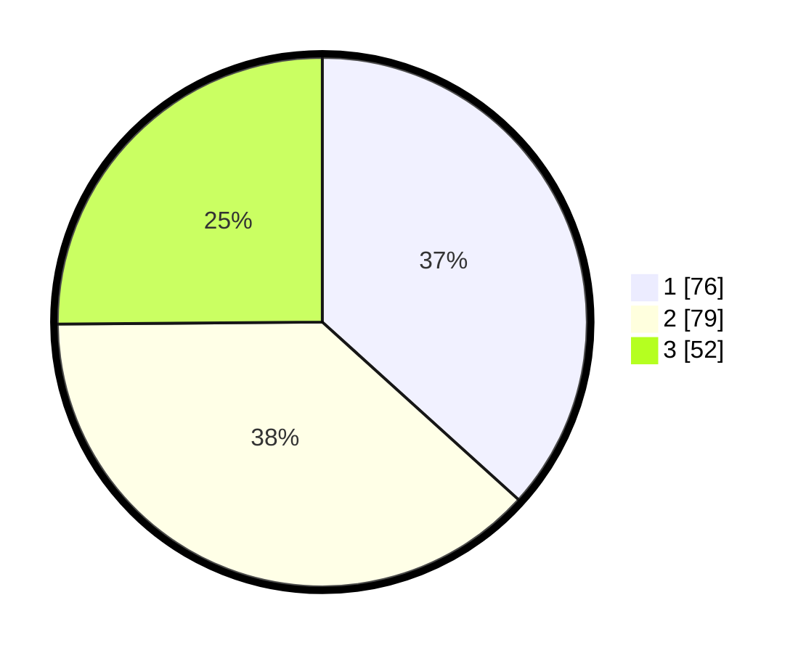

# Hasil

## Grafik

## Tabel

| No. | Nama Paslon    | Suara | Suara (raw) | Persentase |
|:--- |:-------------- | -----:| -----------:| ----------:|
| 1   | ANIES MUHAIMIN | 76    | [76][p-1]   | 36,71      |
| 2   | PRABOWO GIBRAN | 79    | [79][p-2]   | 38,16      |
| 3   | GANJAR MAHFUD  | 52    | [52][p-3]   | 25,12      |

[p-1]: https://github.com/gigit-pemilu/pemilu-2024-34-di-yogyakarta/blob/main/pilpres/hitung-suara/sub/34-di-yogyakarta/sub/02-bantul/sub/10-imogiri/sub/2008-imogiri/sub/009-tps/sub/paslon-1.txt
[p-2]: https://github.com/gigit-pemilu/pemilu-2024-34-di-yogyakarta/blob/main/pilpres/hitung-suara/sub/34-di-yogyakarta/sub/02-bantul/sub/10-imogiri/sub/2008-imogiri/sub/009-tps/sub/paslon-2.txt
[p-3]: https://github.com/gigit-pemilu/pemilu-2024-34-di-yogyakarta/blob/main/pilpres/hitung-suara/sub/34-di-yogyakarta/sub/02-bantul/sub/10-imogiri/sub/2008-imogiri/sub/009-tps/sub/paslon-3.txt

## Foto C Plano

https://sirekap-obj-formc.kpu.go.id/3ae9/pemilu/ppwp/34/02/10/20/08/3402102008009-20240214-232423--f022dc10-f7f9-4dae-95a3-3a5b9b54d147.jpg

https://sirekap-obj-formc.kpu.go.id/3ae9/pemilu/ppwp/34/02/10/20/08/3402102008009-20240214-232538--33f9d73f-7d98-4cf0-a004-76fd1b92d4e8.jpg

https://sirekap-obj-formc.kpu.go.id/3ae9/pemilu/ppwp/34/02/10/20/08/3402102008009-20240214-232627--e126b87f-ee3d-41cd-9c77-4aa8108c4c1a.jpg

## Metadata

| Key        | Value               |
| ---------- | ------------------- |
| Time Stamp | 2024-02-24 22:31:28 |

