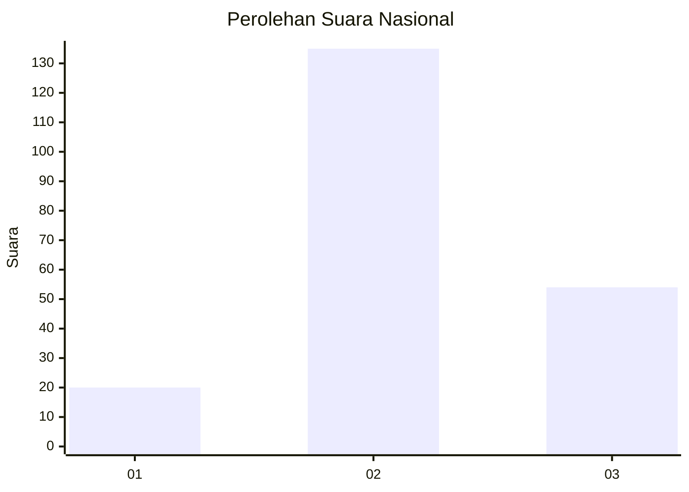
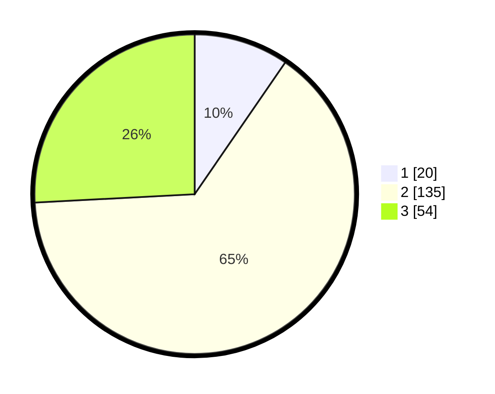

# Hasil

## Grafik

## Tabel

| No. | Nama Paslon    | Suara | Suara (raw) | Persentase |
|:--- |:-------------- | -----:| -----------:| ----------:|
| 1   | ANIES MUHAIMIN | 20    | [20][p-1]   | 9,57       |
| 2   | PRABOWO GIBRAN | 135   | [135][p-2]  | 64,59      |
| 3   | GANJAR MAHFUD  | 54    | [54][p-3]   | 25,84      |

[p-1]: https://github.com/gigit-pemilu/pemilu-2024/blob/main/pilpres/hitung-suara/sub/34-di-yogyakarta/sub/02-bantul/sub/11-dlingo/sub/2001-mangunan/sub/002-tps/sub/paslon-1.txt
[p-2]: https://github.com/gigit-pemilu/pemilu-2024/blob/main/pilpres/hitung-suara/sub/34-di-yogyakarta/sub/02-bantul/sub/11-dlingo/sub/2001-mangunan/sub/002-tps/sub/paslon-2.txt
[p-3]: https://github.com/gigit-pemilu/pemilu-2024/blob/main/pilpres/hitung-suara/sub/34-di-yogyakarta/sub/02-bantul/sub/11-dlingo/sub/2001-mangunan/sub/002-tps/sub/paslon-3.txt

## Foto C Plano

https://sirekap-obj-formc.kpu.go.id/6eca/pemilu/ppwp/34/02/11/20/01/3402112001002-20240214-224754--be9e2f60-bc3b-4aa3-85fc-86ba534c61f4.jpg

https://sirekap-obj-formc.kpu.go.id/6eca/pemilu/ppwp/34/02/11/20/01/3402112001002-20240214-224856--461f9640-f22c-43fa-9528-58ef256de99c.jpg

https://sirekap-obj-formc.kpu.go.id/6eca/pemilu/ppwp/34/02/11/20/01/3402112001002-20240214-224944--d57e76f9-c577-4685-ad24-cd2a77aa805b.jpg

## Metadata

| Key        | Value               |
| ---------- | ------------------- |
| Time Stamp | 2024-02-15 20:30:46 |

