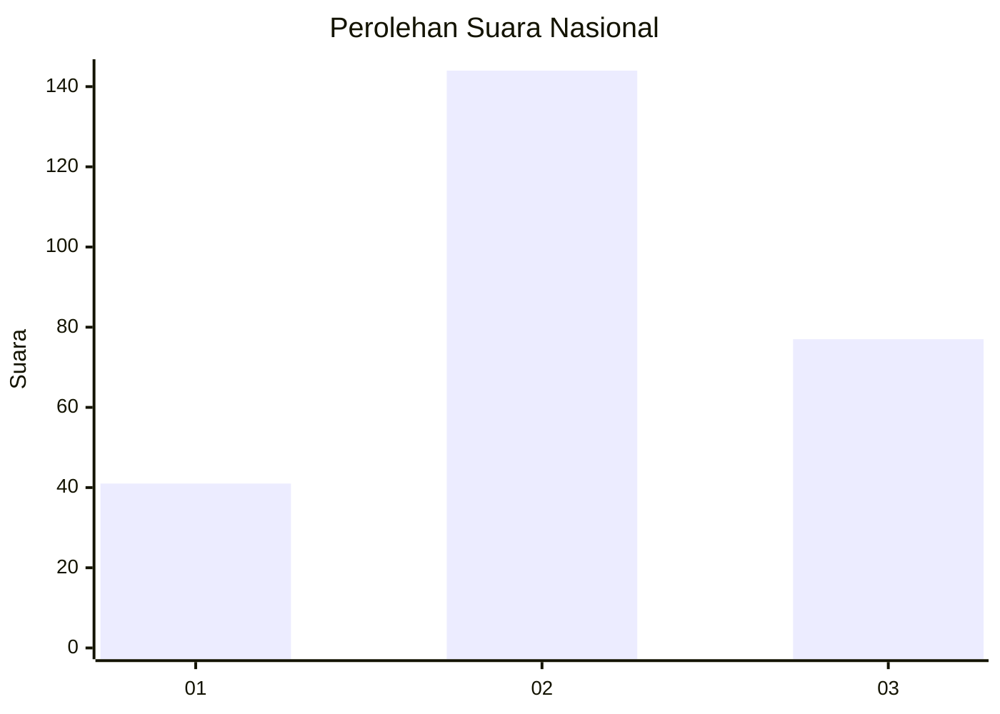
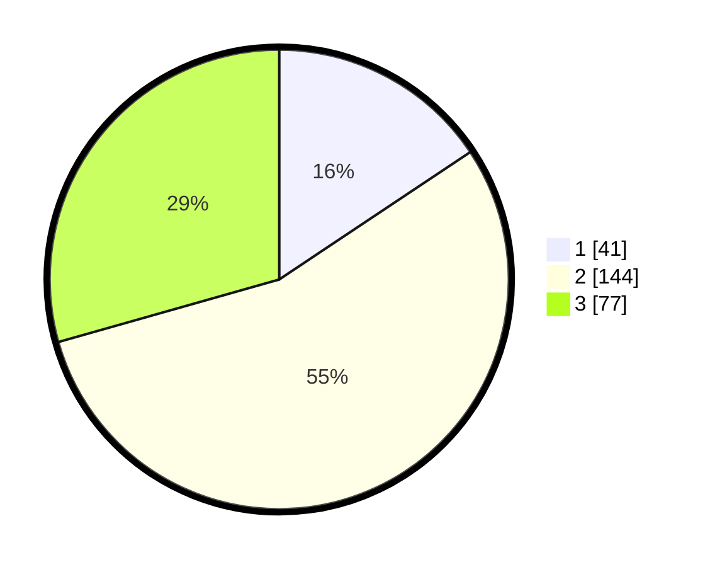

# Hasil

## Grafik

## Tabel

| No. | Nama Paslon    | Suara | Suara (raw) | Persentase |
|:--- |:-------------- | -----:| -----------:| ----------:|
| 1   | ANIES MUHAIMIN | 41    | [41][p-1]   | 15,65      |
| 2   | PRABOWO GIBRAN | 144   | [144][p-2]  | 54,96      |
| 3   | GANJAR MAHFUD  | 77    | [77][p-3]   | 29,39      |

[p-1]: https://github.com/gigit-pemilu/pemilu-2024/blob/main/pilpres/hitung-suara/sub/34-di-yogyakarta/sub/02-bantul/sub/11-dlingo/sub/2001-mangunan/sub/003-tps/sub/paslon-1.txt
[p-2]: https://github.com/gigit-pemilu/pemilu-2024/blob/main/pilpres/hitung-suara/sub/34-di-yogyakarta/sub/02-bantul/sub/11-dlingo/sub/2001-mangunan/sub/003-tps/sub/paslon-2.txt
[p-3]: https://github.com/gigit-pemilu/pemilu-2024/blob/main/pilpres/hitung-suara/sub/34-di-yogyakarta/sub/02-bantul/sub/11-dlingo/sub/2001-mangunan/sub/003-tps/sub/paslon-3.txt

## Foto C Plano

https://sirekap-obj-formc.kpu.go.id/0fe8/pemilu/ppwp/34/02/11/20/01/3402112001003-20240216-153218--2794f140-9478-47a2-a70a-b36908cef934.jpg

https://sirekap-obj-formc.kpu.go.id/0fe8/pemilu/ppwp/34/02/11/20/01/3402112001003-20240216-153219--7f1cd51c-a43b-4930-8759-904e192aadb6.jpg

https://sirekap-obj-formc.kpu.go.id/0fe8/pemilu/ppwp/34/02/11/20/01/3402112001003-20240216-153219--24b0c279-d7bc-4fa5-8e4e-1fde318ff71c.jpg

## Metadata

| Key        | Value               |
| ---------- | ------------------- |
| Time Stamp | 2024-02-16 21:01:00 |

## DATA PEMILIH TETAP

Jumlah pemilih dalam DPT: **286**.
 * L: **138**.
 * P: **148**.

## DATA PENGGUNA HAK PILIH

Jumlah pengguna hak pilih dalam DPT: **266**.
 * L: **128**.
 * P: **138**.

Jumlah pengguna hak pilih dalam DPTb: **1**.
 * L: **0**.
 * P: **1**.

Jumlah pengguna hak pilih dalam DPK: **8**.
 * L: **4**.
 * P: **4**.

Jumlah pengguna hak pilih: **275**.
 * L: **132**.
 * P: **143**.

## JUMLAH SUARA SAH DAN TIDAK SAH

JUMLAH SELURUH SUARA SAH: **262**.

JUMLAH SUARA TIDAK SAH: **13**.

JUMLAH SELURUH SUARA SAH DAN SUARA TIDAK SAH: **275**.

