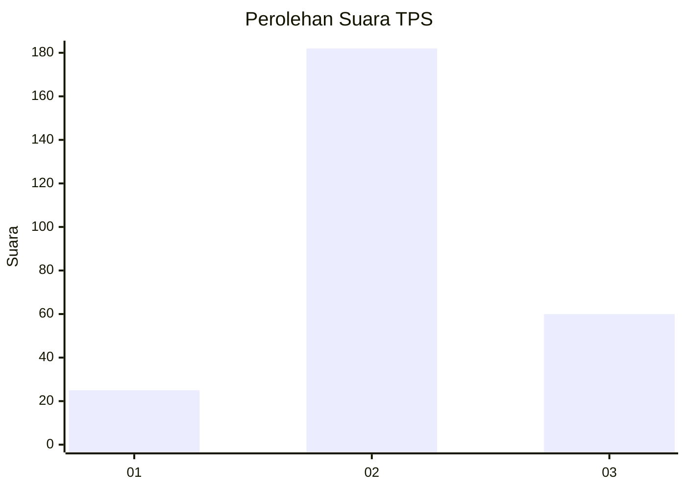
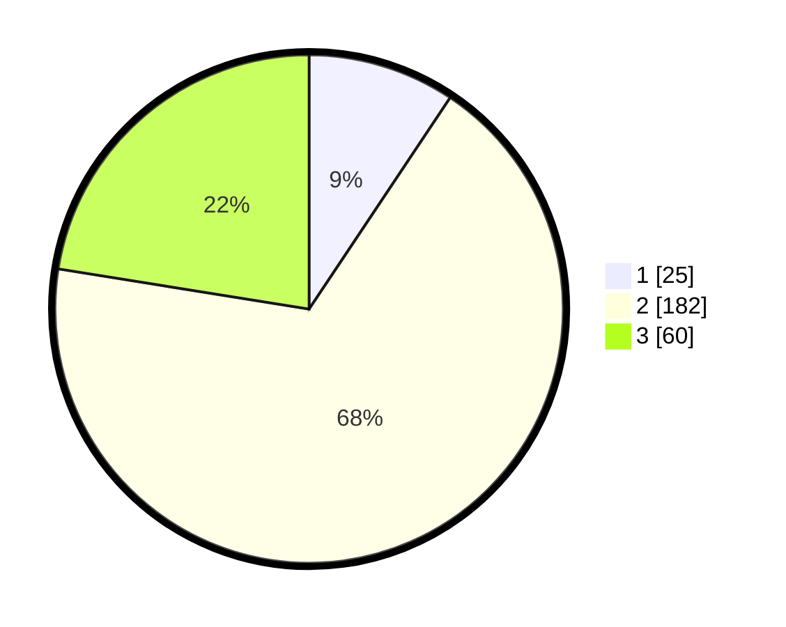

# Hasil

## Grafik

## Tabel

| No. | Nama Paslon    | Suara | Suara (raw) | Persentase |
|:--- |:-------------- | -----:| -----------:| ----------:|
| 1   | ANIES MUHAIMIN | 25    | [25][p-1]   | 9,36       |
| 2   | PRABOWO GIBRAN | 182   | [182][p-2]  | 68,16      |
| 3   | GANJAR MAHFUD  | 60    | [60][p-3]   | 22,47      |

[p-1]: https://github.com/gigit-pemilu/pemilu-2024-34-di-yogyakarta/blob/main/pilpres/hitung-suara/sub/34-di-yogyakarta/sub/02-bantul/sub/11-dlingo/sub/2001-mangunan/sub/004-tps/sub/paslon-1.txt
[p-2]: https://github.com/gigit-pemilu/pemilu-2024-34-di-yogyakarta/blob/main/pilpres/hitung-suara/sub/34-di-yogyakarta/sub/02-bantul/sub/11-dlingo/sub/2001-mangunan/sub/004-tps/sub/paslon-2.txt
[p-3]: https://github.com/gigit-pemilu/pemilu-2024-34-di-yogyakarta/blob/main/pilpres/hitung-suara/sub/34-di-yogyakarta/sub/02-bantul/sub/11-dlingo/sub/2001-mangunan/sub/004-tps/sub/paslon-3.txt

## Foto C Plano

https://sirekap-obj-formc.kpu.go.id/8d85/pemilu/ppwp/34/02/11/20/01/3402112001004-20240216-150201--667393ba-defa-4b24-b6bb-44619146f05e.jpg

https://sirekap-obj-formc.kpu.go.id/8d85/pemilu/ppwp/34/02/11/20/01/3402112001004-20240216-150202--7fa0c26b-4e45-45e5-831e-cf9a9d441898.jpg

https://sirekap-obj-formc.kpu.go.id/8d85/pemilu/ppwp/34/02/11/20/01/3402112001004-20240216-150201--c83d2217-dc06-43b6-b6d2-b8855aabae24.jpg

## Metadata

| Key        | Value               |
| ---------- | ------------------- |
| Time Stamp | 2024-02-16 21:01:00 |

## DATA PEMILIH TETAP

Jumlah pemilih dalam DPT: **290**.
 * L: **132**.
 * P: **158**.

## DATA PENGGUNA HAK PILIH

Jumlah pengguna hak pilih dalam DPT: **261**.
 * L: **119**.
 * P: **142**.

Jumlah pengguna hak pilih dalam DPTb: **6**.
 * L: **3**.
 * P: **3**.

Jumlah pengguna hak pilih dalam DPK: **3**.
 * L: **1**.
 * P: **2**.

Jumlah pengguna hak pilih: **270**.
 * L: **123**.
 * P: **147**.

## JUMLAH SUARA SAH DAN TIDAK SAH

JUMLAH SELURUH SUARA SAH: **267**.

JUMLAH SUARA TIDAK SAH: **3**.

JUMLAH SELURUH SUARA SAH DAN SUARA TIDAK SAH: **270**.

