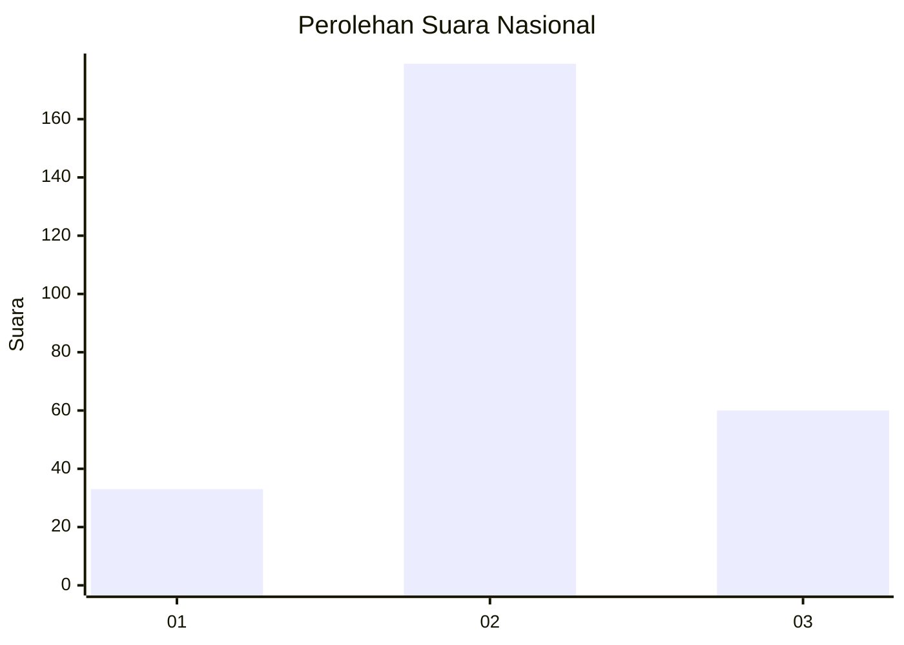
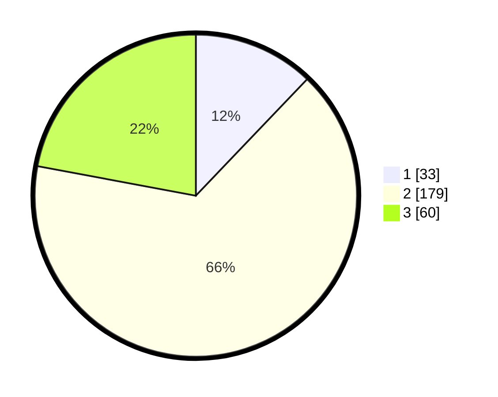

# Hasil

## Grafik

## Tabel

| No. | Nama Paslon    | Suara | Suara (raw) | Persentase |
|:--- |:-------------- | -----:| -----------:| ----------:|
| 1   | ANIES MUHAIMIN | 33    | [33][p-1]   | 12,13      |
| 2   | PRABOWO GIBRAN | 179   | [179][p-2]  | 65,81      |
| 3   | GANJAR MAHFUD  | 60    | [60][p-3]   | 22,06      |

[p-1]: https://github.com/gigit-pemilu/pemilu-2024/blob/main/pilpres/hitung-suara/sub/34-di-yogyakarta/sub/02-bantul/sub/11-dlingo/sub/2001-mangunan/sub/005-tps/sub/paslon-1.txt
[p-2]: https://github.com/gigit-pemilu/pemilu-2024/blob/main/pilpres/hitung-suara/sub/34-di-yogyakarta/sub/02-bantul/sub/11-dlingo/sub/2001-mangunan/sub/005-tps/sub/paslon-2.txt
[p-3]: https://github.com/gigit-pemilu/pemilu-2024/blob/main/pilpres/hitung-suara/sub/34-di-yogyakarta/sub/02-bantul/sub/11-dlingo/sub/2001-mangunan/sub/005-tps/sub/paslon-3.txt

## Foto C Plano

https://sirekap-obj-formc.kpu.go.id/48f6/pemilu/ppwp/34/02/11/20/01/3402112001005-20240214-214954--2d082780-6b7f-4a22-bb48-050c7710db6f.jpg

https://sirekap-obj-formc.kpu.go.id/48f6/pemilu/ppwp/34/02/11/20/01/3402112001005-20240214-215119--a99b0b94-647f-4468-8095-7945cd35499b.jpg

https://sirekap-obj-formc.kpu.go.id/48f6/pemilu/ppwp/34/02/11/20/01/3402112001005-20240214-215233--7550ce80-60b5-4b63-87c3-d75c19a305d9.jpg

## Metadata

| Key        | Value               |
| ---------- | ------------------- |
| Time Stamp | 2024-02-15 21:01:18 |

