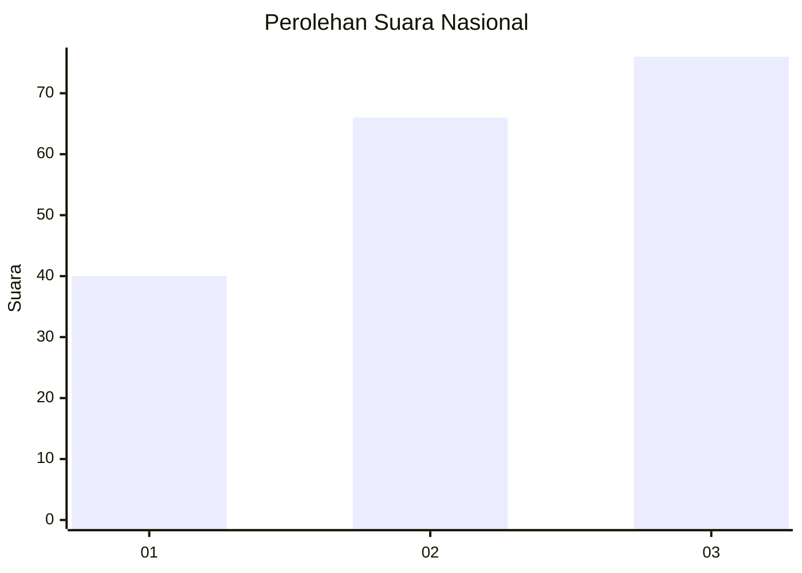
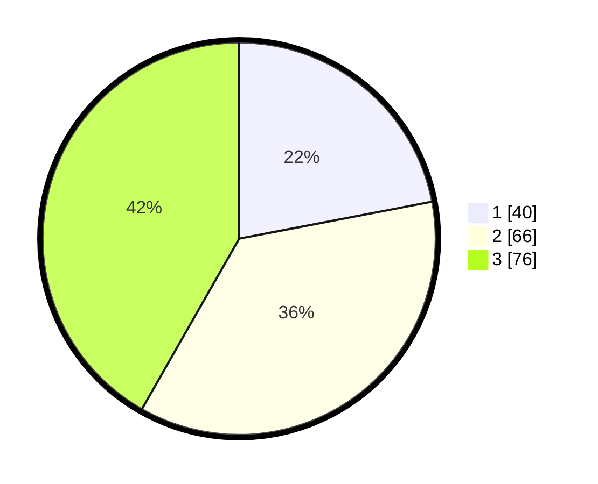

# Hasil

## Grafik

## Tabel

| No. | Nama Paslon    | Suara | Suara (raw) | Persentase |
|:--- |:-------------- | -----:| -----------:| ----------:|
| 1   | ANIES MUHAIMIN | 40    | [40][p-1]   | 21,98      |
| 2   | PRABOWO GIBRAN | 66    | [66][p-2]   | 36,26      |
| 3   | GANJAR MAHFUD  | 76    | [76][p-3]   | 41,76      |

[p-1]: https://github.com/gigit-pemilu/pemilu-2024/blob/main/pilpres/hitung-suara/sub/34-di-yogyakarta/sub/02-bantul/sub/11-dlingo/sub/2001-mangunan/sub/006-tps/sub/paslon-1.txt
[p-2]: https://github.com/gigit-pemilu/pemilu-2024/blob/main/pilpres/hitung-suara/sub/34-di-yogyakarta/sub/02-bantul/sub/11-dlingo/sub/2001-mangunan/sub/006-tps/sub/paslon-2.txt
[p-3]: https://github.com/gigit-pemilu/pemilu-2024/blob/main/pilpres/hitung-suara/sub/34-di-yogyakarta/sub/02-bantul/sub/11-dlingo/sub/2001-mangunan/sub/006-tps/sub/paslon-3.txt

## Foto C Plano

https://sirekap-obj-formc.kpu.go.id/b332/pemilu/ppwp/34/02/11/20/01/3402112001006-20240216-150416--595f14e0-fb0a-4cfd-b8c3-5c4524c22317.jpg

https://sirekap-obj-formc.kpu.go.id/b332/pemilu/ppwp/34/02/11/20/01/3402112001006-20240216-150515--4679821a-6221-4bce-a66e-1191b943667a.jpg

https://sirekap-obj-formc.kpu.go.id/b332/pemilu/ppwp/34/02/11/20/01/3402112001006-20240216-150556--9833e69d-ed40-4a54-a01b-270f08caae9c.jpg

## Metadata

| Key        | Value               |
| ---------- | ------------------- |
| Time Stamp | 2024-02-24 22:31:28 |

