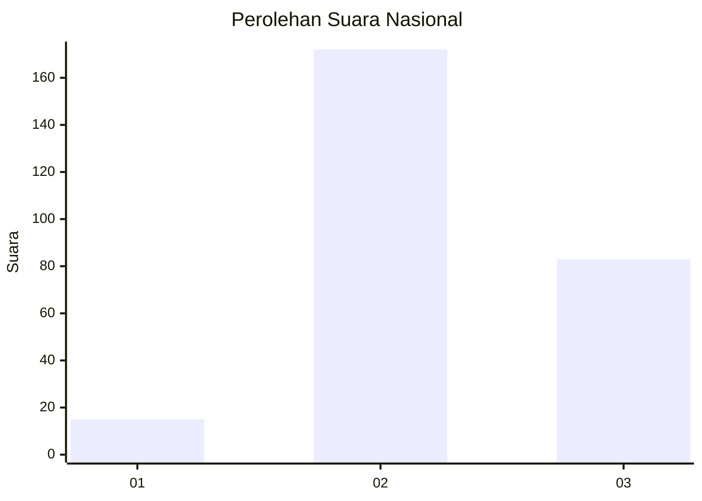
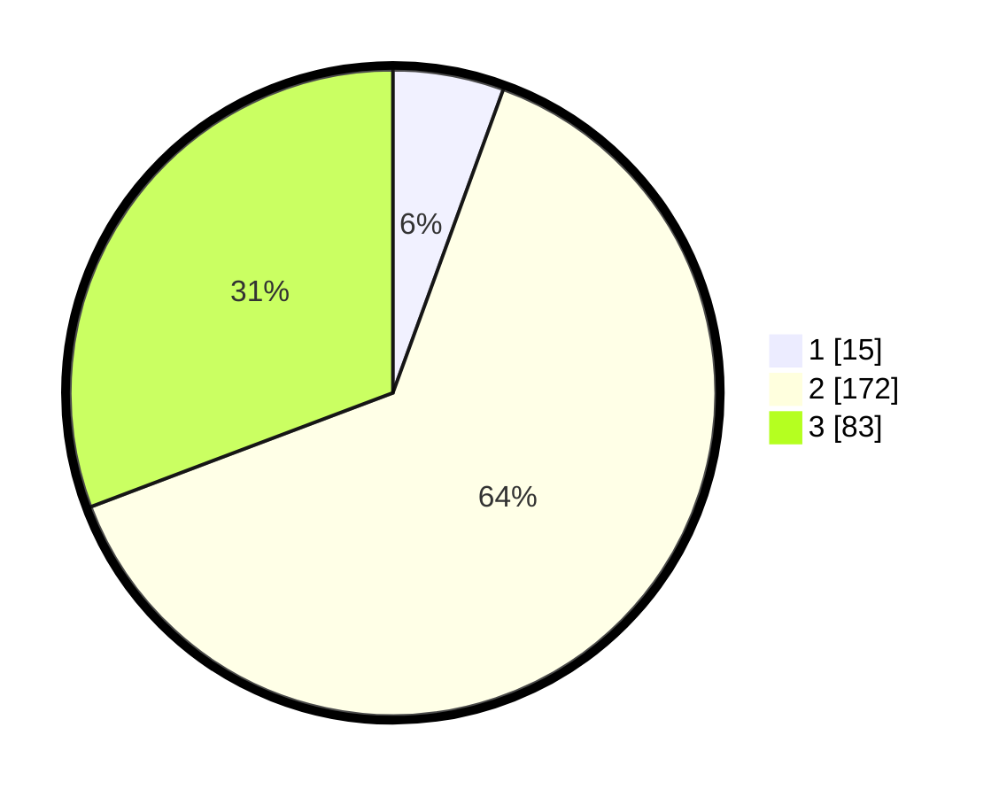

# Hasil

## Grafik

## Tabel

| No. | Nama Paslon    | Suara | Suara (raw) | Persentase |
|:--- |:-------------- | -----:| -----------:| ----------:|
| 1   | ANIES MUHAIMIN | 15    | [15][p-1]   | 5,56       |
| 2   | PRABOWO GIBRAN | 172   | [172][p-2]  | 63,70      |
| 3   | GANJAR MAHFUD  | 83    | [83][p-3]   | 30,74      |

[p-1]: https://github.com/gigit-pemilu/pemilu-2024/blob/main/pilpres/hitung-suara/sub/34-di-yogyakarta/sub/02-bantul/sub/11-dlingo/sub/2001-mangunan/sub/010-tps/sub/paslon-1.txt
[p-2]: https://github.com/gigit-pemilu/pemilu-2024/blob/main/pilpres/hitung-suara/sub/34-di-yogyakarta/sub/02-bantul/sub/11-dlingo/sub/2001-mangunan/sub/010-tps/sub/paslon-2.txt
[p-3]: https://github.com/gigit-pemilu/pemilu-2024/blob/main/pilpres/hitung-suara/sub/34-di-yogyakarta/sub/02-bantul/sub/11-dlingo/sub/2001-mangunan/sub/010-tps/sub/paslon-3.txt

## Foto C Plano

https://sirekap-obj-formc.kpu.go.id/de0c/pemilu/ppwp/34/02/11/20/01/3402112001010-20240216-145903--3c76b188-1bce-4c26-ba8f-5c30e234db0f.jpg

https://sirekap-obj-formc.kpu.go.id/de0c/pemilu/ppwp/34/02/11/20/01/3402112001010-20240216-150010--08670e32-059b-4a58-b6fe-64c26710c3fc.jpg

https://sirekap-obj-formc.kpu.go.id/de0c/pemilu/ppwp/34/02/11/20/01/3402112001010-20240216-150106--1c0353b2-fc77-452e-97a1-e7c8675a16b3.jpg

## Metadata

| Key        | Value               |
| ---------- | ------------------- |
| Time Stamp | 2024-02-24 22:31:28 |

