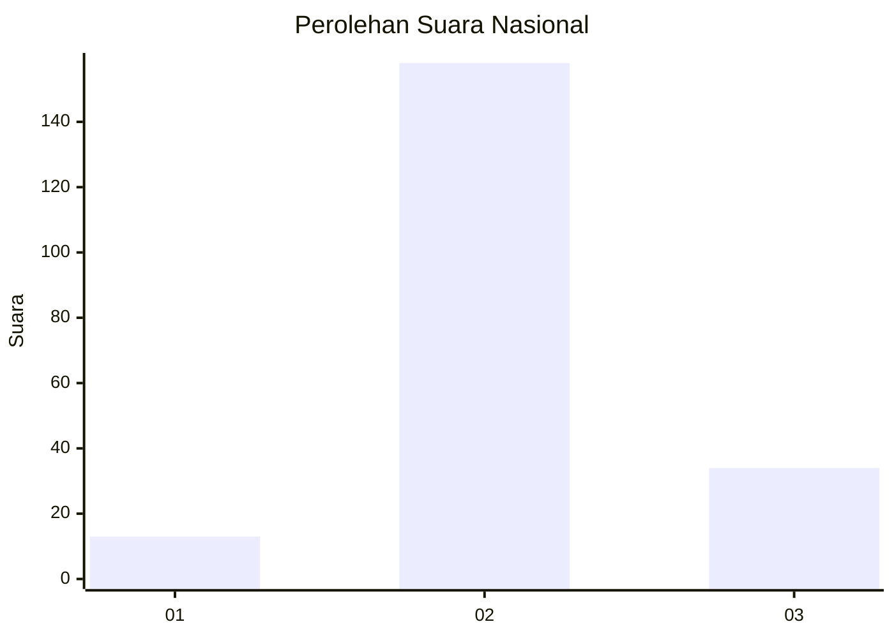
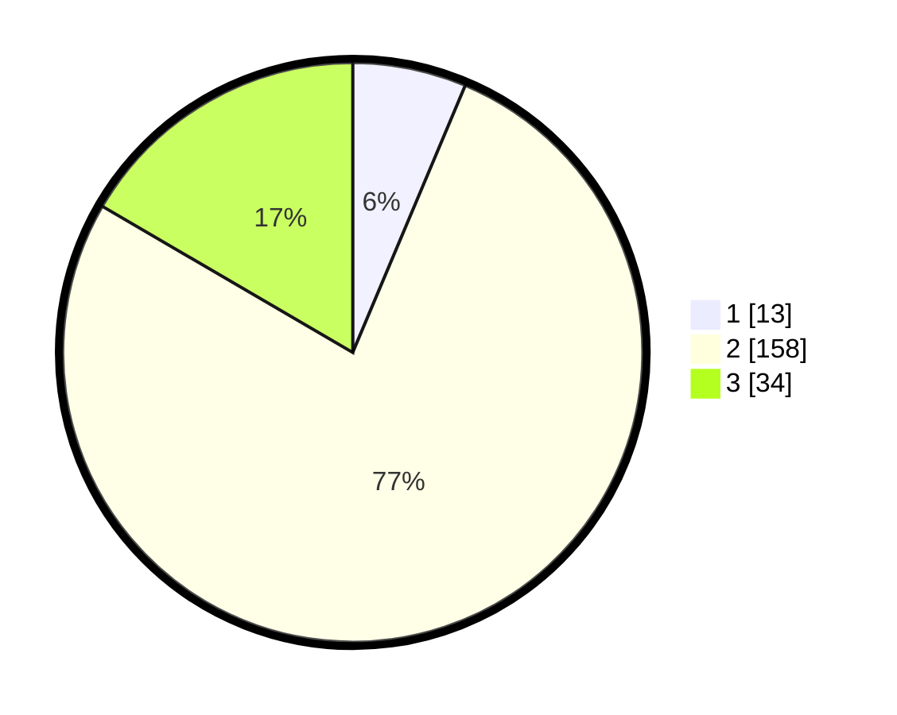

# Hasil

## Grafik

## Tabel

| No. | Nama Paslon    | Suara | Suara (raw) | Persentase |
|:--- |:-------------- | -----:| -----------:| ----------:|
| 1   | ANIES MUHAIMIN | 13    | [13][p-1]   | 6,34       |
| 2   | PRABOWO GIBRAN | 158   | [158][p-2]  | 77,07      |
| 3   | GANJAR MAHFUD  | 34    | [34][p-3]   | 16,59      |

[p-1]: https://github.com/gigit-pemilu/pemilu-2024/blob/main/pilpres/hitung-suara/sub/34-di-yogyakarta/sub/02-bantul/sub/11-dlingo/sub/2001-mangunan/sub/012-tps/sub/paslon-1.txt
[p-2]: https://github.com/gigit-pemilu/pemilu-2024/blob/main/pilpres/hitung-suara/sub/34-di-yogyakarta/sub/02-bantul/sub/11-dlingo/sub/2001-mangunan/sub/012-tps/sub/paslon-2.txt
[p-3]: https://github.com/gigit-pemilu/pemilu-2024/blob/main/pilpres/hitung-suara/sub/34-di-yogyakarta/sub/02-bantul/sub/11-dlingo/sub/2001-mangunan/sub/012-tps/sub/paslon-3.txt

## Foto C Plano

https://sirekap-obj-formc.kpu.go.id/76ac/pemilu/ppwp/34/02/11/20/01/3402112001012-20240214-232514--64af2340-4462-47fe-92ac-c91e0af5c27b.jpg

https://sirekap-obj-formc.kpu.go.id/76ac/pemilu/ppwp/34/02/11/20/01/3402112001012-20240214-232744--b325eb7e-38dc-47fc-8ee8-1eb4abcd9206.jpg

https://sirekap-obj-formc.kpu.go.id/76ac/pemilu/ppwp/34/02/11/20/01/3402112001012-20240214-232937--75b922d4-d7c9-4749-928f-25e38c7dfb84.jpg

## Metadata

| Key        | Value               |
| ---------- | ------------------- |
| Time Stamp | 2024-02-15 12:00:28 |

