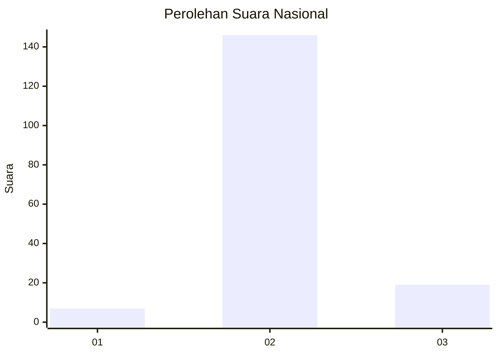
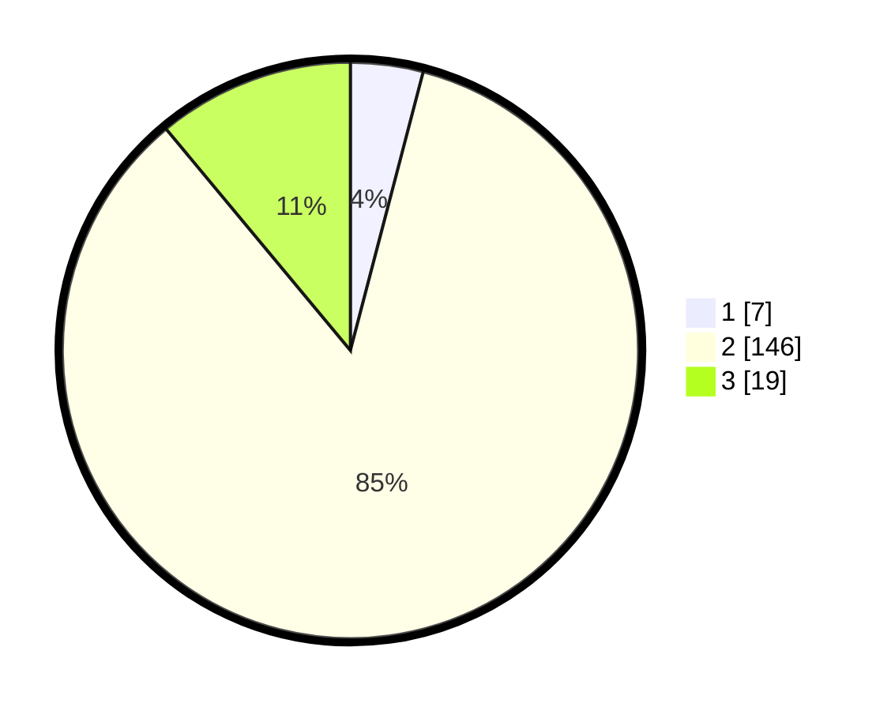

# Hasil

## Grafik

## Tabel

| No. | Nama Paslon    | Suara | Suara (raw) | Persentase |
|:--- |:-------------- | -----:| -----------:| ----------:|
| 1   | ANIES MUHAIMIN | 7     | [7][p-1]    | 4,07       |
| 2   | PRABOWO GIBRAN | 146   | [146][p-2]  | 84,88      |
| 3   | GANJAR MAHFUD  | 19    | [19][p-3]   | 11,05      |

[p-1]: https://github.com/gigit-pemilu/pemilu-2024/blob/main/pilpres/hitung-suara/sub/34-di-yogyakarta/sub/02-bantul/sub/11-dlingo/sub/2001-mangunan/sub/014-tps/sub/paslon-1.txt
[p-2]: https://github.com/gigit-pemilu/pemilu-2024/blob/main/pilpres/hitung-suara/sub/34-di-yogyakarta/sub/02-bantul/sub/11-dlingo/sub/2001-mangunan/sub/014-tps/sub/paslon-2.txt
[p-3]: https://github.com/gigit-pemilu/pemilu-2024/blob/main/pilpres/hitung-suara/sub/34-di-yogyakarta/sub/02-bantul/sub/11-dlingo/sub/2001-mangunan/sub/014-tps/sub/paslon-3.txt

## Foto C Plano

https://sirekap-obj-formc.kpu.go.id/2ce3/pemilu/ppwp/34/02/11/20/01/3402112001014-20240214-224410--223afe87-9be8-45a4-a4bf-9152e74d8f68.jpg

https://sirekap-obj-formc.kpu.go.id/2ce3/pemilu/ppwp/34/02/11/20/01/3402112001014-20240214-223912--25c582e4-cd28-4732-bbf4-f522680181b4.jpg

https://sirekap-obj-formc.kpu.go.id/2ce3/pemilu/ppwp/34/02/11/20/01/3402112001014-20240214-224542--09459d00-a41e-4d8d-9138-a79a0a5538e2.jpg

## Metadata

| Key        | Value               |
| ---------- | ------------------- |
| Time Stamp | 2024-02-15 21:01:18 |

