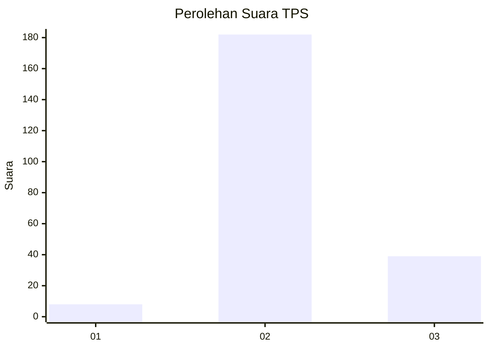

# Hasil

## Grafik

## Tabel

| No. | Nama Paslon    | Suara | Suara (raw) | Persentase |
|:--- |:-------------- | -----:| -----------:| ----------:|
| 1   | ANIES MUHAIMIN | 8     | [8][p-1]    | 3,49       |
| 2   | PRABOWO GIBRAN | 182   | [182][p-2]  | 79,48      |
| 3   | GANJAR MAHFUD  | 39    | [39][p-3]   | 17,03      |

[p-1]: https://github.com/gigit-pemilu/pemilu-2024-34-di-yogyakarta/blob/main/pilpres/hitung-suara/sub/34-di-yogyakarta/sub/02-bantul/sub/11-dlingo/sub/2001-mangunan/sub/015-tps/sub/paslon-1.txt
[p-2]: https://github.com/gigit-pemilu/pemilu-2024-34-di-yogyakarta/blob/main/pilpres/hitung-suara/sub/34-di-yogyakarta/sub/02-bantul/sub/11-dlingo/sub/2001-mangunan/sub/015-tps/sub/paslon-2.txt
[p-3]: https://github.com/gigit-pemilu/pemilu-2024-34-di-yogyakarta/blob/main/pilpres/hitung-suara/sub/34-di-yogyakarta/sub/02-bantul/sub/11-dlingo/sub/2001-mangunan/sub/015-tps/sub/paslon-3.txt

## Foto C Plano

https://sirekap-obj-formc.kpu.go.id/935b/pemilu/ppwp/34/02/11/20/01/3402112001015-20240216-144700--9c57dc66-66e2-4804-80dd-bc3864fca266.jpg

https://sirekap-obj-formc.kpu.go.id/935b/pemilu/ppwp/34/02/11/20/01/3402112001015-20240216-144237--c195c9a5-156a-421a-9d20-861b931581e6.jpg

https://sirekap-obj-formc.kpu.go.id/935b/pemilu/ppwp/34/02/11/20/01/3402112001015-20240216-144505--a9655259-0bf5-4367-9ba0-e81c16cf9941.jpg

## Metadata

| Key        | Value               |
| ---------- | ------------------- |
| Time Stamp | 2024-02-22 15:00:00 |

