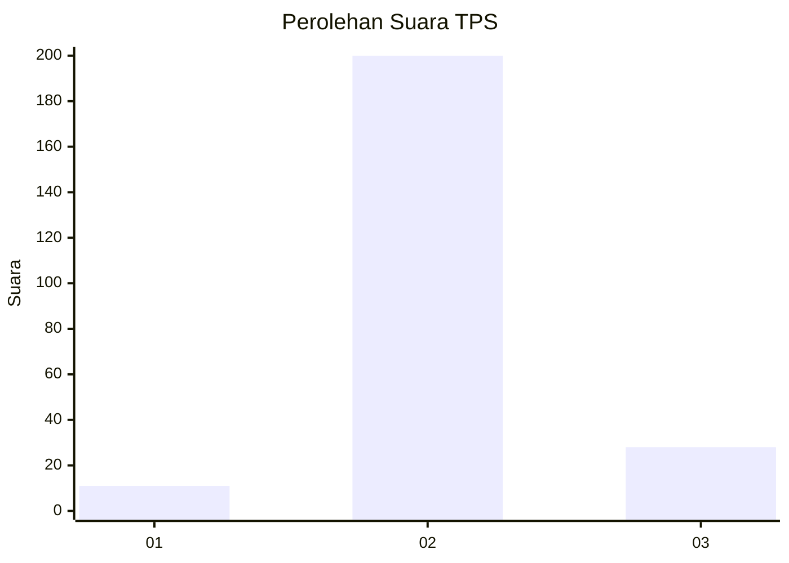
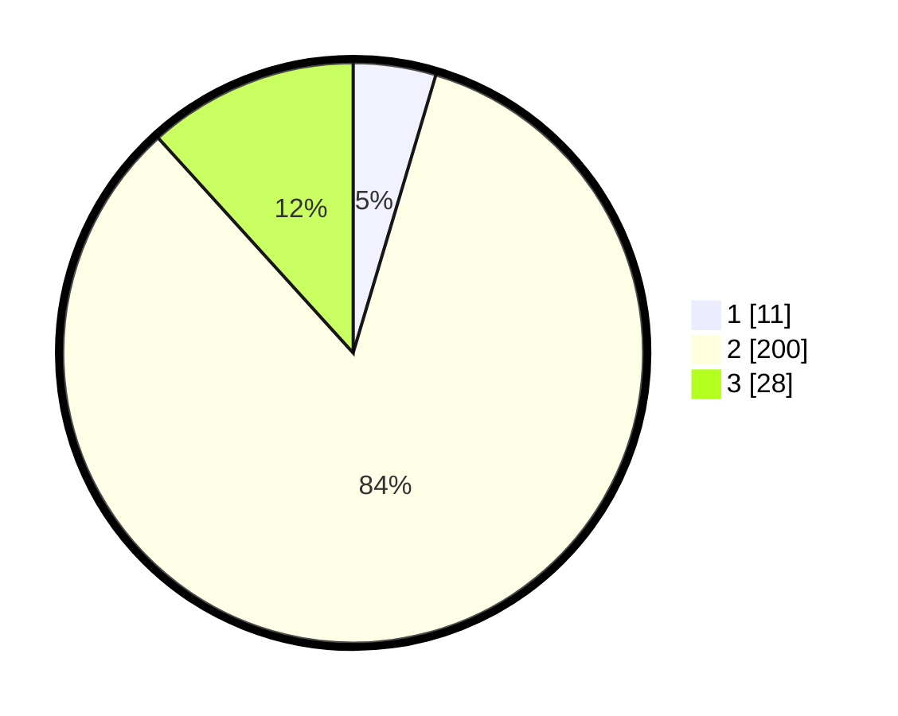

# Hasil

## Grafik

## Tabel

| No. | Nama Paslon    | Suara | Suara (raw) | Persentase |
|:--- |:-------------- | -----:| -----------:| ----------:|
| 1   | ANIES MUHAIMIN | 11    | [11][p-1]   | 4,60       |
| 2   | PRABOWO GIBRAN | 200   | [200][p-2]  | 83,68      |
| 3   | GANJAR MAHFUD  | 28    | [28][p-3]   | 11,72      |

[p-1]: https://github.com/gigit-pemilu/pemilu-2024-34-di-yogyakarta/blob/main/pilpres/hitung-suara/sub/34-di-yogyakarta/sub/02-bantul/sub/11-dlingo/sub/2001-mangunan/sub/016-tps/sub/paslon-1.txt
[p-2]: https://github.com/gigit-pemilu/pemilu-2024-34-di-yogyakarta/blob/main/pilpres/hitung-suara/sub/34-di-yogyakarta/sub/02-bantul/sub/11-dlingo/sub/2001-mangunan/sub/016-tps/sub/paslon-2.txt
[p-3]: https://github.com/gigit-pemilu/pemilu-2024-34-di-yogyakarta/blob/main/pilpres/hitung-suara/sub/34-di-yogyakarta/sub/02-bantul/sub/11-dlingo/sub/2001-mangunan/sub/016-tps/sub/paslon-3.txt

## Foto C Plano

https://sirekap-obj-formc.kpu.go.id/bfa1/pemilu/ppwp/34/02/11/20/01/3402112001016-20240215-172932--64583719-5168-4e28-8162-4d52dcc656b4.jpg

https://sirekap-obj-formc.kpu.go.id/bfa1/pemilu/ppwp/34/02/11/20/01/3402112001016-20240215-173120--99ab7856-411f-460e-b2a5-ddf0e04051cb.jpg

https://sirekap-obj-formc.kpu.go.id/bfa1/pemilu/ppwp/34/02/11/20/01/3402112001016-20240215-173243--22b278cd-9baa-4fed-939d-b9c295f0f33f.jpg

## Metadata

| Key        | Value               |
| ---------- | ------------------- |
| Time Stamp | 2024-02-24 22:31:28 |

