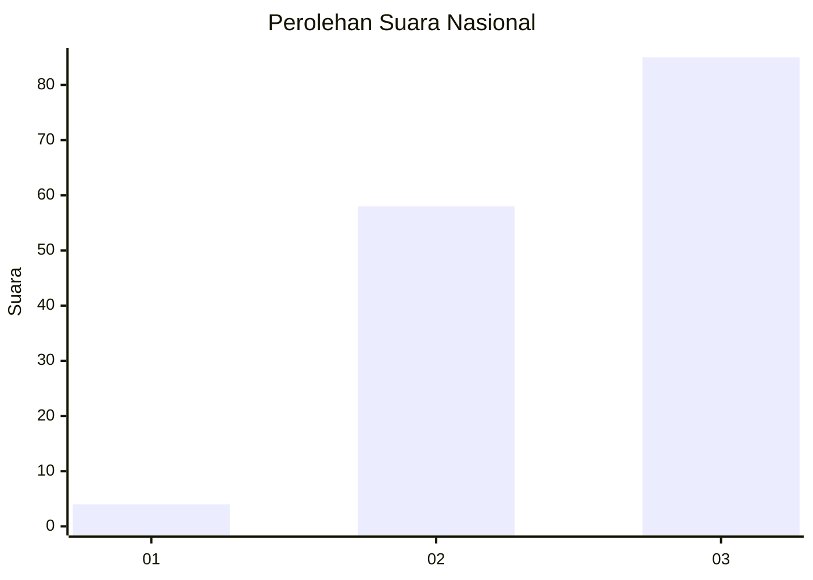
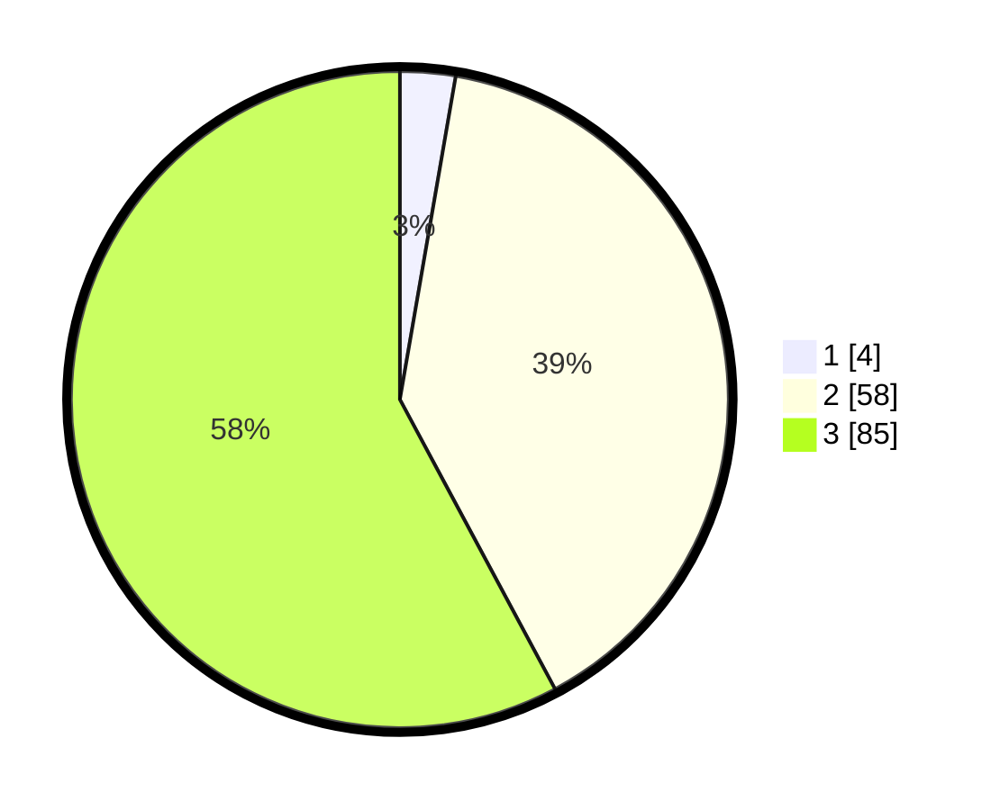

# Hasil

## Grafik

## Tabel

| No. | Nama Paslon    | Suara | Suara (raw) | Persentase |
|:--- |:-------------- | -----:| -----------:| ----------:|
| 1   | ANIES MUHAIMIN | 4     | [4][p-1]    | 2,72       |
| 2   | PRABOWO GIBRAN | 58    | [58][p-2]   | 39,46      |
| 3   | GANJAR MAHFUD  | 85    | [85][p-3]   | 57,82      |

[p-1]: https://github.com/gigit-pemilu/pemilu-2024/blob/main/pilpres/hitung-suara/sub/34-di-yogyakarta/sub/02-bantul/sub/11-dlingo/sub/2002-muntuk/sub/001-tps/sub/paslon-1.txt
[p-2]: https://github.com/gigit-pemilu/pemilu-2024/blob/main/pilpres/hitung-suara/sub/34-di-yogyakarta/sub/02-bantul/sub/11-dlingo/sub/2002-muntuk/sub/001-tps/sub/paslon-2.txt
[p-3]: https://github.com/gigit-pemilu/pemilu-2024/blob/main/pilpres/hitung-suara/sub/34-di-yogyakarta/sub/02-bantul/sub/11-dlingo/sub/2002-muntuk/sub/001-tps/sub/paslon-3.txt

## Foto C Plano

https://sirekap-obj-formc.kpu.go.id/2c84/pemilu/ppwp/34/02/11/20/02/3402112002001-20240216-140759--8b01bc4a-c635-46b8-a1a2-dc8c43a35fb7.jpg

https://sirekap-obj-formc.kpu.go.id/2c84/pemilu/ppwp/34/02/11/20/02/3402112002001-20240216-140845--d28ab9b6-8046-4803-a57d-124cf1464b99.jpg

https://sirekap-obj-formc.kpu.go.id/2c84/pemilu/ppwp/34/02/11/20/02/3402112002001-20240216-141128--2ad4ec30-3418-4d4d-8772-0cadc5008c59.jpg

## Metadata

| Key        | Value               |
| ---------- | ------------------- |
| Time Stamp | 2024-02-16 14:30:33 |

