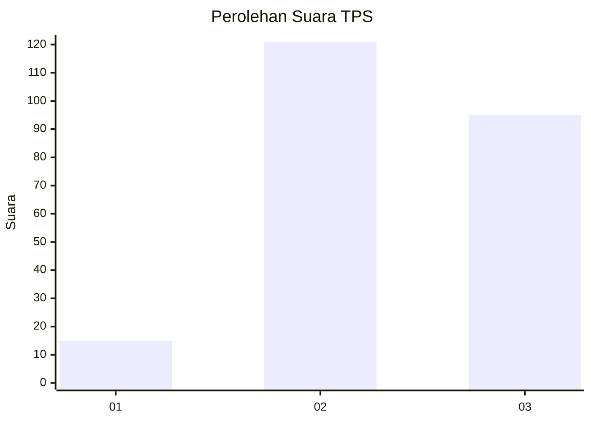
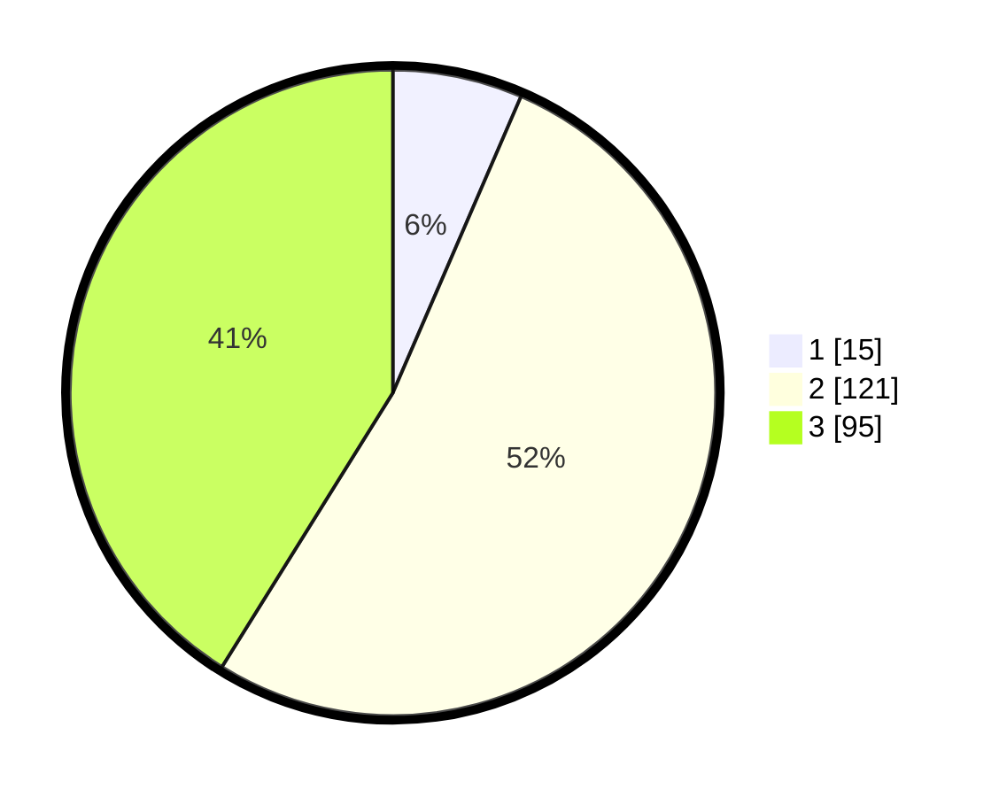

# Hasil

## Grafik

## Tabel

| No. | Nama Paslon    | Suara | Suara (raw) | Persentase |
|:--- |:-------------- | -----:| -----------:| ----------:|
| 1   | ANIES MUHAIMIN | 15    | [15][p-1]   | 6,49       |
| 2   | PRABOWO GIBRAN | 121   | [121][p-2]  | 52,38      |
| 3   | GANJAR MAHFUD  | 95    | [95][p-3]   | 41,13      |

[p-1]: https://github.com/gigit-pemilu/pemilu-2024-34-di-yogyakarta/blob/main/pilpres/hitung-suara/sub/34-di-yogyakarta/sub/02-bantul/sub/11-dlingo/sub/2002-muntuk/sub/008-tps/sub/paslon-1.txt
[p-2]: https://github.com/gigit-pemilu/pemilu-2024-34-di-yogyakarta/blob/main/pilpres/hitung-suara/sub/34-di-yogyakarta/sub/02-bantul/sub/11-dlingo/sub/2002-muntuk/sub/008-tps/sub/paslon-2.txt
[p-3]: https://github.com/gigit-pemilu/pemilu-2024-34-di-yogyakarta/blob/main/pilpres/hitung-suara/sub/34-di-yogyakarta/sub/02-bantul/sub/11-dlingo/sub/2002-muntuk/sub/008-tps/sub/paslon-3.txt

## Foto C Plano

https://sirekap-obj-formc.kpu.go.id/b3ce/pemilu/ppwp/34/02/11/20/02/3402112002008-20240214-215130--f740ae5d-f142-494e-8b82-3ce52e8609f5.jpg

https://sirekap-obj-formc.kpu.go.id/b3ce/pemilu/ppwp/34/02/11/20/02/3402112002008-20240214-214810--edcd1018-efd3-4caa-a38c-9dc68f4d7f7c.jpg

https://sirekap-obj-formc.kpu.go.id/b3ce/pemilu/ppwp/34/02/11/20/02/3402112002008-20240214-215347--d5ae26f5-6bd6-4b97-b0f0-0571ff92cbb6.jpg

## Metadata

| Key        | Value               |
| ---------- | ------------------- |
| Time Stamp | 2024-02-15 20:30:46 |

