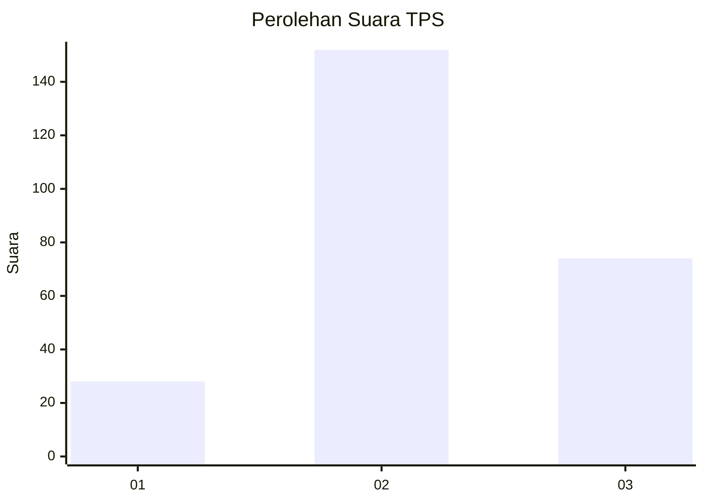
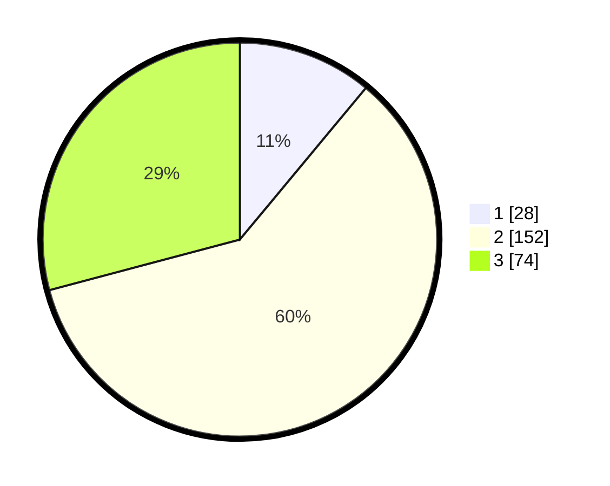

# Hasil

## Grafik

## Tabel

| No. | Nama Paslon    | Suara | Suara (raw) | Persentase |
|:--- |:-------------- | -----:| -----------:| ----------:|
| 1   | ANIES MUHAIMIN | 28    | [28][p-1]   | 11,02      |
| 2   | PRABOWO GIBRAN | 152   | [152][p-2]  | 59,84      |
| 3   | GANJAR MAHFUD  | 74    | [74][p-3]   | 29,13      |

[p-1]: https://github.com/gigit-pemilu/pemilu-2024-34-di-yogyakarta/blob/main/pilpres/hitung-suara/sub/34-di-yogyakarta/sub/02-bantul/sub/11-dlingo/sub/2002-muntuk/sub/011-tps/sub/paslon-1.txt
[p-2]: https://github.com/gigit-pemilu/pemilu-2024-34-di-yogyakarta/blob/main/pilpres/hitung-suara/sub/34-di-yogyakarta/sub/02-bantul/sub/11-dlingo/sub/2002-muntuk/sub/011-tps/sub/paslon-2.txt
[p-3]: https://github.com/gigit-pemilu/pemilu-2024-34-di-yogyakarta/blob/main/pilpres/hitung-suara/sub/34-di-yogyakarta/sub/02-bantul/sub/11-dlingo/sub/2002-muntuk/sub/011-tps/sub/paslon-3.txt

## Foto C Plano

https://sirekap-obj-formc.kpu.go.id/a85c/pemilu/ppwp/34/02/11/20/02/3402112002011-20240216-144834--f339c2e4-c4f3-4c18-8f49-fb42d60359fd.jpg

https://sirekap-obj-formc.kpu.go.id/a85c/pemilu/ppwp/34/02/11/20/02/3402112002011-20240216-144931--98b9e91e-84bf-42a7-94cc-8ce5daf3bd28.jpg

https://sirekap-obj-formc.kpu.go.id/a85c/pemilu/ppwp/34/02/11/20/02/3402112002011-20240216-145039--36378939-4cd3-473b-8418-a69d3888b958.jpg

## Metadata

| Key        | Value               |
| ---------- | ------------------- |
| Time Stamp | 2024-02-22 15:00:00 |

