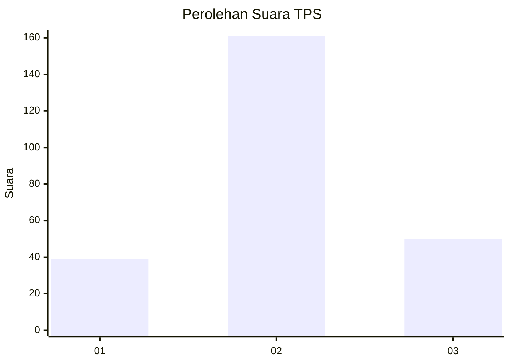
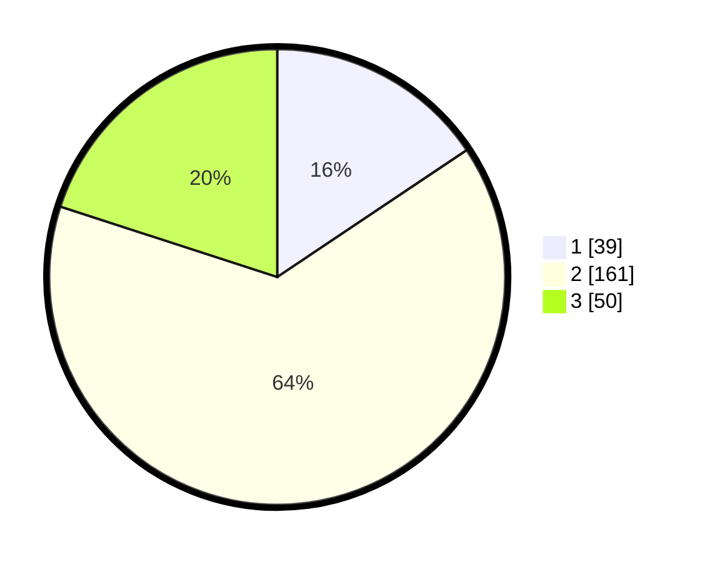

# Hasil

## Grafik

## Tabel

| No. | Nama Paslon    | Suara | Suara (raw) | Persentase |
|:--- |:-------------- | -----:| -----------:| ----------:|
| 1   | ANIES MUHAIMIN | 39    | [39][p-1]   | 15,60      |
| 2   | PRABOWO GIBRAN | 161   | [161][p-2]  | 64,40      |
| 3   | GANJAR MAHFUD  | 50    | [50][p-3]   | 20,00      |

[p-1]: https://github.com/gigit-pemilu/pemilu-2024-34-di-yogyakarta/blob/main/pilpres/hitung-suara/sub/34-di-yogyakarta/sub/02-bantul/sub/11-dlingo/sub/2002-muntuk/sub/013-tps/sub/paslon-1.txt
[p-2]: https://github.com/gigit-pemilu/pemilu-2024-34-di-yogyakarta/blob/main/pilpres/hitung-suara/sub/34-di-yogyakarta/sub/02-bantul/sub/11-dlingo/sub/2002-muntuk/sub/013-tps/sub/paslon-2.txt
[p-3]: https://github.com/gigit-pemilu/pemilu-2024-34-di-yogyakarta/blob/main/pilpres/hitung-suara/sub/34-di-yogyakarta/sub/02-bantul/sub/11-dlingo/sub/2002-muntuk/sub/013-tps/sub/paslon-3.txt

## Foto C Plano

https://sirekap-obj-formc.kpu.go.id/9bda/pemilu/ppwp/34/02/11/20/02/3402112002013-20240216-145434--5152d2d9-74a6-471e-b7a4-92f78a8ddc3c.jpg

https://sirekap-obj-formc.kpu.go.id/9bda/pemilu/ppwp/34/02/11/20/02/3402112002013-20240216-145510--cddd317e-ea21-4944-81d8-cba9dc3ef5e9.jpg

https://sirekap-obj-formc.kpu.go.id/9bda/pemilu/ppwp/34/02/11/20/02/3402112002013-20240216-145636--8db711c8-1e04-4e28-b092-40a4e7c14720.jpg

## Metadata

| Key        | Value               |
| ---------- | ------------------- |
| Time Stamp | 2024-02-16 16:25:10 |

