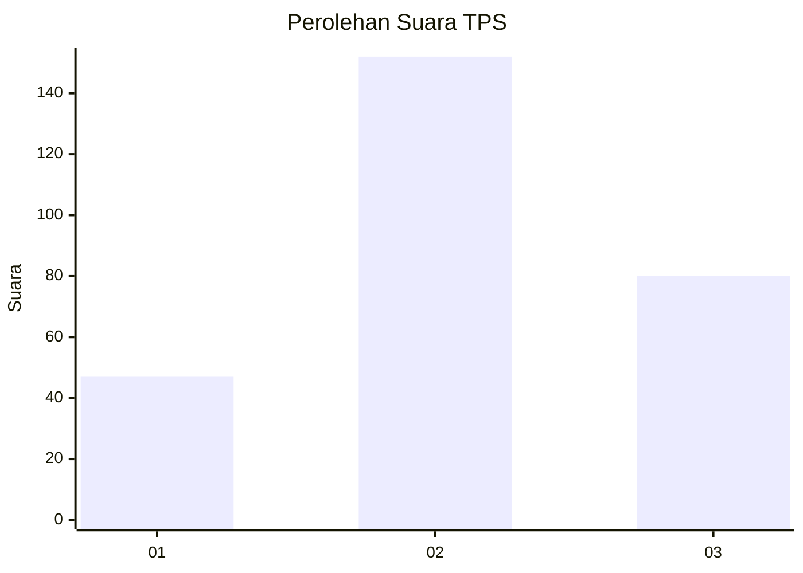
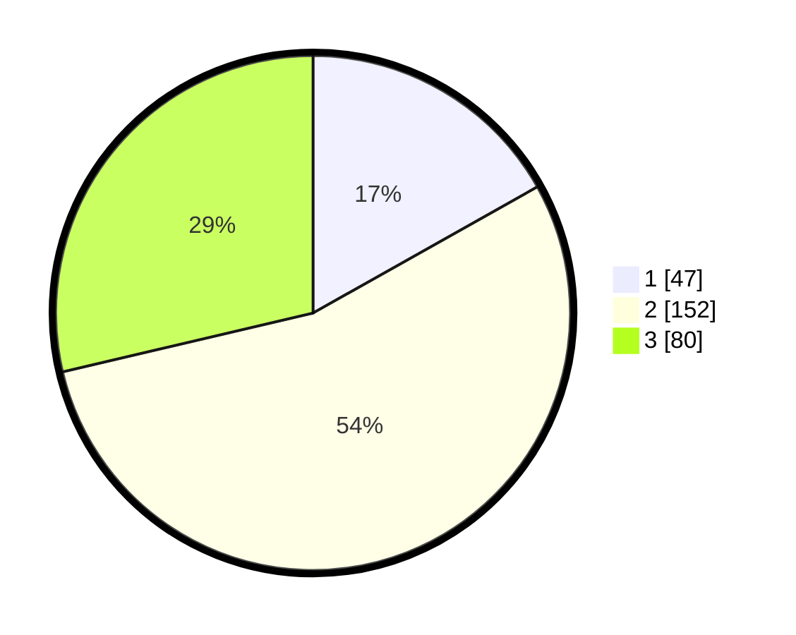

# Hasil

## Grafik

## Tabel

| No. | Nama Paslon    | Suara | Suara (raw) | Persentase |
|:--- |:-------------- | -----:| -----------:| ----------:|
| 1   | ANIES MUHAIMIN | 47    | [47][p-1]   | 16,85      |
| 2   | PRABOWO GIBRAN | 152   | [152][p-2]  | 54,48      |
| 3   | GANJAR MAHFUD  | 80    | [80][p-3]   | 28,67      |

[p-1]: https://github.com/gigit-pemilu/pemilu-2024-34-di-yogyakarta/blob/main/pilpres/hitung-suara/sub/34-di-yogyakarta/sub/02-bantul/sub/11-dlingo/sub/2002-muntuk/sub/027-tps/sub/paslon-1.txt
[p-2]: https://github.com/gigit-pemilu/pemilu-2024-34-di-yogyakarta/blob/main/pilpres/hitung-suara/sub/34-di-yogyakarta/sub/02-bantul/sub/11-dlingo/sub/2002-muntuk/sub/027-tps/sub/paslon-2.txt
[p-3]: https://github.com/gigit-pemilu/pemilu-2024-34-di-yogyakarta/blob/main/pilpres/hitung-suara/sub/34-di-yogyakarta/sub/02-bantul/sub/11-dlingo/sub/2002-muntuk/sub/027-tps/sub/paslon-3.txt

## Foto C Plano

https://sirekap-obj-formc.kpu.go.id/c974/pemilu/ppwp/34/02/11/20/02/3402112002027-20240216-154230--4a18398b-a07f-4a70-8e3e-8697315cbdba.jpg

https://sirekap-obj-formc.kpu.go.id/c974/pemilu/ppwp/34/02/11/20/02/3402112002027-20240216-154348--453ce0dc-5f9f-40a0-8389-c108a5bcb9ef.jpg

https://sirekap-obj-formc.kpu.go.id/c974/pemilu/ppwp/34/02/11/20/02/3402112002027-20240216-154534--daf7fa0a-9882-4223-b9e2-e3ae5a9ae950.jpg

## Metadata

| Key        | Value               |
| ---------- | ------------------- |
| Time Stamp | 2024-02-22 15:00:00 |

