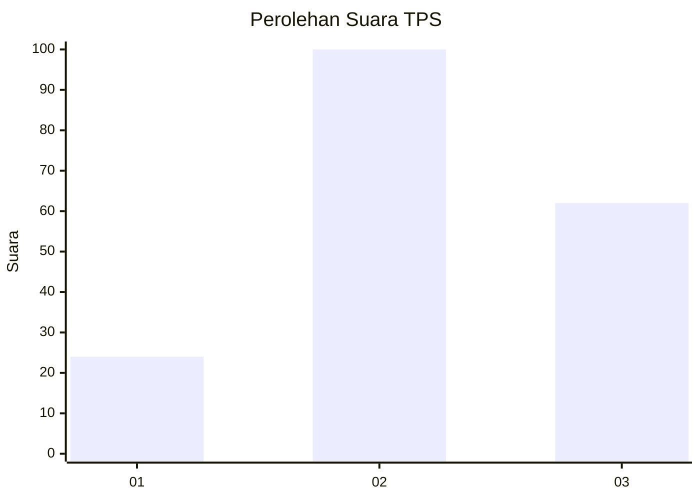
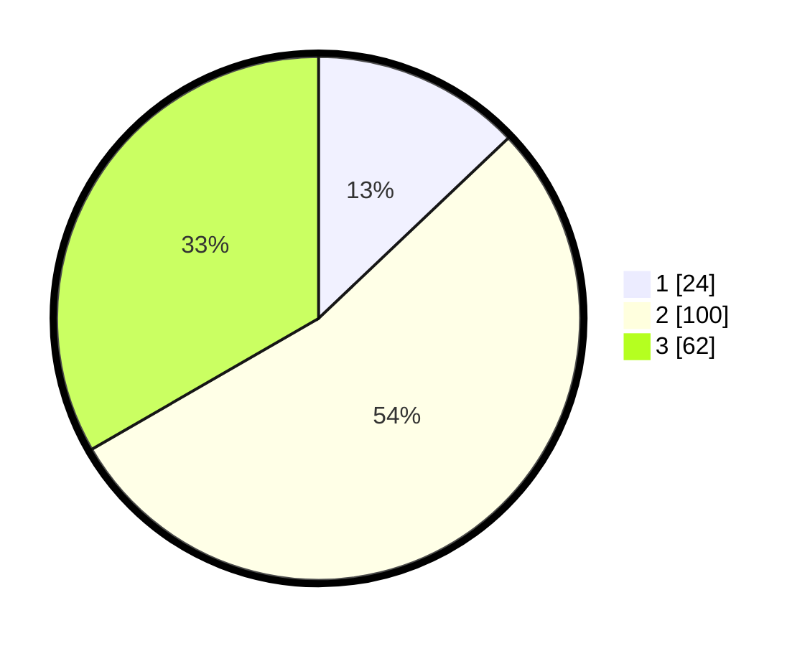

# Hasil

## Grafik

## Tabel

| No. | Nama Paslon    | Suara | Suara (raw) | Persentase |
|:--- |:-------------- | -----:| -----------:| ----------:|
| 1   | ANIES MUHAIMIN | 24    | [24][p-1]   | 12,90      |
| 2   | PRABOWO GIBRAN | 100   | [100][p-2]  | 53,76      |
| 3   | GANJAR MAHFUD  | 62    | [62][p-3]   | 33,33      |

[p-1]: https://github.com/gigit-pemilu/pemilu-2024-34-di-yogyakarta/blob/main/pilpres/hitung-suara/sub/34-di-yogyakarta/sub/02-bantul/sub/11-dlingo/sub/2003-dlingo/sub/002-tps/sub/paslon-1.txt
[p-2]: https://github.com/gigit-pemilu/pemilu-2024-34-di-yogyakarta/blob/main/pilpres/hitung-suara/sub/34-di-yogyakarta/sub/02-bantul/sub/11-dlingo/sub/2003-dlingo/sub/002-tps/sub/paslon-2.txt
[p-3]: https://github.com/gigit-pemilu/pemilu-2024-34-di-yogyakarta/blob/main/pilpres/hitung-suara/sub/34-di-yogyakarta/sub/02-bantul/sub/11-dlingo/sub/2003-dlingo/sub/002-tps/sub/paslon-3.txt

## Foto C Plano

https://sirekap-obj-formc.kpu.go.id/434a/pemilu/ppwp/34/02/11/20/03/3402112003002-20240215-012107--40271c6a-c72f-4693-96f7-1803287f562e.jpg

https://sirekap-obj-formc.kpu.go.id/434a/pemilu/ppwp/34/02/11/20/03/3402112003002-20240215-012835--9e593ab9-a693-4120-8a14-624574e9593d.jpg

https://sirekap-obj-formc.kpu.go.id/434a/pemilu/ppwp/34/02/11/20/03/3402112003002-20240215-013029--e11380a4-f751-4724-8f53-7e90de9efc1a.jpg

## Metadata

| Key        | Value               |
| ---------- | ------------------- |
| Time Stamp | 2024-02-25 15:00:00 |

