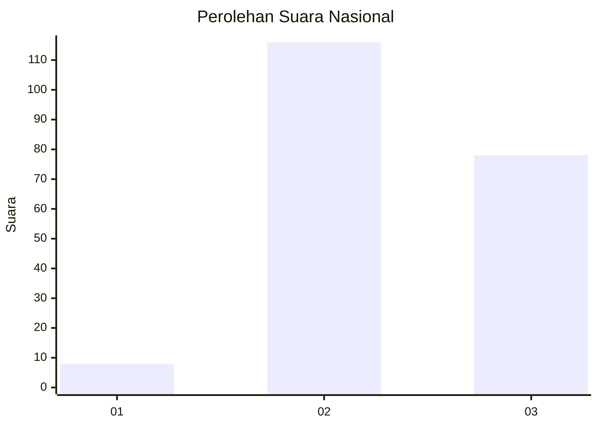
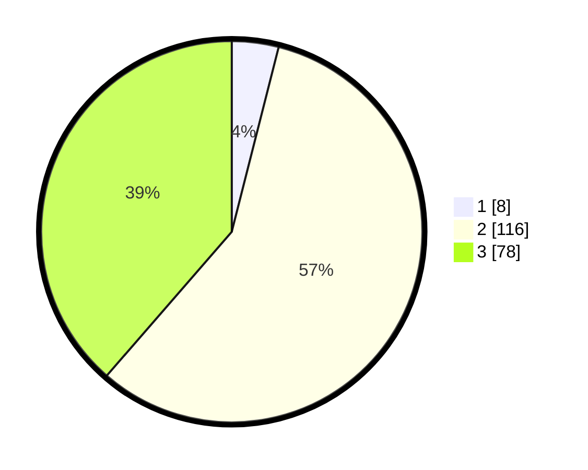

# Hasil

## Grafik

## Tabel

| No. | Nama Paslon    | Suara | Suara (raw) | Persentase |
|:--- |:-------------- | -----:| -----------:| ----------:|
| 1   | ANIES MUHAIMIN | 8     | [8][p-1]    | 3,96       |
| 2   | PRABOWO GIBRAN | 116   | [116][p-2]  | 57,43      |
| 3   | GANJAR MAHFUD  | 78    | [78][p-3]   | 38,61      |

[p-1]: https://github.com/gigit-pemilu/pemilu-2024/blob/main/pilpres/hitung-suara/sub/34-di-yogyakarta/sub/02-bantul/sub/11-dlingo/sub/2003-dlingo/sub/003-tps/sub/paslon-1.txt
[p-2]: https://github.com/gigit-pemilu/pemilu-2024/blob/main/pilpres/hitung-suara/sub/34-di-yogyakarta/sub/02-bantul/sub/11-dlingo/sub/2003-dlingo/sub/003-tps/sub/paslon-2.txt
[p-3]: https://github.com/gigit-pemilu/pemilu-2024/blob/main/pilpres/hitung-suara/sub/34-di-yogyakarta/sub/02-bantul/sub/11-dlingo/sub/2003-dlingo/sub/003-tps/sub/paslon-3.txt

## Foto C Plano

https://sirekap-obj-formc.kpu.go.id/0924/pemilu/ppwp/34/02/11/20/03/3402112003003-20240216-144301--be5fd6f1-bd17-4956-83ad-479a53276d0b.jpg

https://sirekap-obj-formc.kpu.go.id/0924/pemilu/ppwp/34/02/11/20/03/3402112003003-20240216-143525--7022a5d2-fbba-4d4b-bc3a-d9d07ff98667.jpg

https://sirekap-obj-formc.kpu.go.id/0924/pemilu/ppwp/34/02/11/20/03/3402112003003-20240216-143632--e1bd3ae2-407a-4b53-ba27-c242c9604d36.jpg

## Metadata

| Key        | Value               |
| ---------- | ------------------- |
| Time Stamp | 2024-02-22 15:00:00 |

