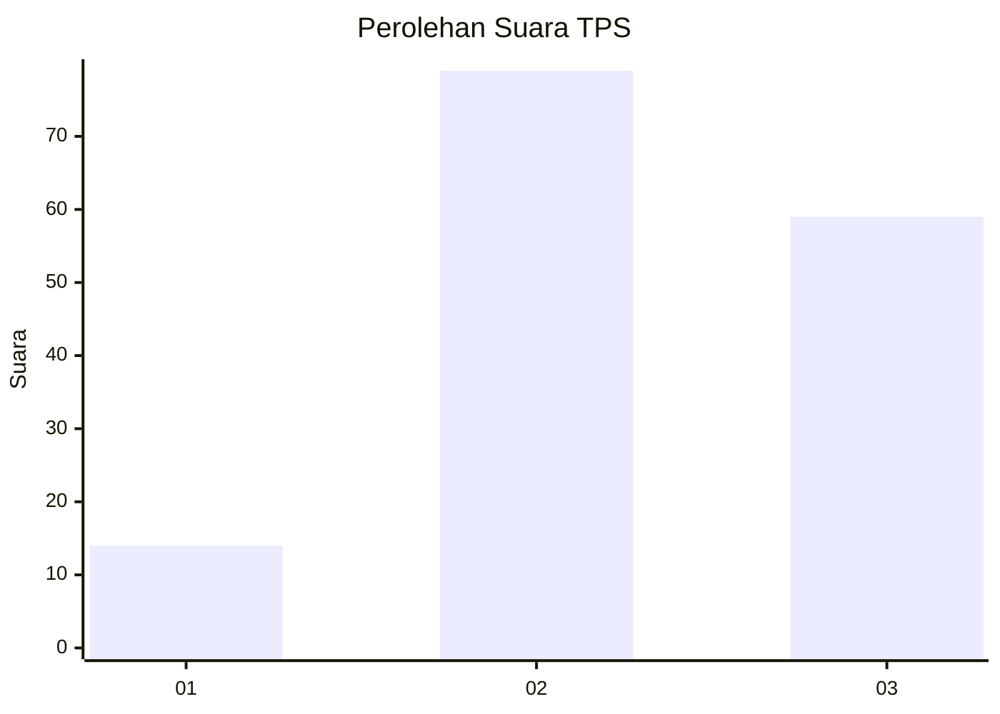
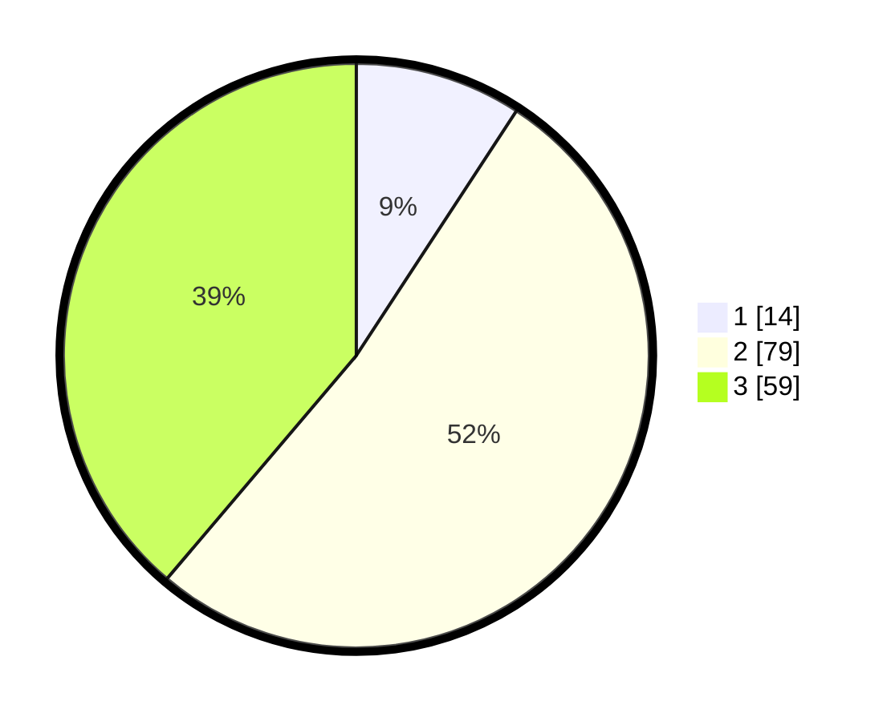

# Hasil

## Grafik

## Tabel

| No. | Nama Paslon    | Suara | Suara (raw) | Persentase |
|:--- |:-------------- | -----:| -----------:| ----------:|
| 1   | ANIES MUHAIMIN | 14    | [14][p-1]   | 9,21       |
| 2   | PRABOWO GIBRAN | 79    | [79][p-2]   | 51,97      |
| 3   | GANJAR MAHFUD  | 59    | [59][p-3]   | 38,82      |

[p-1]: https://github.com/gigit-pemilu/pemilu-2024-34-di-yogyakarta/blob/main/pilpres/hitung-suara/sub/34-di-yogyakarta/sub/02-bantul/sub/11-dlingo/sub/2003-dlingo/sub/009-tps/sub/paslon-1.txt
[p-2]: https://github.com/gigit-pemilu/pemilu-2024-34-di-yogyakarta/blob/main/pilpres/hitung-suara/sub/34-di-yogyakarta/sub/02-bantul/sub/11-dlingo/sub/2003-dlingo/sub/009-tps/sub/paslon-2.txt
[p-3]: https://github.com/gigit-pemilu/pemilu-2024-34-di-yogyakarta/blob/main/pilpres/hitung-suara/sub/34-di-yogyakarta/sub/02-bantul/sub/11-dlingo/sub/2003-dlingo/sub/009-tps/sub/paslon-3.txt

## Foto C Plano

https://sirekap-obj-formc.kpu.go.id/004a/pemilu/ppwp/34/02/11/20/03/3402112003009-20240221-172106--6cc520d8-5542-489e-a669-c4e08320e14f.jpg

https://sirekap-obj-formc.kpu.go.id/004a/pemilu/ppwp/34/02/11/20/03/3402112003009-20240215-011855--177874ba-c087-4131-bd24-11fc81e871f2.jpg

https://sirekap-obj-formc.kpu.go.id/004a/pemilu/ppwp/34/02/11/20/03/3402112003009-20240215-011706--e427ef23-3bfa-45a8-b961-b24b6c90d788.jpg

## Metadata

| Key        | Value               |
| ---------- | ------------------- |
| Time Stamp | 2024-02-24 22:31:28 |

