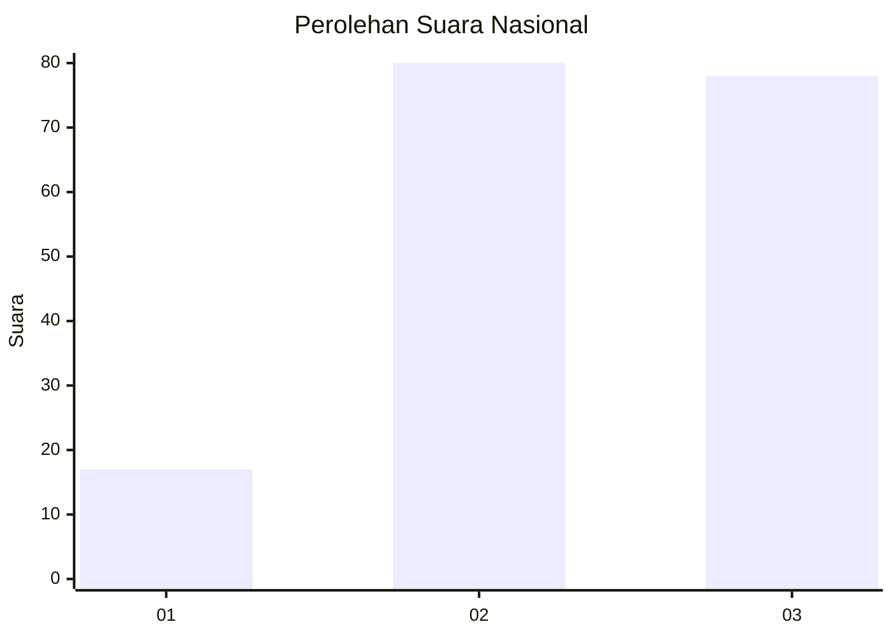
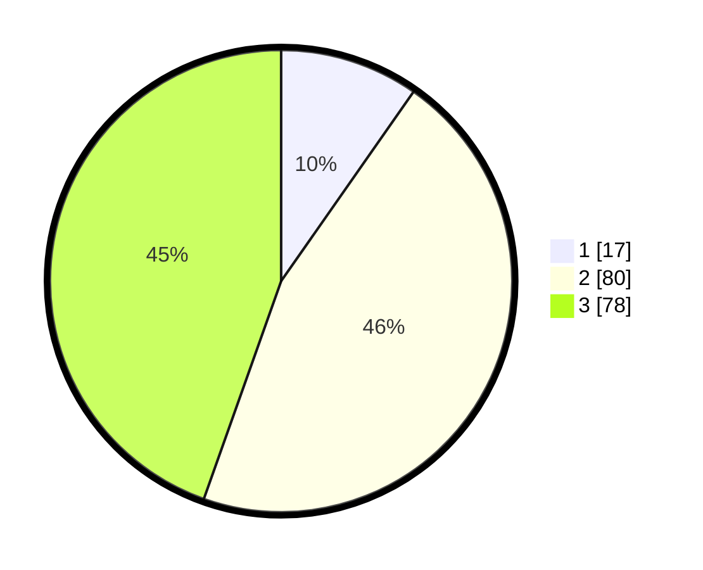

# Hasil

## Grafik

## Tabel

| No. | Nama Paslon    | Suara | Suara (raw) | Persentase |
|:--- |:-------------- | -----:| -----------:| ----------:|
| 1   | ANIES MUHAIMIN | 17    | [17][p-1]   | 9,71       |
| 2   | PRABOWO GIBRAN | 80    | [80][p-2]   | 45,71      |
| 3   | GANJAR MAHFUD  | 78    | [78][p-3]   | 44,57      |

[p-1]: https://github.com/gigit-pemilu/pemilu-2024/blob/main/pilpres/hitung-suara/sub/34-di-yogyakarta/sub/02-bantul/sub/11-dlingo/sub/2003-dlingo/sub/010-tps/sub/paslon-1.txt
[p-2]: https://github.com/gigit-pemilu/pemilu-2024/blob/main/pilpres/hitung-suara/sub/34-di-yogyakarta/sub/02-bantul/sub/11-dlingo/sub/2003-dlingo/sub/010-tps/sub/paslon-2.txt
[p-3]: https://github.com/gigit-pemilu/pemilu-2024/blob/main/pilpres/hitung-suara/sub/34-di-yogyakarta/sub/02-bantul/sub/11-dlingo/sub/2003-dlingo/sub/010-tps/sub/paslon-3.txt

## Foto C Plano

https://sirekap-obj-formc.kpu.go.id/844b/pemilu/ppwp/34/02/11/20/03/3402112003010-20240215-014716--ffeb3f19-1de5-4565-9490-de027e752792.jpg

https://sirekap-obj-formc.kpu.go.id/844b/pemilu/ppwp/34/02/11/20/03/3402112003010-20240215-020323--6b447e62-bb46-420a-830d-74267da00bbf.jpg

https://sirekap-obj-formc.kpu.go.id/844b/pemilu/ppwp/34/02/11/20/03/3402112003010-20240215-020057--9aa38276-4042-41fa-a020-1fe35b1afac6.jpg

## Metadata

| Key        | Value               |
| ---------- | ------------------- |
| Time Stamp | 2024-02-15 21:01:18 |

