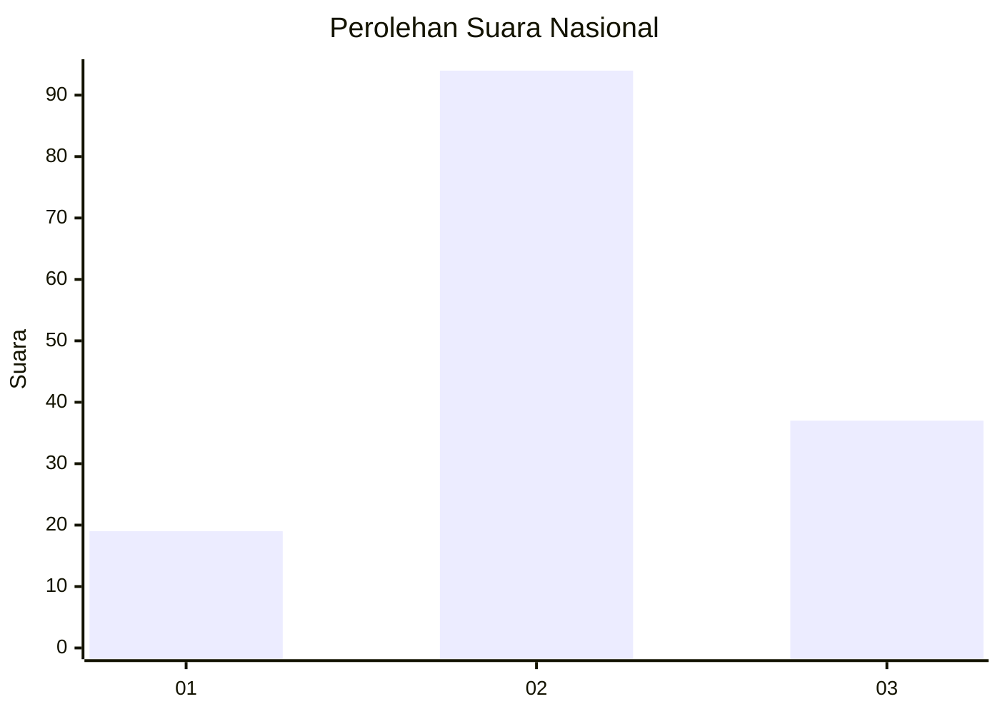
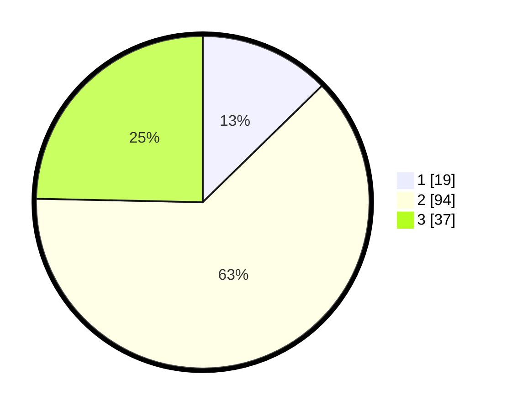

# Hasil

## Grafik

## Tabel

| No. | Nama Paslon    | Suara | Suara (raw) | Persentase |
|:--- |:-------------- | -----:| -----------:| ----------:|
| 1   | ANIES MUHAIMIN | 19    | [19][p-1]   | 12,67      |
| 2   | PRABOWO GIBRAN | 94    | [94][p-2]   | 62,67      |
| 3   | GANJAR MAHFUD  | 37    | [37][p-3]   | 24,67      |

[p-1]: https://github.com/gigit-pemilu/pemilu-2024/blob/main/pilpres/hitung-suara/sub/34-di-yogyakarta/sub/02-bantul/sub/11-dlingo/sub/2003-dlingo/sub/016-tps/sub/paslon-1.txt
[p-2]: https://github.com/gigit-pemilu/pemilu-2024/blob/main/pilpres/hitung-suara/sub/34-di-yogyakarta/sub/02-bantul/sub/11-dlingo/sub/2003-dlingo/sub/016-tps/sub/paslon-2.txt
[p-3]: https://github.com/gigit-pemilu/pemilu-2024/blob/main/pilpres/hitung-suara/sub/34-di-yogyakarta/sub/02-bantul/sub/11-dlingo/sub/2003-dlingo/sub/016-tps/sub/paslon-3.txt

## Foto C Plano

https://sirekap-obj-formc.kpu.go.id/b17c/pemilu/ppwp/34/02/11/20/03/3402112003016-20240216-153631--67236857-8c9e-4249-9cf7-b271d9200be9.jpg

https://sirekap-obj-formc.kpu.go.id/b17c/pemilu/ppwp/34/02/11/20/03/3402112003016-20240221-171654--3c9d0527-09b0-4401-8e34-3115a6397fbb.jpg

https://sirekap-obj-formc.kpu.go.id/b17c/pemilu/ppwp/34/02/11/20/03/3402112003016-20240221-171857--feddbcab-153f-4895-9267-19b707dfb837.jpg

## Metadata

| Key        | Value               |
| ---------- | ------------------- |
| Time Stamp | 2024-02-22 15:00:00 |

