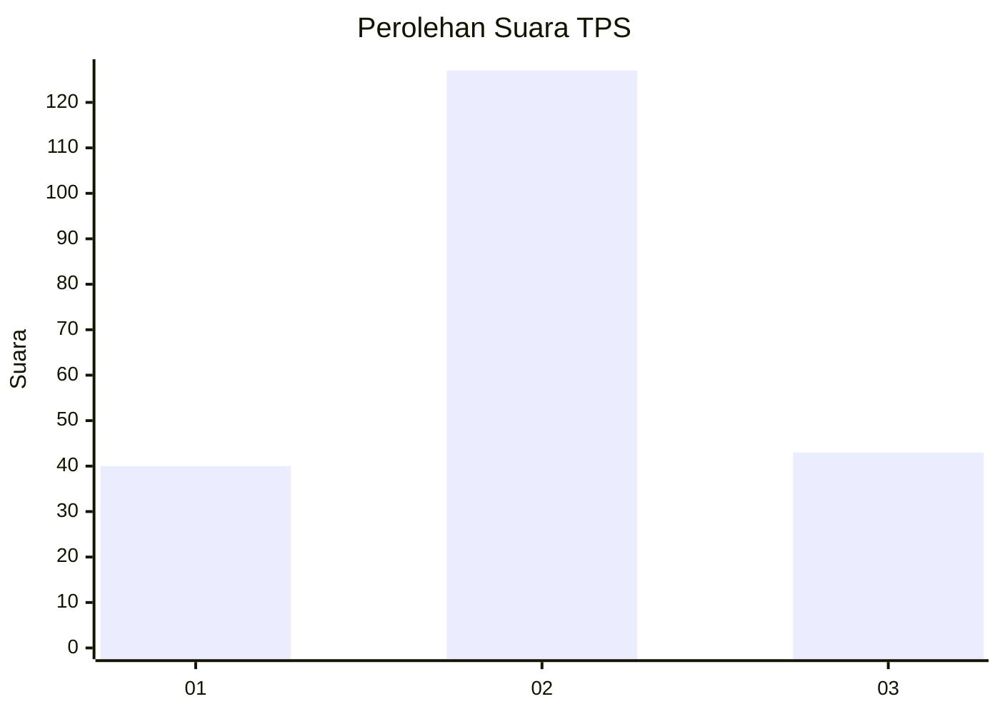
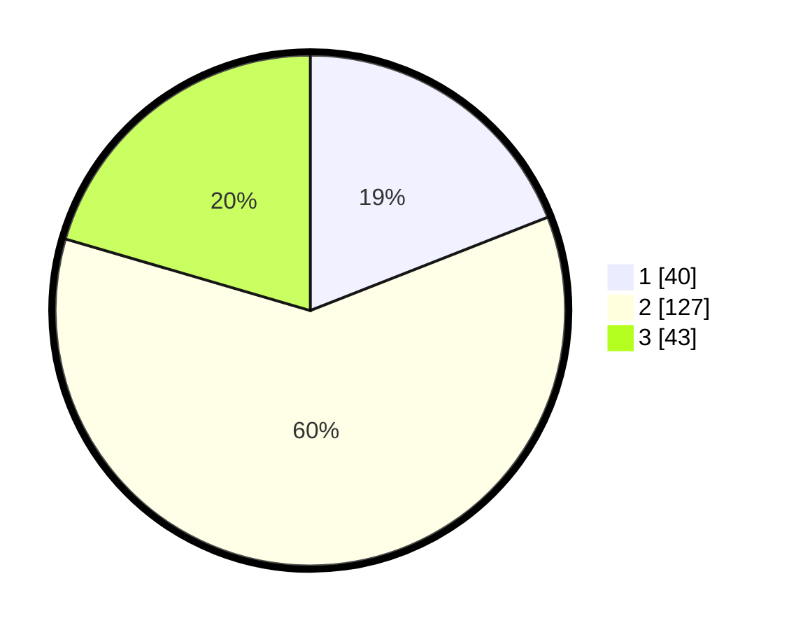

# Hasil

## Grafik

## Tabel

| No. | Nama Paslon    | Suara | Suara (raw) | Persentase |
|:--- |:-------------- | -----:| -----------:| ----------:|
| 1   | ANIES MUHAIMIN | 40    | [40][p-1]   | 19,05      |
| 2   | PRABOWO GIBRAN | 127   | [127][p-2]  | 60,48      |
| 3   | GANJAR MAHFUD  | 43    | [43][p-3]   | 20,48      |

[p-1]: https://github.com/gigit-pemilu/pemilu-2024-34-di-yogyakarta/blob/main/pilpres/hitung-suara/sub/34-di-yogyakarta/sub/02-bantul/sub/11-dlingo/sub/2003-dlingo/sub/018-tps/sub/paslon-1.txt
[p-2]: https://github.com/gigit-pemilu/pemilu-2024-34-di-yogyakarta/blob/main/pilpres/hitung-suara/sub/34-di-yogyakarta/sub/02-bantul/sub/11-dlingo/sub/2003-dlingo/sub/018-tps/sub/paslon-2.txt
[p-3]: https://github.com/gigit-pemilu/pemilu-2024-34-di-yogyakarta/blob/main/pilpres/hitung-suara/sub/34-di-yogyakarta/sub/02-bantul/sub/11-dlingo/sub/2003-dlingo/sub/018-tps/sub/paslon-3.txt

## Foto C Plano

https://sirekap-obj-formc.kpu.go.id/62dd/pemilu/ppwp/34/02/11/20/03/3402112003018-20240216-155602--c1355178-f00a-4178-bf11-943b8d8db574.jpg

https://sirekap-obj-formc.kpu.go.id/62dd/pemilu/ppwp/34/02/11/20/03/3402112003018-20240216-154910--59ff9231-74a1-4de6-995d-c717c1f4e2c4.jpg

https://sirekap-obj-formc.kpu.go.id/62dd/pemilu/ppwp/34/02/11/20/03/3402112003018-20240216-155308--98466bc4-f9a5-4039-84f4-4cafbde9315d.jpg

## Metadata

| Key        | Value               |
| ---------- | ------------------- |
| Time Stamp | 2024-02-22 15:00:00 |

