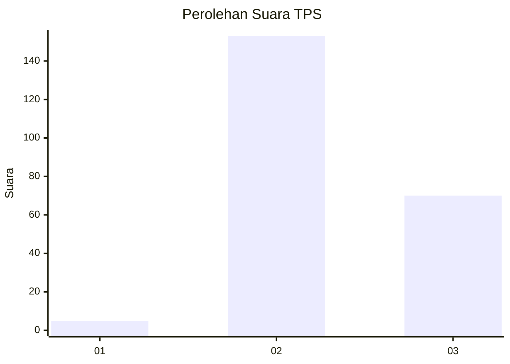
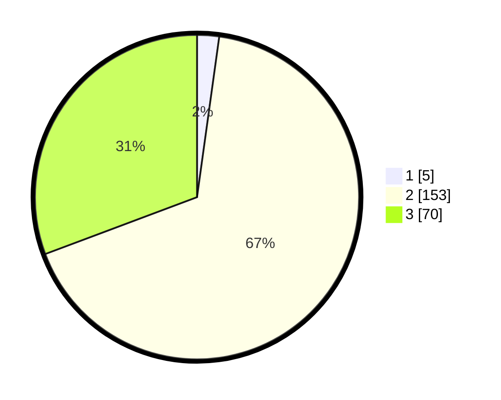

# Hasil

## Grafik

## Tabel

| No. | Nama Paslon    | Suara | Suara (raw) | Persentase |
|:--- |:-------------- | -----:| -----------:| ----------:|
| 1   | ANIES MUHAIMIN | 5     | [5][p-1]    | 2,19       |
| 2   | PRABOWO GIBRAN | 153   | [153][p-2]  | 67,11      |
| 3   | GANJAR MAHFUD  | 70    | [70][p-3]   | 30,70      |

[p-1]: https://github.com/gigit-pemilu/pemilu-2024-34-di-yogyakarta/blob/main/pilpres/hitung-suara/sub/34-di-yogyakarta/sub/02-bantul/sub/11-dlingo/sub/2004-temuwuh/sub/005-tps/sub/paslon-1.txt
[p-2]: https://github.com/gigit-pemilu/pemilu-2024-34-di-yogyakarta/blob/main/pilpres/hitung-suara/sub/34-di-yogyakarta/sub/02-bantul/sub/11-dlingo/sub/2004-temuwuh/sub/005-tps/sub/paslon-2.txt
[p-3]: https://github.com/gigit-pemilu/pemilu-2024-34-di-yogyakarta/blob/main/pilpres/hitung-suara/sub/34-di-yogyakarta/sub/02-bantul/sub/11-dlingo/sub/2004-temuwuh/sub/005-tps/sub/paslon-3.txt

## Foto C Plano

https://sirekap-obj-formc.kpu.go.id/2360/pemilu/ppwp/34/02/11/20/04/3402112004005-20240214-224208--47656d22-a110-4f85-9319-2287e9c5fb30.jpg

https://sirekap-obj-formc.kpu.go.id/2360/pemilu/ppwp/34/02/11/20/04/3402112004005-20240214-224259--06e4bc3e-c2ff-4037-a52a-c83daa4d054a.jpg

https://sirekap-obj-formc.kpu.go.id/2360/pemilu/ppwp/34/02/11/20/04/3402112004005-20240214-224447--1694cf37-1326-4f92-80cf-3f85b0b266f9.jpg

## Metadata

| Key        | Value               |
| ---------- | ------------------- |
| Time Stamp | 2024-02-15 20:30:46 |

