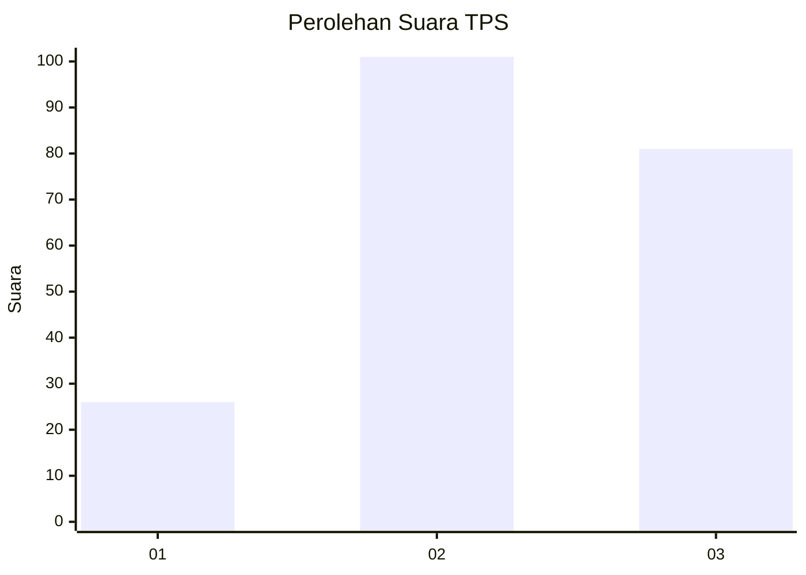
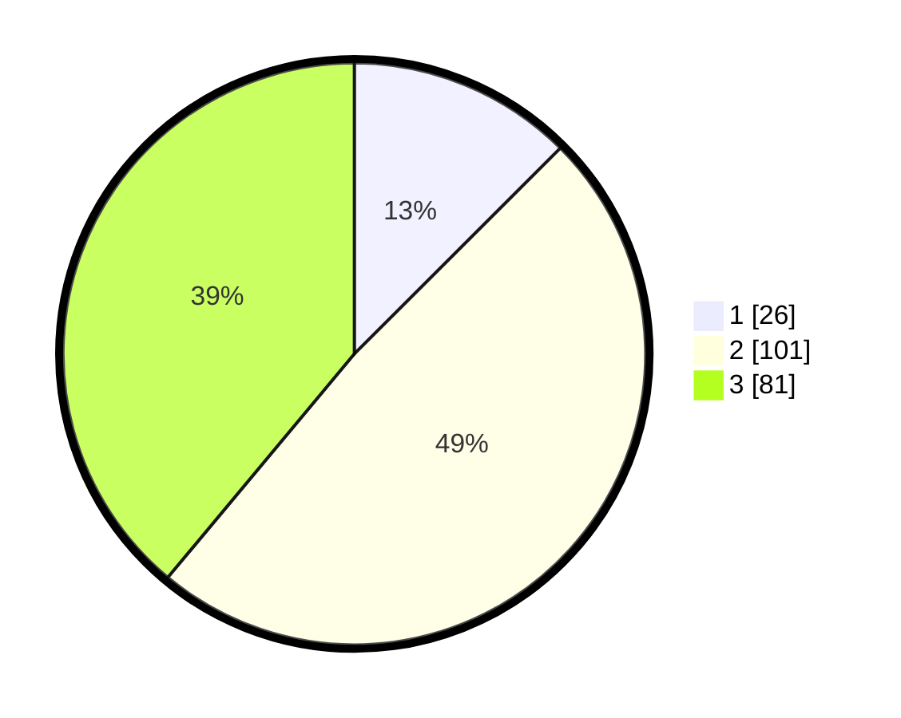

# Hasil

## Grafik

## Tabel

| No. | Nama Paslon    | Suara | Suara (raw) | Persentase |
|:--- |:-------------- | -----:| -----------:| ----------:|
| 1   | ANIES MUHAIMIN | 26    | [26][p-1]   | 12,50      |
| 2   | PRABOWO GIBRAN | 101   | [101][p-2]  | 48,56      |
| 3   | GANJAR MAHFUD  | 81    | [81][p-3]   | 38,94      |

[p-1]: https://github.com/gigit-pemilu/pemilu-2024-34-di-yogyakarta/blob/main/pilpres/hitung-suara/sub/34-di-yogyakarta/sub/02-bantul/sub/11-dlingo/sub/2004-temuwuh/sub/010-tps/sub/paslon-1.txt
[p-2]: https://github.com/gigit-pemilu/pemilu-2024-34-di-yogyakarta/blob/main/pilpres/hitung-suara/sub/34-di-yogyakarta/sub/02-bantul/sub/11-dlingo/sub/2004-temuwuh/sub/010-tps/sub/paslon-2.txt
[p-3]: https://github.com/gigit-pemilu/pemilu-2024-34-di-yogyakarta/blob/main/pilpres/hitung-suara/sub/34-di-yogyakarta/sub/02-bantul/sub/11-dlingo/sub/2004-temuwuh/sub/010-tps/sub/paslon-3.txt

## Foto C Plano

https://sirekap-obj-formc.kpu.go.id/62f2/pemilu/ppwp/34/02/11/20/04/3402112004010-20240217-170405--51d09f94-b181-4921-8236-1722f67d5495.jpg

https://sirekap-obj-formc.kpu.go.id/62f2/pemilu/ppwp/34/02/11/20/04/3402112004010-20240217-170608--409e9b5a-87f0-4740-8db1-68bb1fa6878f.jpg

https://sirekap-obj-formc.kpu.go.id/62f2/pemilu/ppwp/34/02/11/20/04/3402112004010-20240217-170655--26cbea35-cca9-43fc-a153-3a5da953304b.jpg

## Metadata

| Key        | Value               |
| ---------- | ------------------- |
| Time Stamp | 2024-02-22 15:00:00 |

