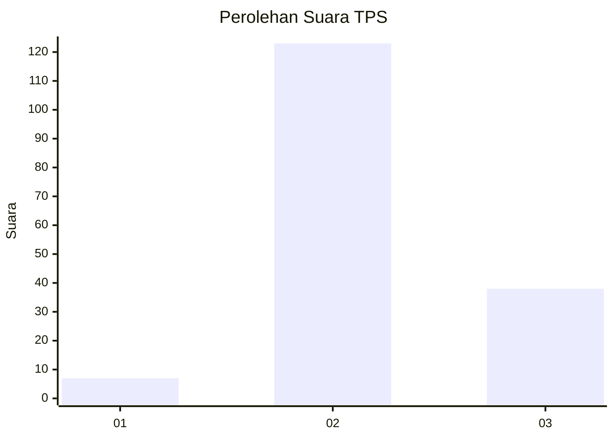
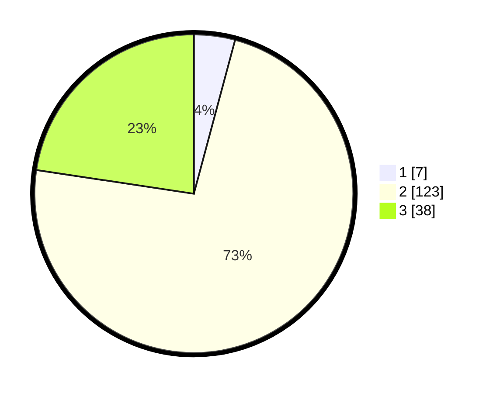

# Hasil

## Grafik

## Tabel

| No. | Nama Paslon    | Suara | Suara (raw) | Persentase |
|:--- |:-------------- | -----:| -----------:| ----------:|
| 1   | ANIES MUHAIMIN | 7     | [7][p-1]    | 4,17       |
| 2   | PRABOWO GIBRAN | 123   | [123][p-2]  | 73,21      |
| 3   | GANJAR MAHFUD  | 38    | [38][p-3]   | 22,62      |

[p-1]: https://github.com/gigit-pemilu/pemilu-2024-34-di-yogyakarta/blob/main/pilpres/hitung-suara/sub/34-di-yogyakarta/sub/02-bantul/sub/11-dlingo/sub/2004-temuwuh/sub/017-tps/sub/paslon-1.txt
[p-2]: https://github.com/gigit-pemilu/pemilu-2024-34-di-yogyakarta/blob/main/pilpres/hitung-suara/sub/34-di-yogyakarta/sub/02-bantul/sub/11-dlingo/sub/2004-temuwuh/sub/017-tps/sub/paslon-2.txt
[p-3]: https://github.com/gigit-pemilu/pemilu-2024-34-di-yogyakarta/blob/main/pilpres/hitung-suara/sub/34-di-yogyakarta/sub/02-bantul/sub/11-dlingo/sub/2004-temuwuh/sub/017-tps/sub/paslon-3.txt

## Foto C Plano

https://sirekap-obj-formc.kpu.go.id/7ce5/pemilu/ppwp/34/02/11/20/04/3402112004017-20240216-185930--1c581715-0542-4886-96e8-f2967ae9d4af.jpg

https://sirekap-obj-formc.kpu.go.id/7ce5/pemilu/ppwp/34/02/11/20/04/3402112004017-20240216-185931--08611650-85ce-4622-ba04-08974eff6619.jpg

https://sirekap-obj-formc.kpu.go.id/7ce5/pemilu/ppwp/34/02/11/20/04/3402112004017-20240216-185930--53d38d47-55c5-4c3b-b562-54c4bb5df507.jpg

## Metadata

| Key        | Value               |
| ---------- | ------------------- |
| Time Stamp | 2024-02-19 10:00:00 |

## DATA PEMILIH TETAP

Jumlah pemilih dalam DPT: **179**.
 * L: **90**.
 * P: **89**.

## DATA PENGGUNA HAK PILIH

Jumlah pengguna hak pilih dalam DPT: **165**.
 * L: **79**.
 * P: **86**.

Jumlah pengguna hak pilih dalam DPTb: **3**.
 * L: **1**.
 * P: **2**.

Jumlah pengguna hak pilih dalam DPK: **0**.
 * L: **0**.
 * P: **0**.

Jumlah pengguna hak pilih: **168**.
 * L: **80**.
 * P: **88**.

## JUMLAH SUARA SAH DAN TIDAK SAH

JUMLAH SELURUH SUARA SAH: **168**.

JUMLAH SUARA TIDAK SAH: **0**.

JUMLAH SELURUH SUARA SAH DAN SUARA TIDAK SAH: **168**.

