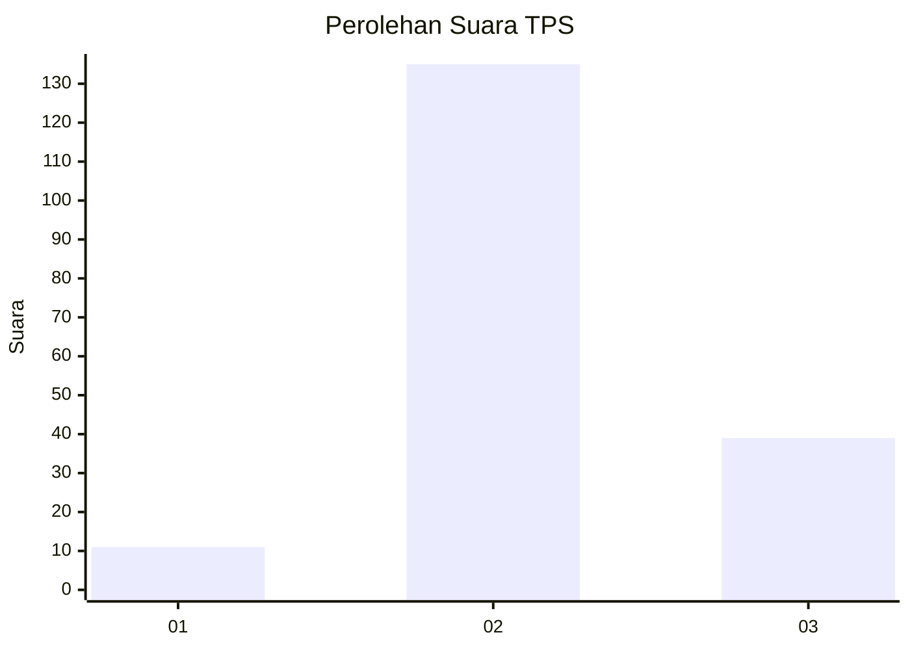

# Hasil

## Grafik

## Tabel

| No. | Nama Paslon    | Suara | Suara (raw) | Persentase |
|:--- |:-------------- | -----:| -----------:| ----------:|
| 1   | ANIES MUHAIMIN | 11    | [11][p-1]   | 5,95       |
| 2   | PRABOWO GIBRAN | 135   | [135][p-2]  | 72,97      |
| 3   | GANJAR MAHFUD  | 39    | [39][p-3]   | 21,08      |

[p-1]: https://github.com/gigit-pemilu/pemilu-2024-34-di-yogyakarta/blob/main/pilpres/hitung-suara/sub/34-di-yogyakarta/sub/02-bantul/sub/11-dlingo/sub/2004-temuwuh/sub/020-tps/sub/paslon-1.txt
[p-2]: https://github.com/gigit-pemilu/pemilu-2024-34-di-yogyakarta/blob/main/pilpres/hitung-suara/sub/34-di-yogyakarta/sub/02-bantul/sub/11-dlingo/sub/2004-temuwuh/sub/020-tps/sub/paslon-2.txt
[p-3]: https://github.com/gigit-pemilu/pemilu-2024-34-di-yogyakarta/blob/main/pilpres/hitung-suara/sub/34-di-yogyakarta/sub/02-bantul/sub/11-dlingo/sub/2004-temuwuh/sub/020-tps/sub/paslon-3.txt

## Foto C Plano

https://sirekap-obj-formc.kpu.go.id/bad0/pemilu/ppwp/34/02/11/20/04/3402112004020-20240214-222822--ebc1f1ee-fee6-4044-b9d4-a9e98dd532ac.jpg

https://sirekap-obj-formc.kpu.go.id/bad0/pemilu/ppwp/34/02/11/20/04/3402112004020-20240214-220536--d85733f6-9cf9-4997-81c4-688147054b16.jpg

https://sirekap-obj-formc.kpu.go.id/bad0/pemilu/ppwp/34/02/11/20/04/3402112004020-20240214-222959--a4273a3b-bf69-45c3-96f6-f2b1113f2816.jpg

## Metadata

| Key        | Value               |
| ---------- | ------------------- |
| Time Stamp | 2024-02-25 11:00:00 |

