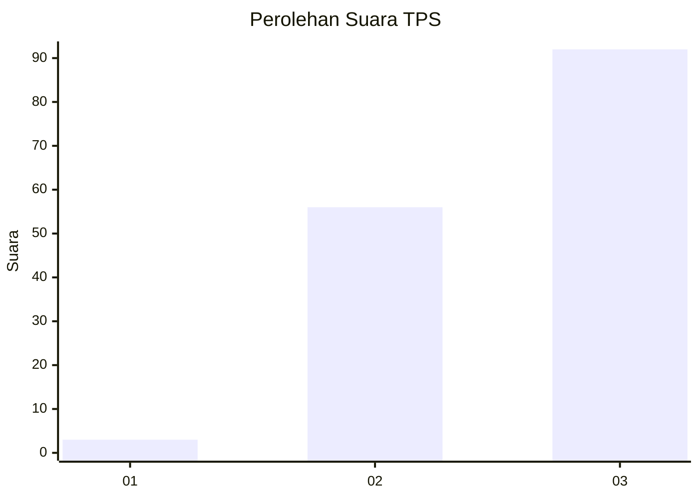
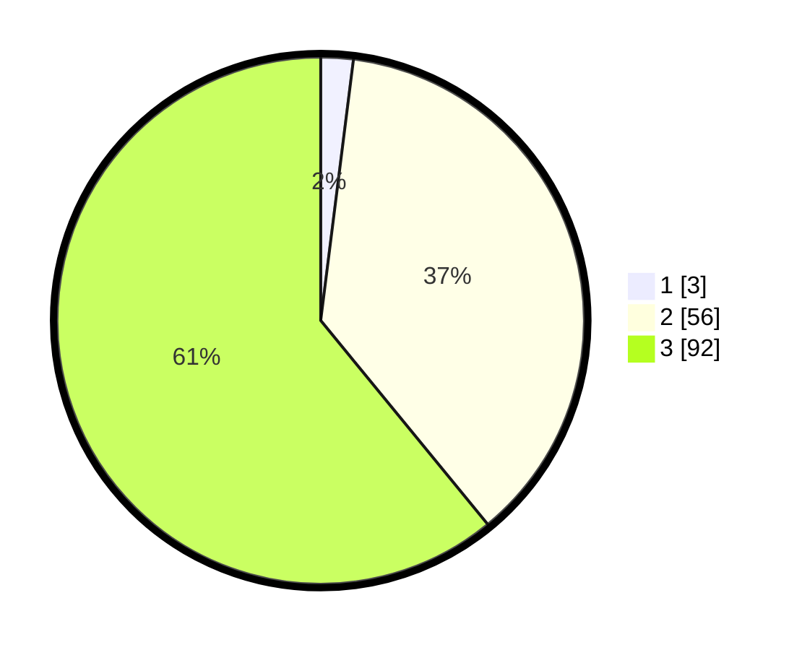

# Hasil

## Grafik

## Tabel

| No. | Nama Paslon    | Suara | Suara (raw) | Persentase |
|:--- |:-------------- | -----:| -----------:| ----------:|
| 1   | ANIES MUHAIMIN | 3     | [3][p-1]    | 1,99       |
| 2   | PRABOWO GIBRAN | 56    | [56][p-2]   | 37,09      |
| 3   | GANJAR MAHFUD  | 92    | [92][p-3]   | 60,93      |

[p-1]: https://github.com/gigit-pemilu/pemilu-2024-34-di-yogyakarta/blob/main/pilpres/hitung-suara/sub/34-di-yogyakarta/sub/02-bantul/sub/11-dlingo/sub/2004-temuwuh/sub/024-tps/sub/paslon-1.txt
[p-2]: https://github.com/gigit-pemilu/pemilu-2024-34-di-yogyakarta/blob/main/pilpres/hitung-suara/sub/34-di-yogyakarta/sub/02-bantul/sub/11-dlingo/sub/2004-temuwuh/sub/024-tps/sub/paslon-2.txt
[p-3]: https://github.com/gigit-pemilu/pemilu-2024-34-di-yogyakarta/blob/main/pilpres/hitung-suara/sub/34-di-yogyakarta/sub/02-bantul/sub/11-dlingo/sub/2004-temuwuh/sub/024-tps/sub/paslon-3.txt

## Foto C Plano

https://sirekap-obj-formc.kpu.go.id/dc3c/pemilu/ppwp/34/02/11/20/04/3402112004024-20240217-171514--409ef672-682f-4130-a79f-cc279e3b880a.jpg

https://sirekap-obj-formc.kpu.go.id/dc3c/pemilu/ppwp/34/02/11/20/04/3402112004024-20240217-171731--b84d8bf3-91c2-4d38-be5b-f91628f03c7e.jpg

https://sirekap-obj-formc.kpu.go.id/dc3c/pemilu/ppwp/34/02/11/20/04/3402112004024-20240217-171615--418d2a17-8470-4bc6-8753-59ddde40adda.jpg

## Metadata

| Key        | Value               |
| ---------- | ------------------- |
| Time Stamp | 2024-02-22 15:00:00 |

