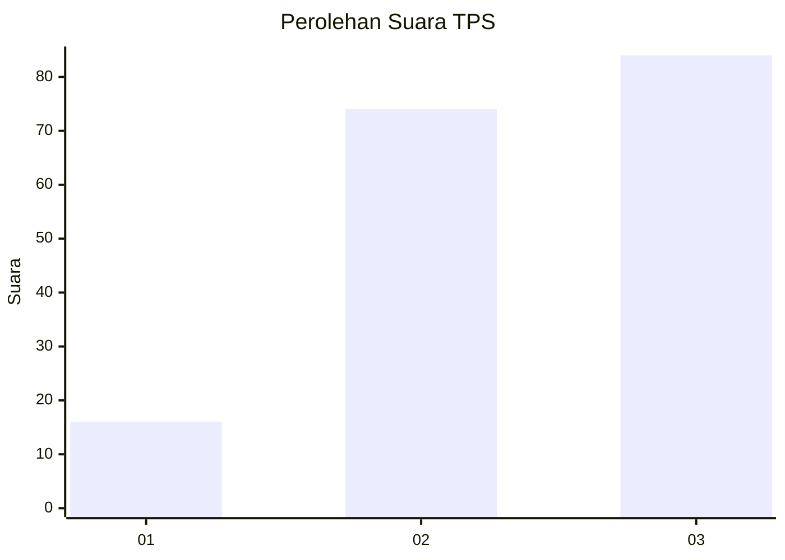
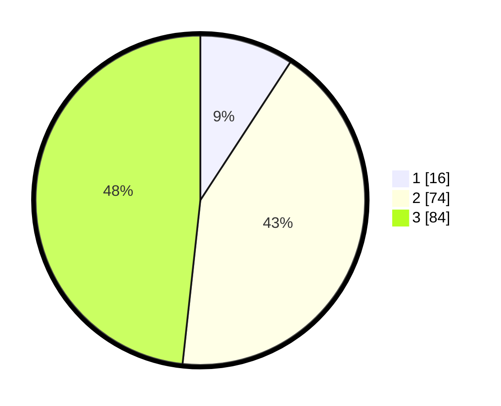

# Hasil

## Grafik

## Tabel

| No. | Nama Paslon    | Suara | Suara (raw) | Persentase |
|:--- |:-------------- | -----:| -----------:| ----------:|
| 1   | ANIES MUHAIMIN | 16    | [16][p-1]   | 9,20       |
| 2   | PRABOWO GIBRAN | 74    | [74][p-2]   | 42,53      |
| 3   | GANJAR MAHFUD  | 84    | [84][p-3]   | 48,28      |

[p-1]: https://github.com/gigit-pemilu/pemilu-2024-34-di-yogyakarta/blob/main/pilpres/hitung-suara/sub/34-di-yogyakarta/sub/02-bantul/sub/11-dlingo/sub/2004-temuwuh/sub/026-tps/sub/paslon-1.txt
[p-2]: https://github.com/gigit-pemilu/pemilu-2024-34-di-yogyakarta/blob/main/pilpres/hitung-suara/sub/34-di-yogyakarta/sub/02-bantul/sub/11-dlingo/sub/2004-temuwuh/sub/026-tps/sub/paslon-2.txt
[p-3]: https://github.com/gigit-pemilu/pemilu-2024-34-di-yogyakarta/blob/main/pilpres/hitung-suara/sub/34-di-yogyakarta/sub/02-bantul/sub/11-dlingo/sub/2004-temuwuh/sub/026-tps/sub/paslon-3.txt

## Foto C Plano

https://sirekap-obj-formc.kpu.go.id/590d/pemilu/ppwp/34/02/11/20/04/3402112004026-20240215-004513--bc389fe6-1cb5-4b3f-b534-5d1a478f6be9.jpg

https://sirekap-obj-formc.kpu.go.id/590d/pemilu/ppwp/34/02/11/20/04/3402112004026-20240215-000948--f2911ea6-b061-4841-a219-4f4eaeadab0e.jpg

https://sirekap-obj-formc.kpu.go.id/590d/pemilu/ppwp/34/02/11/20/04/3402112004026-20240215-004633--622c4329-482d-49c8-989c-6928d8129ef2.jpg

## Metadata

| Key        | Value               |
| ---------- | ------------------- |
| Time Stamp | 2024-02-15 20:30:46 |

