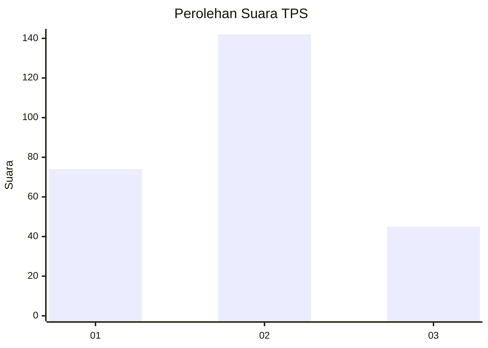
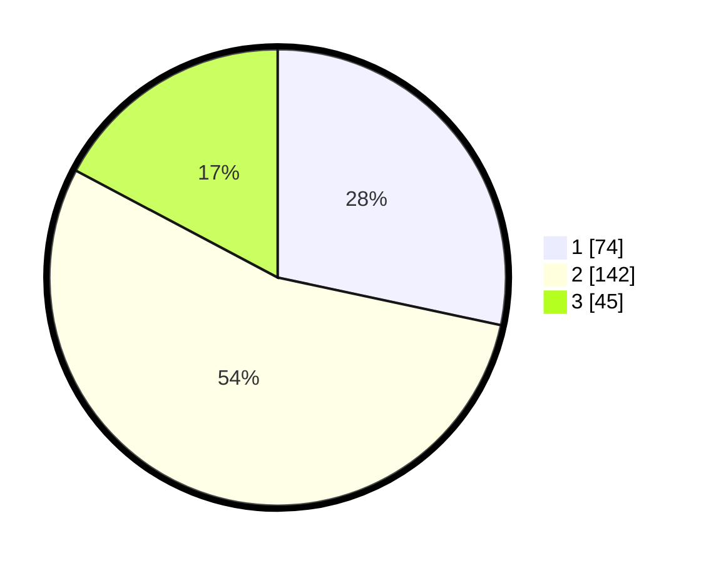

# Hasil

## Grafik

## Tabel

| No. | Nama Paslon    | Suara | Suara (raw) | Persentase |
|:--- |:-------------- | -----:| -----------:| ----------:|
| 1   | ANIES MUHAIMIN | 74    | [74][p-1]   | 28,35      |
| 2   | PRABOWO GIBRAN | 142   | [142][p-2]  | 54,41      |
| 3   | GANJAR MAHFUD  | 45    | [45][p-3]   | 17,24      |

[p-1]: https://github.com/gigit-pemilu/pemilu-2024-34-di-yogyakarta/blob/main/pilpres/hitung-suara/sub/34-di-yogyakarta/sub/02-bantul/sub/11-dlingo/sub/2005-terong/sub/014-tps/sub/paslon-1.txt
[p-2]: https://github.com/gigit-pemilu/pemilu-2024-34-di-yogyakarta/blob/main/pilpres/hitung-suara/sub/34-di-yogyakarta/sub/02-bantul/sub/11-dlingo/sub/2005-terong/sub/014-tps/sub/paslon-2.txt
[p-3]: https://github.com/gigit-pemilu/pemilu-2024-34-di-yogyakarta/blob/main/pilpres/hitung-suara/sub/34-di-yogyakarta/sub/02-bantul/sub/11-dlingo/sub/2005-terong/sub/014-tps/sub/paslon-3.txt

## Foto C Plano

https://sirekap-obj-formc.kpu.go.id/3b70/pemilu/ppwp/34/02/11/20/05/3402112005014-20240217-182103--b5f78a15-8318-465c-9557-4ffb22203ffe.jpg

https://sirekap-obj-formc.kpu.go.id/3b70/pemilu/ppwp/34/02/11/20/05/3402112005014-20240217-182335--b49bfadb-a695-4d25-a61e-ef8da56e6de8.jpg

https://sirekap-obj-formc.kpu.go.id/3b70/pemilu/ppwp/34/02/11/20/05/3402112005014-20240217-183319--f492428d-04c7-4aa1-a2ef-0687a7eb0e8b.jpg

## Metadata

| Key        | Value               |
| ---------- | ------------------- |
| Time Stamp | 2024-02-17 19:00:04 |

## DATA PEMILIH TETAP

Jumlah pemilih dalam DPT: **283**.
 * L: **135**.
 * P: **148**.

## DATA PENGGUNA HAK PILIH

Jumlah pengguna hak pilih dalam DPT: **258**.
 * L: **120**.
 * P: **138**.

Jumlah pengguna hak pilih dalam DPTb: **11**.
 * L: **5**.
 * P: **6**.

Jumlah pengguna hak pilih dalam DPK: **0**.
 * L: **0**.
 * P: **0**.

Jumlah pengguna hak pilih: **269**.
 * L: **125**.
 * P: **144**.

## JUMLAH SUARA SAH DAN TIDAK SAH

JUMLAH SELURUH SUARA SAH: **261**.

JUMLAH SUARA TIDAK SAH: **8**.

JUMLAH SELURUH SUARA SAH DAN SUARA TIDAK SAH: **269**.

