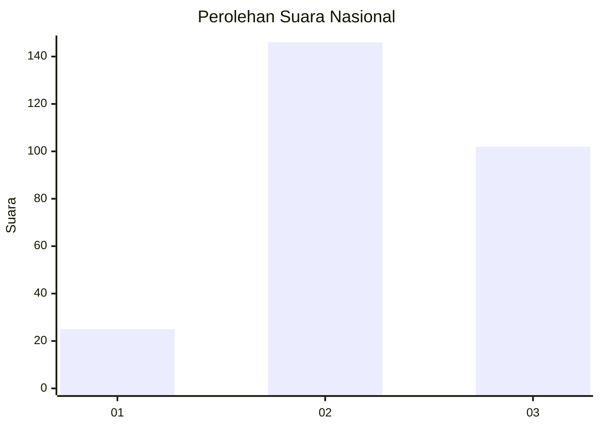
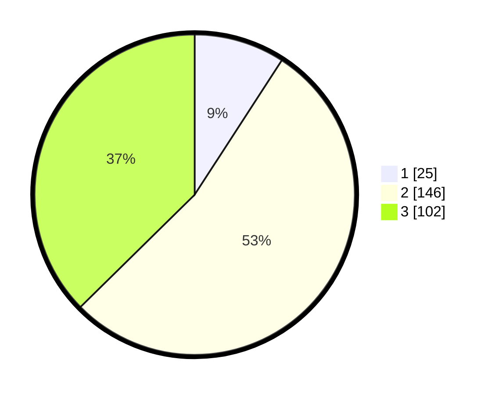

# Hasil

## Grafik

## Tabel

| No. | Nama Paslon    | Suara | Suara (raw) | Persentase |
|:--- |:-------------- | -----:| -----------:| ----------:|
| 1   | ANIES MUHAIMIN | 25    | [25][p-1]   | 9,16       |
| 2   | PRABOWO GIBRAN | 146   | [146][p-2]  | 53,48      |
| 3   | GANJAR MAHFUD  | 102   | [102][p-3]  | 37,36      |

[p-1]: https://github.com/gigit-pemilu/pemilu-2024/blob/main/pilpres/hitung-suara/sub/34-di-yogyakarta/sub/02-bantul/sub/11-dlingo/sub/2005-terong/sub/016-tps/sub/paslon-1.txt
[p-2]: https://github.com/gigit-pemilu/pemilu-2024/blob/main/pilpres/hitung-suara/sub/34-di-yogyakarta/sub/02-bantul/sub/11-dlingo/sub/2005-terong/sub/016-tps/sub/paslon-2.txt
[p-3]: https://github.com/gigit-pemilu/pemilu-2024/blob/main/pilpres/hitung-suara/sub/34-di-yogyakarta/sub/02-bantul/sub/11-dlingo/sub/2005-terong/sub/016-tps/sub/paslon-3.txt

## Foto C Plano

https://sirekap-obj-formc.kpu.go.id/e209/pemilu/ppwp/34/02/11/20/05/3402112005016-20240217-214318--9bc7c806-02a0-4477-98cb-5ea645a4b4ba.jpg

https://sirekap-obj-formc.kpu.go.id/e209/pemilu/ppwp/34/02/11/20/05/3402112005016-20240217-214319--6a646f4d-b69a-4da5-9af2-1d618beba0cc.jpg

https://sirekap-obj-formc.kpu.go.id/e209/pemilu/ppwp/34/02/11/20/05/3402112005016-20240217-214318--ddd75fa0-e13a-4414-8685-bc2a70046351.jpg

## Metadata

| Key        | Value               |
| ---------- | ------------------- |
| Time Stamp | 2024-02-19 16:00:00 |

## DATA PEMILIH TETAP

Jumlah pemilih dalam DPT: **292**.
 * L: **139**.
 * P: **153**.

## DATA PENGGUNA HAK PILIH

Jumlah pengguna hak pilih dalam DPT: **271**.
 * L: **132**.
 * P: **139**.

Jumlah pengguna hak pilih dalam DPTb: **11**.
 * L: **5**.
 * P: **6**.

Jumlah pengguna hak pilih dalam DPK: **1**.
 * L: **1**.
 * P: **0**.

Jumlah pengguna hak pilih: **283**.
 * L: **138**.
 * P: **145**.

## JUMLAH SUARA SAH DAN TIDAK SAH

JUMLAH SELURUH SUARA SAH: **273**.

JUMLAH SUARA TIDAK SAH: **10**.

JUMLAH SELURUH SUARA SAH DAN SUARA TIDAK SAH: **283**.

