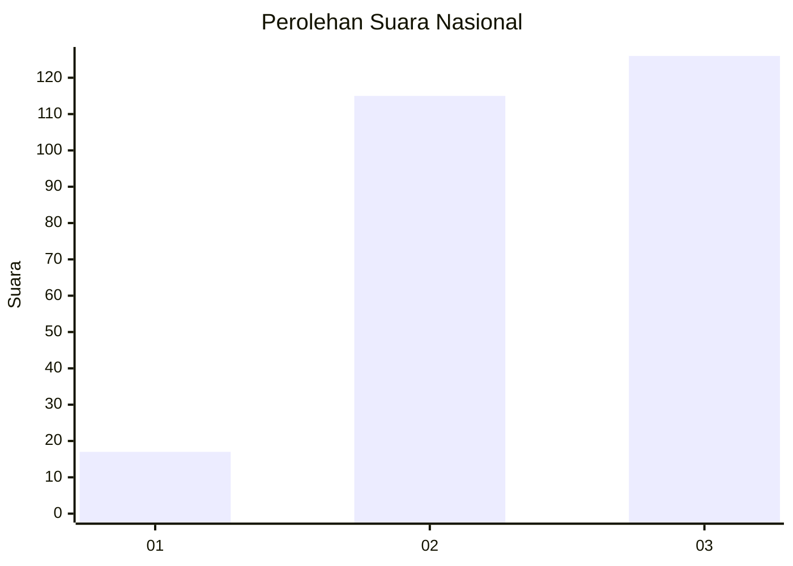
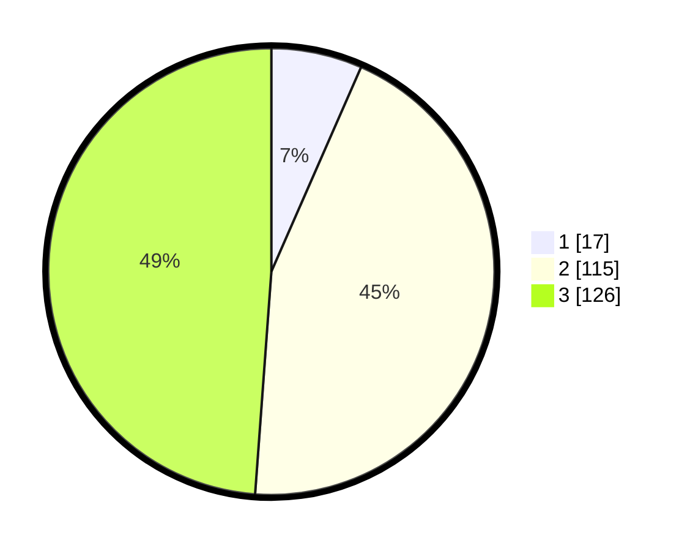

# Hasil

## Grafik

## Tabel

| No. | Nama Paslon    | Suara | Suara (raw) | Persentase |
|:--- |:-------------- | -----:| -----------:| ----------:|
| 1   | ANIES MUHAIMIN | 17    | [17][p-1]   | 6,59       |
| 2   | PRABOWO GIBRAN | 115   | [115][p-2]  | 44,57      |
| 3   | GANJAR MAHFUD  | 126   | [126][p-3]  | 48,84      |

[p-1]: https://github.com/gigit-pemilu/pemilu-2024/blob/main/pilpres/hitung-suara/sub/34-di-yogyakarta/sub/02-bantul/sub/11-dlingo/sub/2005-terong/sub/017-tps/sub/paslon-1.txt
[p-2]: https://github.com/gigit-pemilu/pemilu-2024/blob/main/pilpres/hitung-suara/sub/34-di-yogyakarta/sub/02-bantul/sub/11-dlingo/sub/2005-terong/sub/017-tps/sub/paslon-2.txt
[p-3]: https://github.com/gigit-pemilu/pemilu-2024/blob/main/pilpres/hitung-suara/sub/34-di-yogyakarta/sub/02-bantul/sub/11-dlingo/sub/2005-terong/sub/017-tps/sub/paslon-3.txt

## Foto C Plano

https://sirekap-obj-formc.kpu.go.id/3a7e/pemilu/ppwp/34/02/11/20/05/3402112005017-20240217-221451--26f53eaa-5fbd-4111-baca-5e92e83464c9.jpg

https://sirekap-obj-formc.kpu.go.id/3a7e/pemilu/ppwp/34/02/11/20/05/3402112005017-20240217-221457--b4e220b0-cd67-4801-b057-a037c374f530.jpg

https://sirekap-obj-formc.kpu.go.id/3a7e/pemilu/ppwp/34/02/11/20/05/3402112005017-20240217-221810--122a7557-d97a-4533-b1ac-3e4f89c20940.jpg

## Metadata

| Key        | Value               |
| ---------- | ------------------- |
| Time Stamp | 2024-02-19 06:16:00 |

