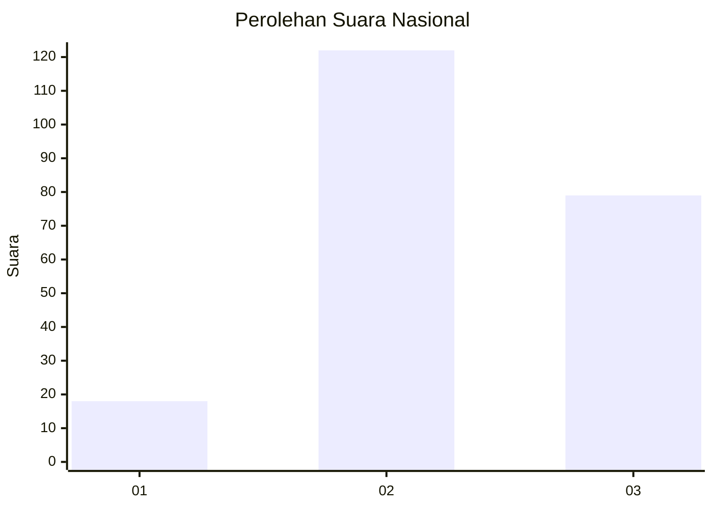
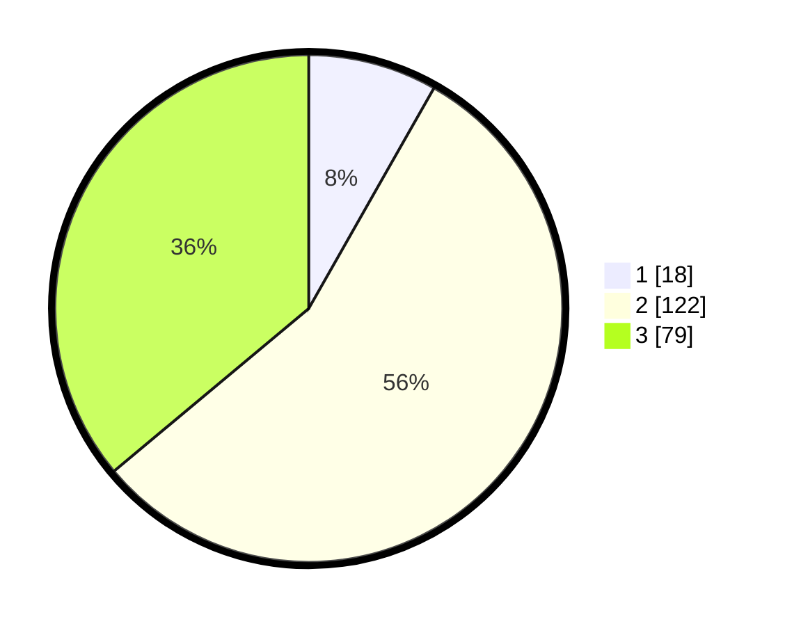

# Hasil

## Grafik

## Tabel

| No. | Nama Paslon    | Suara | Suara (raw) | Persentase |
|:--- |:-------------- | -----:| -----------:| ----------:|
| 1   | ANIES MUHAIMIN | 18    | [18][p-1]   | 8,22       |
| 2   | PRABOWO GIBRAN | 122   | [122][p-2]  | 55,71      |
| 3   | GANJAR MAHFUD  | 79    | [79][p-3]   | 36,07      |

[p-1]: https://github.com/gigit-pemilu/pemilu-2024/blob/main/pilpres/hitung-suara/sub/34-di-yogyakarta/sub/02-bantul/sub/11-dlingo/sub/2005-terong/sub/019-tps/sub/paslon-1.txt
[p-2]: https://github.com/gigit-pemilu/pemilu-2024/blob/main/pilpres/hitung-suara/sub/34-di-yogyakarta/sub/02-bantul/sub/11-dlingo/sub/2005-terong/sub/019-tps/sub/paslon-2.txt
[p-3]: https://github.com/gigit-pemilu/pemilu-2024/blob/main/pilpres/hitung-suara/sub/34-di-yogyakarta/sub/02-bantul/sub/11-dlingo/sub/2005-terong/sub/019-tps/sub/paslon-3.txt

## Foto C Plano

https://sirekap-obj-formc.kpu.go.id/eef4/pemilu/ppwp/34/02/11/20/05/3402112005019-20240214-141446--e95020c4-b7c7-4d08-86f6-e0eefa4dd8ea.jpg

https://sirekap-obj-formc.kpu.go.id/eef4/pemilu/ppwp/34/02/11/20/05/3402112005019-20240214-141336--7b004de5-e8fe-494f-9fc3-4d03ed60d7c1.jpg

https://sirekap-obj-formc.kpu.go.id/eef4/pemilu/ppwp/34/02/11/20/05/3402112005019-20240214-141803--7db8fe30-9963-4d26-82f5-21bf85cfe351.jpg

## Metadata

| Key        | Value               |
| ---------- | ------------------- |
| Time Stamp | 2024-02-15 21:01:18 |

