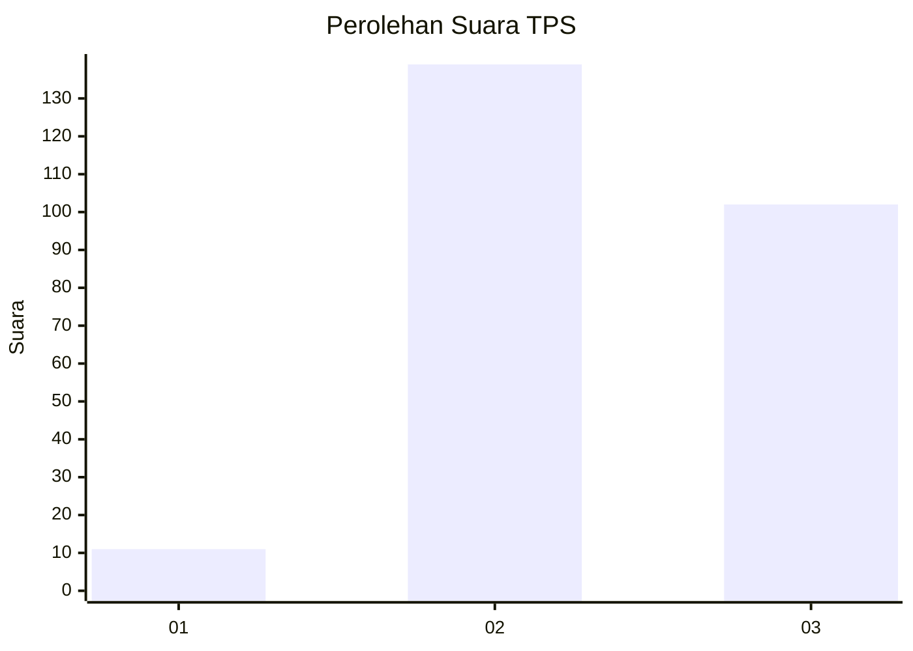
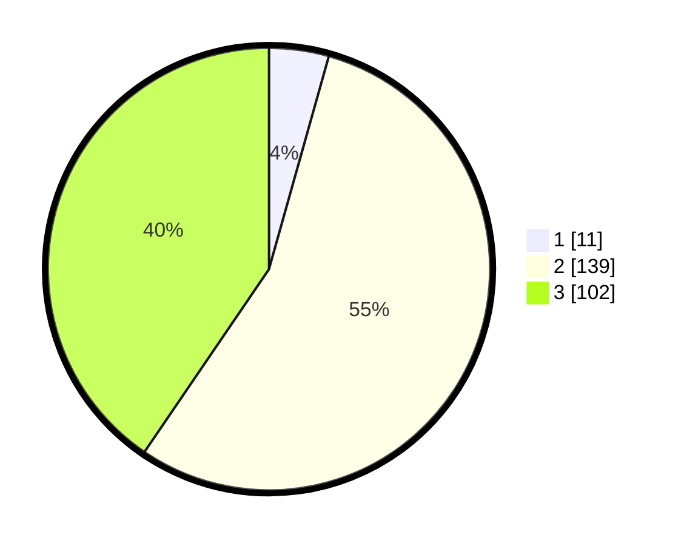

# Hasil

## Grafik

## Tabel

| No. | Nama Paslon    | Suara | Suara (raw) | Persentase |
|:--- |:-------------- | -----:| -----------:| ----------:|
| 1   | ANIES MUHAIMIN | 11    | [11][p-1]   | 4,37       |
| 2   | PRABOWO GIBRAN | 139   | [139][p-2]  | 55,16      |
| 3   | GANJAR MAHFUD  | 102   | [102][p-3]  | 40,48      |

[p-1]: https://github.com/gigit-pemilu/pemilu-2024-34-di-yogyakarta/blob/main/pilpres/hitung-suara/sub/34-di-yogyakarta/sub/02-bantul/sub/11-dlingo/sub/2006-jatimulyo/sub/010-tps/sub/paslon-1.txt
[p-2]: https://github.com/gigit-pemilu/pemilu-2024-34-di-yogyakarta/blob/main/pilpres/hitung-suara/sub/34-di-yogyakarta/sub/02-bantul/sub/11-dlingo/sub/2006-jatimulyo/sub/010-tps/sub/paslon-2.txt
[p-3]: https://github.com/gigit-pemilu/pemilu-2024-34-di-yogyakarta/blob/main/pilpres/hitung-suara/sub/34-di-yogyakarta/sub/02-bantul/sub/11-dlingo/sub/2006-jatimulyo/sub/010-tps/sub/paslon-3.txt

## Foto C Plano

https://sirekap-obj-formc.kpu.go.id/37ba/pemilu/ppwp/34/02/11/20/06/3402112006010-20240217-194836--9110f268-cc42-4de0-b20d-907381c06d15.jpg

https://sirekap-obj-formc.kpu.go.id/37ba/pemilu/ppwp/34/02/11/20/06/3402112006010-20240215-021819--f8c90477-63fe-4e9a-9f61-e7d682b42f78.jpg

https://sirekap-obj-formc.kpu.go.id/37ba/pemilu/ppwp/34/02/11/20/06/3402112006010-20240217-194555--bea5714c-f564-45d1-9bb0-342c37e1eaec.jpg

## Metadata

| Key        | Value               |
| ---------- | ------------------- |
| Time Stamp | 2024-02-19 06:16:00 |

