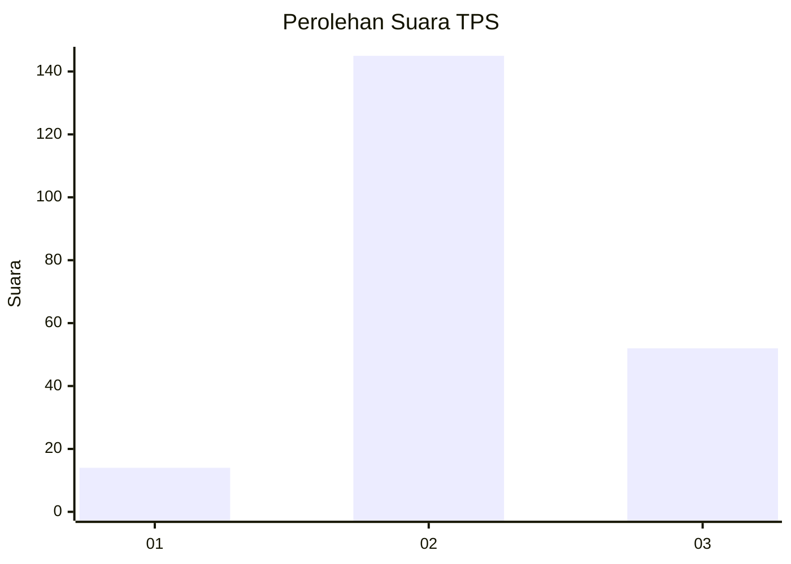
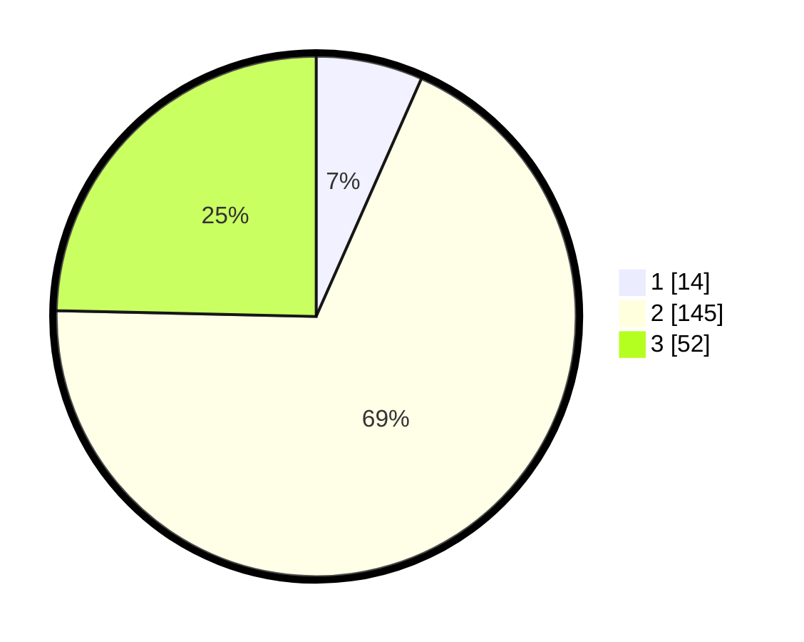

# Hasil

## Grafik

## Tabel

| No. | Nama Paslon    | Suara | Suara (raw) | Persentase |
|:--- |:-------------- | -----:| -----------:| ----------:|
| 1   | ANIES MUHAIMIN | 14    | [14][p-1]   | 6,64       |
| 2   | PRABOWO GIBRAN | 145   | [145][p-2]  | 68,72      |
| 3   | GANJAR MAHFUD  | 52    | [52][p-3]   | 24,64      |

[p-1]: https://github.com/gigit-pemilu/pemilu-2024-34-di-yogyakarta/blob/main/pilpres/hitung-suara/sub/34-di-yogyakarta/sub/02-bantul/sub/11-dlingo/sub/2006-jatimulyo/sub/012-tps/sub/paslon-1.txt
[p-2]: https://github.com/gigit-pemilu/pemilu-2024-34-di-yogyakarta/blob/main/pilpres/hitung-suara/sub/34-di-yogyakarta/sub/02-bantul/sub/11-dlingo/sub/2006-jatimulyo/sub/012-tps/sub/paslon-2.txt
[p-3]: https://github.com/gigit-pemilu/pemilu-2024-34-di-yogyakarta/blob/main/pilpres/hitung-suara/sub/34-di-yogyakarta/sub/02-bantul/sub/11-dlingo/sub/2006-jatimulyo/sub/012-tps/sub/paslon-3.txt

## Foto C Plano

https://sirekap-obj-formc.kpu.go.id/9127/pemilu/ppwp/34/02/11/20/06/3402112006012-20240217-181950--8b504eb6-5652-4128-9ec2-d0d4271c94b7.jpg

https://sirekap-obj-formc.kpu.go.id/9127/pemilu/ppwp/34/02/11/20/06/3402112006012-20240221-172650--aa4e06c3-fedc-4e77-9a4f-67f0f5f6e68a.jpg

https://sirekap-obj-formc.kpu.go.id/9127/pemilu/ppwp/34/02/11/20/06/3402112006012-20240217-182319--970ce8ae-5826-42f7-9b0f-7ac8c2f58289.jpg

## Metadata

| Key        | Value               |
| ---------- | ------------------- |
| Time Stamp | 2024-02-22 16:00:00 |

