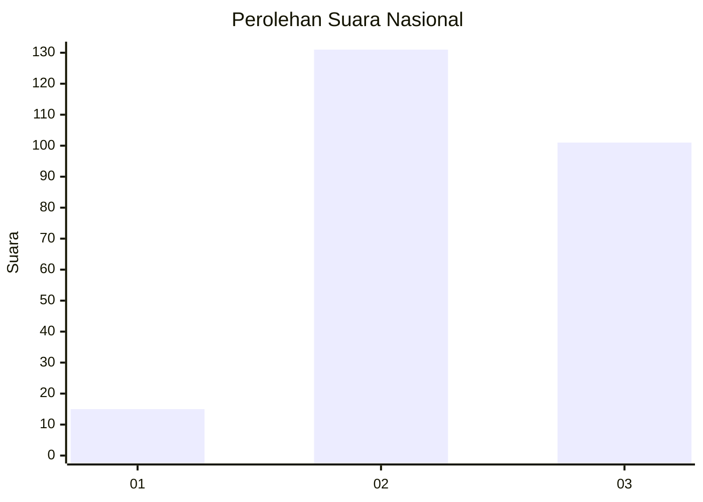
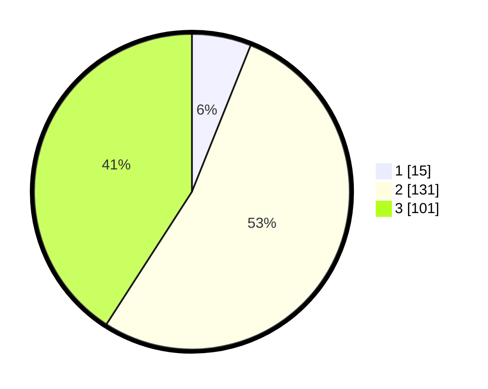

# Hasil

## Grafik

## Tabel

| No. | Nama Paslon    | Suara | Suara (raw) | Persentase |
|:--- |:-------------- | -----:| -----------:| ----------:|
| 1   | ANIES MUHAIMIN | 15    | [15][p-1]   | 6,07       |
| 2   | PRABOWO GIBRAN | 131   | [131][p-2]  | 53,04      |
| 3   | GANJAR MAHFUD  | 101   | [101][p-3]  | 40,89      |

[p-1]: https://github.com/gigit-pemilu/pemilu-2024/blob/main/pilpres/hitung-suara/sub/34-di-yogyakarta/sub/02-bantul/sub/11-dlingo/sub/2006-jatimulyo/sub/021-tps/sub/paslon-1.txt
[p-2]: https://github.com/gigit-pemilu/pemilu-2024/blob/main/pilpres/hitung-suara/sub/34-di-yogyakarta/sub/02-bantul/sub/11-dlingo/sub/2006-jatimulyo/sub/021-tps/sub/paslon-2.txt
[p-3]: https://github.com/gigit-pemilu/pemilu-2024/blob/main/pilpres/hitung-suara/sub/34-di-yogyakarta/sub/02-bantul/sub/11-dlingo/sub/2006-jatimulyo/sub/021-tps/sub/paslon-3.txt

## Foto C Plano

https://sirekap-obj-formc.kpu.go.id/98ce/pemilu/ppwp/34/02/11/20/06/3402112006021-20240217-194923--e7252c30-f9d1-418e-a727-a80796bc46f7.jpg

https://sirekap-obj-formc.kpu.go.id/98ce/pemilu/ppwp/34/02/11/20/06/3402112006021-20240217-195147--f89c1432-06bc-482f-a2fd-4c4dec639b1f.jpg

https://sirekap-obj-formc.kpu.go.id/98ce/pemilu/ppwp/34/02/11/20/06/3402112006021-20240217-195332--860c11ce-972d-49c8-804c-cfc7f74173a9.jpg

## Metadata

| Key        | Value               |
| ---------- | ------------------- |
| Time Stamp | 2024-02-22 16:00:00 |

