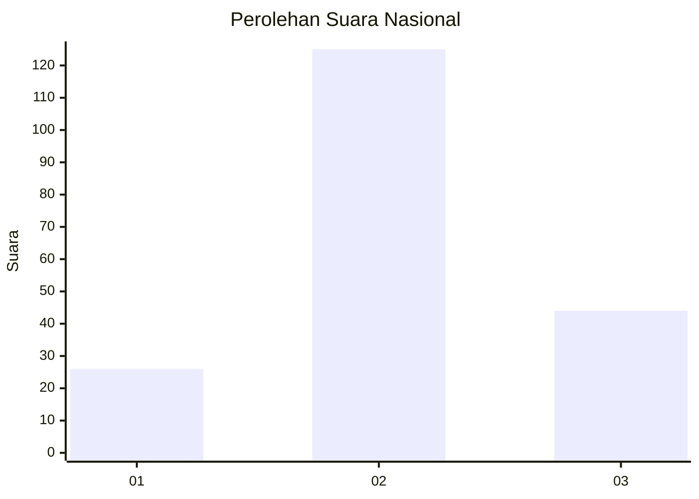
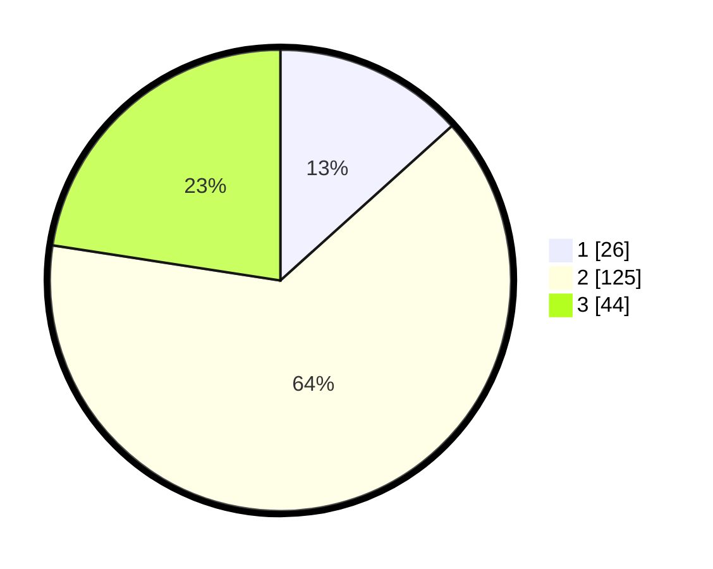

# Hasil

## Grafik

## Tabel

| No. | Nama Paslon    | Suara | Suara (raw) | Persentase |
|:--- |:-------------- | -----:| -----------:| ----------:|
| 1   | ANIES MUHAIMIN | 26    | [26][p-1]   | 13,33      |
| 2   | PRABOWO GIBRAN | 125   | [125][p-2]  | 64,10      |
| 3   | GANJAR MAHFUD  | 44    | [44][p-3]   | 22,56      |

[p-1]: https://github.com/gigit-pemilu/pemilu-2024/blob/main/pilpres/hitung-suara/sub/34-di-yogyakarta/sub/02-bantul/sub/12-banguntapan/sub/2001-baturetno/sub/001-tps/sub/paslon-1.txt
[p-2]: https://github.com/gigit-pemilu/pemilu-2024/blob/main/pilpres/hitung-suara/sub/34-di-yogyakarta/sub/02-bantul/sub/12-banguntapan/sub/2001-baturetno/sub/001-tps/sub/paslon-2.txt
[p-3]: https://github.com/gigit-pemilu/pemilu-2024/blob/main/pilpres/hitung-suara/sub/34-di-yogyakarta/sub/02-bantul/sub/12-banguntapan/sub/2001-baturetno/sub/001-tps/sub/paslon-3.txt

## Foto C Plano

https://sirekap-obj-formc.kpu.go.id/740a/pemilu/ppwp/34/02/12/20/01/3402122001001-20240215-070225--32c7f47d-42a2-46c9-9263-c1e07bcf88af.jpg

https://sirekap-obj-formc.kpu.go.id/740a/pemilu/ppwp/34/02/12/20/01/3402122001001-20240215-070313--dbcf3249-b890-4587-a8ab-f78bda98077f.jpg

https://sirekap-obj-formc.kpu.go.id/740a/pemilu/ppwp/34/02/12/20/01/3402122001001-20240215-070448--b3ae0a68-224d-4127-8e4c-2fb97ee73508.jpg

## Metadata

| Key        | Value               |
| ---------- | ------------------- |
| Time Stamp | 2024-02-15 22:00:27 |

## DATA PEMILIH TETAP

Jumlah pemilih dalam DPT: **292**.
 * L: **136**.
 * P: **156**.

## DATA PENGGUNA HAK PILIH

Jumlah pengguna hak pilih dalam DPT: **247**.
 * L: **80**.
 * P: **167**.

Jumlah pengguna hak pilih dalam DPTb: **3**.
 * L: **1**.
 * P: **2**.

Jumlah pengguna hak pilih dalam DPK: **3**.
 * L: **1**.
 * P: **2**.

Jumlah pengguna hak pilih: **253**.
 * L: **82**.
 * P: **171**.

## JUMLAH SUARA SAH DAN TIDAK SAH

JUMLAH SELURUH SUARA SAH: **246**.

JUMLAH SUARA TIDAK SAH: **7**.

JUMLAH SELURUH SUARA SAH DAN SUARA TIDAK SAH: **0**.

